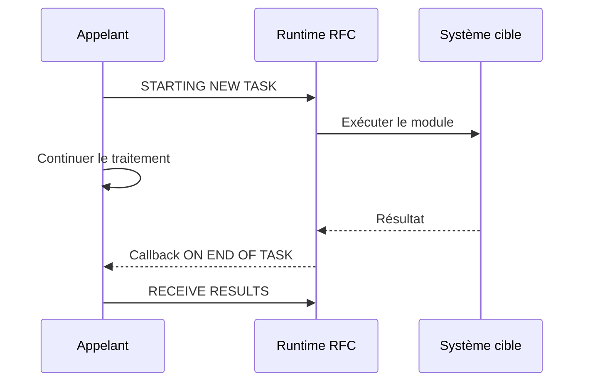

# APPELS RFC SYNCHRONES ET ASYNCHRONES

## RÉSULTAT ATTENDU

- Implémenter un appel RFC synchrone
- Comprendre `STARTING NEW TASK`
- Recevoir un résultat asynchrone
- Choisir le mode adapté au besoin

## RFC SYNCHRONE

L’appelant attend la fin du module distant :

```abap
CALL FUNCTION 'Z_DEV_READ_REMOTE'
  DESTINATION 'S4H_DEV_100'
  EXPORTING
    iv_key                = lv_key
  IMPORTING
    es_result             = ls_result
  EXCEPTIONS
    system_failure        = 1 MESSAGE lv_message
    communication_failure = 2 MESSAGE lv_message
    OTHERS                = 3.
```

Utiliser ce mode lorsqu’un résultat est requis avant de poursuivre.

## RFC ASYNCHRONE

`STARTING NEW TASK` démarre un appel asynchrone :

```abap
CALL FUNCTION 'Z_DEV_READ_REMOTE'
  STARTING NEW TASK lv_task
  DESTINATION 'S4H_DEV_100'
  CALLING on_end_of_task ON END OF TASK
  EXPORTING
    iv_key = lv_key.
```

La forme exacte de callback dépend du style procédural ou objet et de la version ABAP.

## RÉCEPTION

Dans le callback, utiliser `RECEIVE RESULTS FROM FUNCTION` :

```abap
RECEIVE RESULTS FROM FUNCTION 'Z_DEV_READ_REMOTE'
  IMPORTING
    es_result             = ls_result
  EXCEPTIONS
    system_failure        = 1 MESSAGE lv_message
    communication_failure = 2 MESSAGE lv_message
    OTHERS                = 3.
```

## FLUX



## ATTENTE ET PARALLÉLISME

Un aRFC peut servir au traitement parallèle, notamment avec des groupes de serveurs. Ce mode exige :

- découpage indépendant des unités ;
- nombre de tâches maîtrisé ;
- gestion de la fin de chaque tâche ;
- agrégation sûre des résultats ;
- gestion des ressources et erreurs.

Ne pas paralléliser un traitement sans mesurer la charge globale du système.

## CHOIX

| Besoin                        | Mode probable |
| ----------------------------- | ------------- |
| Résultat immédiat obligatoire | sRFC          |
| Travail parallèle avec retour | aRFC          |
| Livraison fiable différée     | tRFC ou qRFC  |
| Ordre strict entre unités     | qRFC          |

## PROCÉDURE PAS À PAS

1. Saisir `/nSE37`.
2. Entrer le nom du module fonction puis choisir **Afficher**, **Modifier** ou **Créer** selon l’autorisation.
3. Analyser les onglets Import, Export, Changing, Tables et Exceptions.
4. Lire la documentation et le code source avant tout appel.
5. Utiliser **Test/Exécuter** avec des données non destructives.
6. Pour un module Z, contrôler, activer puis tester les cas nominal et d’erreur.

## VÉRIFICATION

- Le contrôle syntaxique réussit.
- La version active correspond au code sauvegardé.
- L’exécution produit le résultat décrit dans le chapitre.
- Les cas vide, limite et erreur sont testés séparément lorsque la syntaxe le permet.

## ERREURS FRÉQUENTES

- Copier un exemple sans adapter les types, noms d’objets et données disponibles dans le système.
- Tester uniquement le cas nominal et ignorer les valeurs initiales, absentes ou invalides.
- Appeler un module fonction sans lire sa documentation et ses exceptions.
- Supposer qu’une BAPI effectue automatiquement le commit.

## SNIPPET À RÉUTILISER

> [!NOTE]
> Adapter les noms `Z*`, les types DDIC, les données et les autorisations au système cible. Effectuer un contrôle syntaxique avant activation.

```abap
CALL FUNCTION 'Z_DEV_READ_REMOTE'
  DESTINATION 'S4H_DEV_100'
  EXPORTING
    iv_key                = lv_key
  IMPORTING
    es_result             = ls_result
  EXCEPTIONS
    system_failure        = 1 MESSAGE lv_message
    communication_failure = 2 MESSAGE lv_message
    OTHERS                = 3.
```

## TERMES DU LEXIQUE

- [Module fonction](<../🧩 00 ├── LEXIQUE SAP ET ABAP/06 ├── PROGRAMMES CLASSES ET OBJETS TECHNIQUES.md#module-fonction>)
- [Function group](<../🧩 00 ├── LEXIQUE SAP ET ABAP/06 ├── PROGRAMMES CLASSES ET OBJETS TECHNIQUES.md#function-group>)
- [RFC](<../🧩 00 ├── LEXIQUE SAP ET ABAP/10 └── ACRONYMES SAP.md#acro-rfc>)
- [BAPI](<../🧩 00 ├── LEXIQUE SAP ET ABAP/10 └── ACRONYMES SAP.md#acro-bapi>)
- [Destination RFC](<../🧩 00 ├── LEXIQUE SAP ET ABAP/07 ├── INTERFACES ET INTEGRATION.md#destination-rfc>)

## RÉFÉRENCES OFFICIELLES SAP

- [CALL FUNCTION STARTING NEW TASK — ABAP Keyword Documentation](https://help.sap.com/doc/abapdocu_816_index_htm/8.16/en-US/ABAPCALL_FUNCTION_STARTING.html)
- [Receiving Results from an Asynchronous RFC — SAP Help Portal](https://help.sap.com/docs/ABAP_PLATFORM_NEW/753088fc00704d0a80e7fbd6803c8adb/489bdeec0c1c73e7e10000000a42189b.html)
- [Parallel Processing with Asynchronous RFC — SAP Help Portal](https://help.sap.com/docs/ABAP_PLATFORM_NEW/753088fc00704d0a80e7fbd6803c8adb/489aa5b948c673e8e10000000a42189b.html)


---

[Chapitre suivant — TRFC, QRFC ET SURVEILLANCE](<./16 ├── TRFC QRFC ET SURVEILLANCE.md>)
