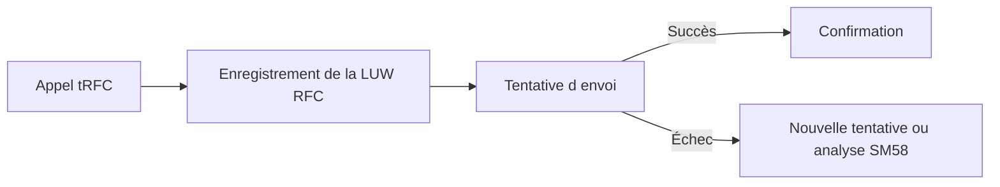

# TRFC, QRFC ET SURVEILLANCE

## RÉSULTAT ATTENDU

- Distinguer tRFC et qRFC
- Comprendre l’enregistrement transactionnel
- Identifier les moniteurs `SM58`, `SMQ1` et `SMQ2`
- Éviter les retraitements destructifs

## TRFC

Le transactional RFC enregistre l’unité d’appel afin qu’elle puisse être exécutée de manière fiable lorsque la cible est disponible.

L’appelant ne reçoit pas un résultat métier comme dans un sRFC. Le traitement est conçu autour de l’envoi fiable.

## QRFC

Le qRFC ajoute une file et un ordre d’exécution. Il est utilisé lorsque deux unités concernant le même objet ne doivent pas être exécutées dans un ordre différent.

Exemple conceptuel :

1. création d’un objet ;
2. modification de cet objet ;
3. clôture de cet objet.

Une file commune préserve l’ordre.

## MONITEURS

| Transaction | Rôle                         |
| ----------- | ---------------------------- |
| `SM58`      | Surveillance des appels tRFC |
| `SMQ1`      | Files qRFC sortantes         |
| `SMQ2`      | Files qRFC entrantes         |

Selon le paysage, d’autres transactions et schedulers peuvent intervenir.

## ANALYSE D UNE ERREUR

Vérifier :

- destination ;
- message d’erreur ;
- date et heure ;
- utilisateur ;
- fonction appelée ;
- disponibilité de la cible ;
- blocage de file ;
- erreur applicative dans l’unité précédente ;
- cohérence d’un retraitement.

## RETRAITEMENT

Ne jamais supprimer ou relancer une unité sans comprendre :

- si le traitement a déjà été exécuté partiellement ;
- si l’opération est idempotente ;
- si l’ordre doit être conservé ;
- si une unité précédente bloque volontairement les suivantes ;
- si la suppression entraîne une perte définitive.

## LIMITE

Les garanties exactes de livraison et d’ordre dépendent du mécanisme et du scénario. Ne pas résumer tRFC ou qRFC à une promesse générale sans analyser l’implémentation de l’application.

## PROCÉDURE PAS À PAS

1. Saisir `/nSE37`.
2. Entrer le nom du module fonction puis choisir **Afficher**, **Modifier** ou **Créer** selon l’autorisation.
3. Analyser les onglets Import, Export, Changing, Tables et Exceptions.
4. Lire la documentation et le code source avant tout appel.
5. Utiliser **Test/Exécuter** avec des données non destructives.
6. Pour un module Z, contrôler, activer puis tester les cas nominal et d’erreur.

## VÉRIFICATION

- Le lecteur peut expliquer la différence entre cette notion et les concepts proches.
- Le choix technique est justifié par un besoin concret, pas uniquement par habitude.
- Les limites liées à la release, aux autorisations et au contexte d’exécution sont identifiées.

## ERREURS FRÉQUENTES

- Appeler un module fonction sans lire sa documentation et ses exceptions.
- Supposer qu’une BAPI effectue automatiquement le commit.

## TERMES DU LEXIQUE

- [tRFC](<../🧩 00 ├── LEXIQUE SAP ET ABAP/10 └── ACRONYMES SAP.md#acro-trfc>)
- [qRFC](<../🧩 00 ├── LEXIQUE SAP ET ABAP/10 └── ACRONYMES SAP.md#acro-qrfc>)
- [Module fonction](<../🧩 00 ├── LEXIQUE SAP ET ABAP/06 ├── PROGRAMMES CLASSES ET OBJETS TECHNIQUES.md#module-fonction>)
- [Function group](<../🧩 00 ├── LEXIQUE SAP ET ABAP/06 ├── PROGRAMMES CLASSES ET OBJETS TECHNIQUES.md#function-group>)
- [RFC](<../🧩 00 ├── LEXIQUE SAP ET ABAP/10 └── ACRONYMES SAP.md#acro-rfc>)
- [BAPI](<../🧩 00 ├── LEXIQUE SAP ET ABAP/10 └── ACRONYMES SAP.md#acro-bapi>)

## RÉFÉRENCES OFFICIELLES SAP

- [RFC in SAP Systems — SAP Help Portal](https://help.sap.com/docs/SAP_NETWEAVER_700/108f625f6c53101491e88dc4cf51a6cc/48920827feb35ed2e10000000a42189d.html)
- [Transactional RFC and Queued RFC Monitor — SAP Help Portal](https://help.sap.com/docs/SAP_NETWEAVER_700/10905b976c53101487c0c95187a63f9a/8bceea3b31aac554e10000000a114084.html)
- [SMQ1 and SMQ2 — SAP Help Portal](https://help.sap.com/saphelp_snc70/helpdata/EN/76/e12041c877f623e10000000a155106/content.htm)

---

[Chapitre suivant — SÉCURITÉ ET AUTORISATIONS RFC](<./17 ├── SECURITE ET AUTORISATIONS RFC.md>)
