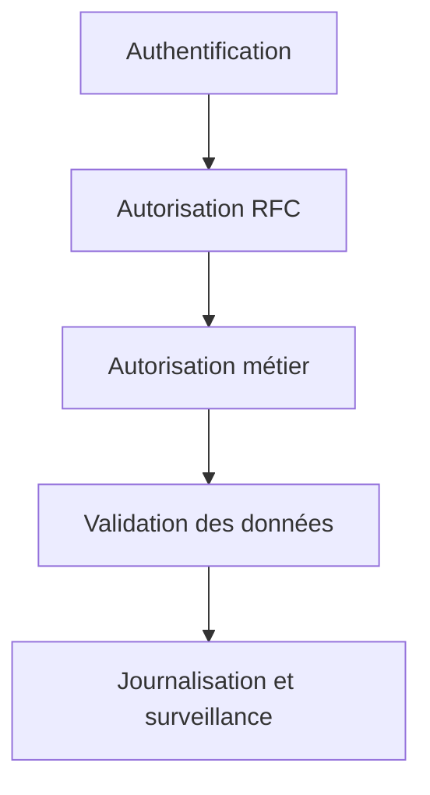

# SÉCURITÉ ET AUTORISATIONS RFC

## RÉSULTAT ATTENDU

- Comprendre les contrôles d’autorisation RFC
- Distinguer administration de destination et exécution distante
- Réduire les privilèges du compte technique
- Éviter l’exposition excessive de fonctions

## SURFACE D EXPOSITION

Un module marqué RFC peut devenir accessible au-delà du programme local. La sécurité doit être conçue à plusieurs niveaux :



## OBJETS D AUTORISATION

Parmi les objets classiques :

| Objet       | Rôle général                                                 |
| ----------- | ------------------------------------------------------------ |
| `S_RFC`     | Autoriser l’exécution de groupes ou modules RFC              |
| `S_RFC_ADM` | Contrôler certaines fonctions d’administration RFC et `SM59` |

Les champs et valeurs exacts doivent être définis par l’équipe sécurité selon le scénario.

## COMPTE TECHNIQUE

Appliquer le moindre privilège :

- compte dédié au flux ;
- accès limité aux modules nécessaires ;
- absence d’autorisation de développement ;
- restrictions métier complémentaires ;
- mot de passe, certificat ou mécanisme d’authentification géré par l’administration ;
- rotation et supervision conformes aux règles de l’entreprise.

## CONTRÔLES MÉTIER

`S_RFC` ne remplace pas les contrôles fonctionnels. Le module doit encore vérifier les autorisations requises pour lire ou modifier les données métier.

Exemple conceptuel :

```abap
AUTHORITY-CHECK OBJECT 'Z_PRODUCT'
  ID 'ACTVT' FIELD '03'.

IF sy-subrc <> 0.
  " Retourner une erreur d autorisation contrôlée
ENDIF.
```

## DONNÉES D ENTRÉE

Traiter toute donnée RFC comme une entrée externe :

- valider format et longueur ;
- contrôler les valeurs autorisées ;
- éviter les appels dynamiques non maîtrisés ;
- protéger les lectures massives ;
- limiter les informations techniques retournées ;
- ne pas exposer de secret dans les messages.

## TRAÇABILITÉ

Journaliser suffisamment pour relier :

- appelant ;
- destination ;
- utilisateur cible ;
- fonction ;
- objet métier ;
- résultat ;
- identifiant de corrélation lorsqu’il existe.

## PROCÉDURE PAS À PAS

1. Saisir `/nSAT`.
2. Créer ou sélectionner une variante de mesure adaptée.
3. Définir le programme, la transaction ou l’utilisateur à mesurer.
4. Démarrer la mesure puis reproduire une seule fois le scénario.
5. Arrêter et analyser le hit list, la hiérarchie d’appels et les temps nets.
6. Répéter la mesure après correction avec les mêmes données et le même contexte.

## VÉRIFICATION

- Le scénario reproduit correspond au même utilisateur, mandant, transaction et jeu de données.
- L’horodatage et l’identifiant de l’analyse sont conservés.
- La cause retenue est soutenue par une ligne source, une trace ou une valeur observée.
- Après correction, le même scénario ne reproduit plus le défaut et le résultat métier reste identique.

## ERREURS FRÉQUENTES

- Copier un exemple sans adapter les types, noms d’objets et données disponibles dans le système.
- Tester uniquement le cas nominal et ignorer les valeurs initiales, absentes ou invalides.
- Appeler un module fonction sans lire sa documentation et ses exceptions.
- Supposer qu’une BAPI effectue automatiquement le commit.

## SNIPPET À RÉUTILISER

> [!NOTE]
> Adapter les noms `Z*`, les types DDIC, les données et les autorisations au système cible. Effectuer un contrôle syntaxique avant activation.

```abap
AUTHORITY-CHECK OBJECT 'Z_PRODUCT'
  ID 'ACTVT' FIELD '03'.

IF sy-subrc <> 0.
  " Retourner une erreur d autorisation contrôlée
ENDIF.
```

## TERMES DU LEXIQUE

- [Module fonction](<../🧩 00 ├── LEXIQUE SAP ET ABAP/06 ├── PROGRAMMES CLASSES ET OBJETS TECHNIQUES.md#module-fonction>)
- [Function group](<../🧩 00 ├── LEXIQUE SAP ET ABAP/06 ├── PROGRAMMES CLASSES ET OBJETS TECHNIQUES.md#function-group>)
- [RFC](<../🧩 00 ├── LEXIQUE SAP ET ABAP/10 └── ACRONYMES SAP.md#acro-rfc>)
- [BAPI](<../🧩 00 ├── LEXIQUE SAP ET ABAP/10 └── ACRONYMES SAP.md#acro-bapi>)
- [Destination RFC](<../🧩 00 ├── LEXIQUE SAP ET ABAP/07 ├── INTERFACES ET INTEGRATION.md#destination-rfc>)

## RÉFÉRENCES OFFICIELLES SAP

- [Authorizations — SAP Help Portal](https://help.sap.com/docs/ABAP_PLATFORM_NEW/c495ada972d045b2be2869f5573af8e7/488de31b81cd0e27e10000000a421937.html)
- [RFC Authorization — SAP Help Portal](https://help.sap.com/docs/SAP_NETWEAVER_700/108f625f6c53101491e88dc4cf51a6cc/4895128d94cc73eae10000000a42189b.html)
- [Authorization Object S_RFC_ADM — SAP Help Portal](https://help.sap.com/docs/ABAP_PLATFORM_NEW/c495ada972d045b2be2869f5573af8e7/488d1c05ae444e6ee10000000a421937.html)


---

[Chapitre suivant — PRINCIPES DES BAPI ET RECHERCHE](<./18 ├── PRINCIPES DES BAPI ET RECHERCHE.md>)
