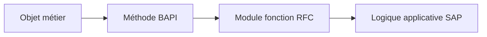

# PRINCIPES DES BAPI ET RECHERCHE

## RÉSULTAT ATTENDU

- Définir une BAPI
- Distinguer BAPI et module RFC générique
- Rechercher une BAPI existante
- Vérifier son contrat et sa documentation

## DÉFINITION

Une **Business Application Programming Interface** est une interface métier standardisée exposant une opération sur un objet ou un processus SAP. Elle est généralement implémentée par un module fonction distant.



## BAPI ET RFC

| Module RFC                     | BAPI                                                       |
| ------------------------------ | ---------------------------------------------------------- |
| Technologie de communication   | Contrat métier standardisé                                 |
| Peut être purement technique   | Porte une sémantique métier                                |
| Peut être spécifique client    | Peut être fournie par SAP ou définie selon les règles BAPI |
| Pas nécessairement liée au BOR | Historiquement exposée comme méthode d’un objet BOR        |

Toute BAPI est liée à la technologie RFC classique, mais tout module RFC n’est pas une BAPI.

## RECHERCHE

Outils classiques selon le système :

- `BAPI` ou BAPI Explorer ;
- `SWO1` et Business Object Repository ;
- `SE37` pour l’interface technique ;
- documentation de l’application SAP ;
- Repository Information System.

## ANALYSE

Avant d’utiliser une BAPI, lire :

- documentation générale ;
- paramètres obligatoires ;
- structures `X` de mise à jour éventuelles ;
- table ou structure `RETURN` ;
- règles de commit ;
- unités et formats ;
- restrictions fonctionnelles ;
- séquence d’appels ;
- notes et documentation du composant.

## TEST

Une BAPI peut être testée dans `SE37`, mais le test isolé peut être incomplet. Certaines BAPI nécessitent :

- préparation de données ;
- appel de plusieurs méthodes ;
- `BAPI_TRANSACTION_COMMIT` ;
- rollback en cas d’erreur ;
- contexte métier valide.

## CHOIX D API

Lorsqu’une API officielle plus récente existe pour le scénario, suivre la recommandation du produit SAP. Ne pas choisir une BAPI uniquement parce qu’elle est connue ou facile à appeler.

## PROCÉDURE PAS À PAS

1. Saisir `/nSE37`.
2. Entrer le nom du module fonction puis choisir **Afficher**, **Modifier** ou **Créer** selon l’autorisation.
3. Analyser les onglets Import, Export, Changing, Tables et Exceptions.
4. Lire la documentation et le code source avant tout appel.
5. Utiliser **Test/Exécuter** avec des données non destructives.
6. Pour un module Z, contrôler, activer puis tester les cas nominal et d’erreur.

## VÉRIFICATION

- Le lecteur peut expliquer la différence entre cette notion et les concepts proches.
- Le choix technique est justifié par un besoin concret, pas uniquement par habitude.
- Les limites liées à la release, aux autorisations et au contexte d’exécution sont identifiées.

## ERREURS FRÉQUENTES

- Appeler un module fonction sans lire sa documentation et ses exceptions.
- Supposer qu’une BAPI effectue automatiquement le commit.

## FICHE DE CONTRÔLE À COPIER

```text
Système / SID       :
Mandant             :
Utilisateur         :
Transaction / outil :
Objet technique     :
Jeu de données      :
Résultat attendu    :
Résultat observé    :
Horodatage          :
Ordre de transport  :
```

## TERMES DU LEXIQUE

- [BAPI](<../🧩 00 ├── LEXIQUE SAP ET ABAP/10 └── ACRONYMES SAP.md#acro-bapi>)
- [Module fonction](<../🧩 00 ├── LEXIQUE SAP ET ABAP/06 ├── PROGRAMMES CLASSES ET OBJETS TECHNIQUES.md#module-fonction>)
- [Function group](<../🧩 00 ├── LEXIQUE SAP ET ABAP/06 ├── PROGRAMMES CLASSES ET OBJETS TECHNIQUES.md#function-group>)
- [RFC](<../🧩 00 ├── LEXIQUE SAP ET ABAP/10 └── ACRONYMES SAP.md#acro-rfc>)
- [Destination RFC](<../🧩 00 ├── LEXIQUE SAP ET ABAP/07 ├── INTERFACES ET INTEGRATION.md#destination-rfc>)

## RÉFÉRENCES OFFICIELLES SAP

- [Describing Remote Function Calls and BAPIs — SAP Learning](https://learning.sap.com/courses/technical-implementation-and-operation-i-of-sap-s-4hana-and-sap-business-suite/describing-remote-function-calls-and-bapis)
- [Explaining the Integration Technology Based on BAPIs and IDocs — SAP Learning](https://learning.sap.com/courses/developing-integration-scenarios-using-idoc-rfc-adapter-of-sap-process-orchestration/explaining-the-integration-technology-based-on-bapis-and-idocs-basics_db458c59-a70f-480d-b139-65065be1b9e9)
- [Transaction Model for Developing BAPIs — SAP Help Portal](https://help.sap.com/docs/SAP_ERP/67ae2d27aed945b7bd0ad1d2185ec217/4d5b102ba1483d8fe10000000a42189e.html)


---

[Chapitre suivant — INTERFACES BAPI, STRUCTURES X ET RETURN](<./19 ├── INTERFACES BAPI STRUCTURES X ET RETURN.md>)
