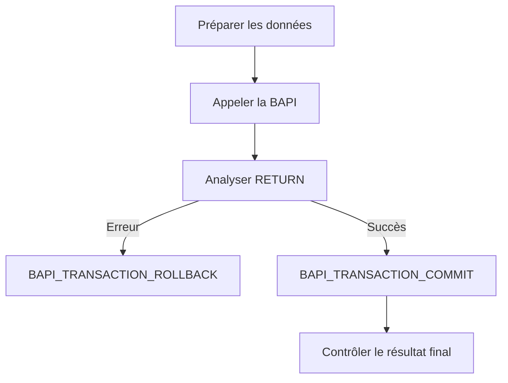

# 20. APPELER UNE BAPI ET GÉRER LA TRANSACTION

## 20.A RÉSULTAT ATTENDU

- Construire un appel BAPI complet
- Analyser les retours métier
- Valider avec `BAPI_TRANSACTION_COMMIT`
- Annuler avec `BAPI_TRANSACTION_ROLLBACK`

## 20.B SÉQUENCE GÉNÉRALE



## 20.C EXEMPLE GÉNÉRIQUE

```abap
DATA lt_return TYPE TABLE OF bapiret2.

CALL FUNCTION 'BAPI_EXAMPLE_CHANGE'
  EXPORTING
    objectkey = lv_key
    data      = ls_data
    datax     = ls_datax
  TABLES
    return    = lt_return.

IF line_exists( lt_return[ type = 'E' ] )
 OR line_exists( lt_return[ type = 'A' ] ).

  CALL FUNCTION 'BAPI_TRANSACTION_ROLLBACK'.

ELSE.

  CALL FUNCTION 'BAPI_TRANSACTION_COMMIT'
    EXPORTING
      wait = abap_true.

ENDIF.
```

`BAPI_EXAMPLE_CHANGE` est un nom fictif. Utiliser l’interface réelle et sa documentation.

## 20.D COMMIT BAPI

Après une BAPI de modification, utiliser le mécanisme transactionnel documenté par SAP. La documentation SAP précise l’usage de `BAPI_TRANSACTION_COMMIT` dans le modèle transactionnel BAPI.

Le paramètre `WAIT = abap_true` demande une validation synchrone des mises à jour, ce qui peut être nécessaire lorsque le traitement suivant doit lire immédiatement les données validées.

## 20.E ROLLBACK

En présence d’une erreur métier ou technique avant validation, appeler `BAPI_TRANSACTION_ROLLBACK` lorsque le modèle de la BAPI le prévoit.

## 20.F PIÈGES

- Appeler `COMMIT WORK` directement sans respecter le modèle BAPI.
- Valider alors que `RETURN` contient une erreur.
- Ignorer les avertissements ayant un impact métier.
- Effectuer plusieurs opérations indépendantes dans une même LUW sans stratégie.
- Supposer qu’un rollback distant annule des opérations déjà validées.
- Oublier que certaines BAPI documentent un comportement transactionnel particulier.

## 20.G APPEL DISTANT

Lorsque la BAPI est appelée via une destination RFC, la gestion de la transaction doit rester dans le même contexte RFC selon le modèle applicable. Vérifier la documentation de la BAPI et de l’environnement appelant.

## 20.H PROCESS

### 20.H.1 Étape 1 — Préparer les données et la clé de corrélation

Valider les entrées, renseigner structures et indicateurs `X`, puis conserver une clé permettant de retrouver le document ou la tentative.

### 20.H.2 Étape 2 — Appeler la BAPI

Insérer le modèle exact depuis `SE37`, mapper tous les paramètres obligatoires et récupérer la clé retournée ainsi que la table `RETURN`.

### 20.H.3 Étape 3 — Décider succès ou échec

Parcourir `RETURN`. Si une ligne de type `A`, `E` ou `X` existe, ne pas lancer le commit. Journaliser les messages utiles et appeler `BAPI_TRANSACTION_ROLLBACK` lorsque le contrat le prévoit.

### 20.H.4 Étape 4 — Valider la transaction

En absence d’erreur bloquante, appeler `BAPI_TRANSACTION_COMMIT` avec attente lorsque la lecture immédiate est nécessaire. Ne mélanger pas ce commit avec une LUW métier plus large non conçue pour être validée ici.

### 20.H.5 Étape 5 — Relire l’objet

Utiliser une BAPI ou API de lecture pour confirmer la persistance et la clé. Tester ensuite un cas d’erreur et vérifier qu’aucun objet partiel ne subsiste.

## 20.I VÉRIFICATION

- Le contrôle syntaxique réussit.
- La version active correspond au code sauvegardé.
- L’exécution produit le résultat décrit dans le chapitre.
- Les cas vide, limite et erreur sont testés séparément lorsque la syntaxe le permet.

## 20.J ERREURS FRÉQUENTES

- Copier un exemple sans adapter les types, noms d’objets et données disponibles dans le système.
- Tester uniquement le cas nominal et ignorer les valeurs initiales, absentes ou invalides.
- Appeler un module fonction sans lire sa documentation et ses exceptions.
- Supposer qu’une BAPI effectue automatiquement le commit.

## 20.K SNIPPET À RÉUTILISER

> [!NOTE]
> Adapter les noms `Z*`, les types DDIC, les données et les autorisations au système cible. Effectuer un contrôle syntaxique avant activation.

```abap
DATA lt_return TYPE TABLE OF bapiret2.

CALL FUNCTION 'BAPI_EXAMPLE_CHANGE'
  EXPORTING
    objectkey = lv_key
    data      = ls_data
    datax     = ls_datax
  TABLES
    return    = lt_return.

IF line_exists( lt_return[ type = 'E' ] )
 OR line_exists( lt_return[ type = 'A' ] ).

  CALL FUNCTION 'BAPI_TRANSACTION_ROLLBACK'.

ELSE.

  CALL FUNCTION 'BAPI_TRANSACTION_COMMIT'
    EXPORTING
      wait = abap_true.

ENDIF.
```

## 20.L TERMES DU LEXIQUE

- [Transaction](<../🧩 00 ├── LEXIQUE SAP ET ABAP/02 ├── SAP GUI NAVIGATION ET TRANSACTIONS.md#transaction>)
- [BAPI](<../🧩 00 ├── LEXIQUE SAP ET ABAP/10 └── ACRONYMES SAP.md#acro-bapi>)
- [Module fonction](<../🧩 00 ├── LEXIQUE SAP ET ABAP/06 ├── PROGRAMMES CLASSES ET OBJETS TECHNIQUES.md#module-fonction>)
- [Function group](<../🧩 00 ├── LEXIQUE SAP ET ABAP/06 ├── PROGRAMMES CLASSES ET OBJETS TECHNIQUES.md#function-group>)
- [RFC](<../🧩 00 ├── LEXIQUE SAP ET ABAP/10 └── ACRONYMES SAP.md#acro-rfc>)
- [Destination RFC](<../🧩 00 ├── LEXIQUE SAP ET ABAP/07 ├── INTERFACES ET INTEGRATION.md#destination-rfc>)

## 20.M RÉFÉRENCES OFFICIELLES SAP

- [BAPI_TRANSACTION_COMMIT versus COMMIT WORK — SAP Help Portal](https://help.sap.com/docs/btp/ABAP/3353526184.html)
- [Transaction Model for Developing BAPIs — SAP Help Portal](https://help.sap.com/docs/SAP_ERP/67ae2d27aed945b7bd0ad1d2185ec217/4d5b102ba1483d8fe10000000a42189e.html)
- [Example: BAPI Transaction Model Without Commit — SAP Help Portal](https://help.sap.com/docs/SAP_NETWEAVER_702/fe1c8e016c551014ba0ec92da35a91ee/4d5bfea2db8618b5e10000000a42189e.html)

---

[Chapitre suivant — DIAGNOSTIC ET BONNES PRATIQUES](<./21 └── DIAGNOSTIC ET BONNES PRATIQUES.md>)
