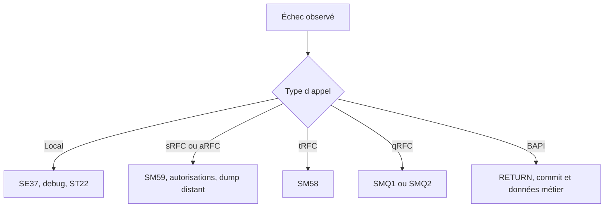

# 21. DIAGNOSTIC ET BONNES PRATIQUES

## 21.A RÉSULTAT ATTENDU

- Diagnostiquer un échec local, RFC ou BAPI
- Utiliser les transactions adaptées
- Vérifier le contrat avant de modifier le code
- Appliquer une checklist de conception et d’exploitation

## 21.B MÉTHODE DE DIAGNOSTIC



## 21.C QUESTIONS PRIORITAIRES

1. Le module appelé est-il le bon ?
2. L’interface active correspond-elle à l’appel ?
3. Les paramètres obligatoires sont-ils fournis ?
4. `sy-subrc` ou `RETURN` ont-ils été analysés immédiatement ?
5. La destination fonctionne-t-elle ?
6. L’utilisateur cible possède-t-il les autorisations ?
7. Un dump existe-t-il dans le système cible ?
8. Une unité tRFC ou qRFC est-elle bloquée ?
9. Le commit attendu a-t-il été exécuté ?
10. Le traitement est-il idempotent avant relance ?

## 21.D OUTILS

| Outil           | Usage                                                     |
| --------------- | --------------------------------------------------------- |
| `SE37`          | Interface, test et documentation                          |
| `SE80`          | Groupe de fonctions et dépendances                        |
| `SM59`          | Destinations et tests RFC                                 |
| `SM58`          | tRFC                                                      |
| `SMQ1` / `SMQ2` | qRFC sortant et entrant                                   |
| `SM13`          | Tâches de mise à jour                                     |
| `ST22`          | Dumps locaux ou distants                                  |
| `SU53`          | Dernier échec d’autorisation dans le contexte utilisateur |
| `STAUTHTRACE`   | Analyse d’autorisations selon les droits et procédures    |
| `SLG1`          | Journal applicatif lorsqu’il est utilisé                  |

## 21.E CHECKLIST DE CONCEPTION

- Le nom décrit l’action et le périmètre.
- Le groupe de fonctions est cohérent.
- L’interface est minimale et typée.
- Les paramètres facultatifs sont documentés.
- Les erreurs sont structurées.
- Aucun état global caché n’est nécessaire.
- Le module ne déclenche pas de commit imprévu.
- Le module RFC valide toutes les entrées externes.
- Les autorisations métier sont contrôlées.
- Les volumes et temps de réponse sont bornés.
- La compatibilité des consommateurs est prise en compte.

## 21.F CHECKLIST D APPEL

- Générer le modèle d’appel depuis l’interface active.
- Contrôler `sy-subrc` immédiatement.
- Intercepter `SYSTEM_FAILURE` et `COMMUNICATION_FAILURE` pour un RFC classique.
- Analyser toute la table `RETURN` d’une BAPI.
- Utiliser commit ou rollback selon le modèle documenté.
- Journaliser la clé métier et l’identifiant de corrélation.
- Ne pas relancer une unité asynchrone sans analyse d’idempotence.

## 21.G RÈGLE FINALE

Une fonction visible dans `SE37` n’est pas automatiquement une API stable. Une exécution réussie dans le système de développement ne prouve ni la sécurité, ni la compatibilité, ni la robustesse distribuée du scénario.

## 21.H PROCESS

### 21.H.1 Étape 1 — Classer le défaut

Distinguer recherche de module, erreur de signature, exception locale, destination, communication, autorisation, unité tRFC/qRFC, message BAPI ou transaction non validée.

### 21.H.2 Étape 2 — Tester au niveau le plus bas

Tester le module localement dans le système où il s’exécute. Si ce test échoue, corriger contrat ou données avant d’analyser RFC et réseau.

### 21.H.3 Étape 3 — Remonter les couches

Tester destination `SM59`, appel distant minimal, puis appel applicatif complet. À chaque couche, conserver entrées, utilisateur, système et message exact.

### 21.H.4 Étape 4 — Contrôler les moniteurs

Selon le modèle, examiner `SM13`, `SM58`, moniteurs qRFC, logs de job et `ST22`. Rechercher l’unité avec horodatage et identifiant de corrélation.

### 21.H.5 Étape 5 — Vérifier transaction et doublons

Avant toute reprise, rechercher l’objet métier. Corriger la première cause, relancer une seule unité puis contrôler commit ou rollback.

### 21.H.6 Étape 6 — Clôturer

Documenter cause, couche, correction et preuve. Le diagnostic est terminé lorsque le cas nominal réussit, le cas d’erreur est contrôlé et aucune unité ni donnée partielle ne reste.

## 21.I VÉRIFICATION

- Le lecteur peut expliquer la différence entre cette notion et les concepts proches.
- Le choix technique est justifié par un besoin concret, pas uniquement par habitude.
- Les limites liées à la release, aux autorisations et au contexte d’exécution sont identifiées.

## 21.J ERREURS FRÉQUENTES

- Appeler un module fonction sans lire sa documentation et ses exceptions.
- Supposer qu’une BAPI effectue automatiquement le commit.

## 21.K FICHE DE CONTRÔLE À COPIER

```text
Système / SID       :
Mandant             :
Utilisateur         :
Transaction / outil :
Objet technique     :
Jeu de données      :
Résultat attendu    :
Résultat observé    :
Horodatage          :
Ordre de transport  :
```

## 21.L TERMES DU LEXIQUE

- [Module fonction](<../🧩 00 ├── LEXIQUE SAP ET ABAP/06 ├── PROGRAMMES CLASSES ET OBJETS TECHNIQUES.md#module-fonction>)
- [Function group](<../🧩 00 ├── LEXIQUE SAP ET ABAP/06 ├── PROGRAMMES CLASSES ET OBJETS TECHNIQUES.md#function-group>)
- [RFC](<../🧩 00 ├── LEXIQUE SAP ET ABAP/10 └── ACRONYMES SAP.md#acro-rfc>)
- [BAPI](<../🧩 00 ├── LEXIQUE SAP ET ABAP/10 └── ACRONYMES SAP.md#acro-bapi>)
- [Destination RFC](<../🧩 00 ├── LEXIQUE SAP ET ABAP/07 ├── INTERFACES ET INTEGRATION.md#destination-rfc>)

## 21.M RÉFÉRENCES OFFICIELLES SAP

- [Looking Up Function Modules — SAP Help Portal](https://help.sap.com/docs/ABAP_PLATFORM_NEW/bd833c8355f34e96a6e83096b38bf192/d1801ec1454211d189710000e8322d00.html)
- [Calling RFC Function Modules in ABAP — SAP Help Portal](https://help.sap.com/docs/ABAP_PLATFORM_NEW/753088fc00704d0a80e7fbd6803c8adb/48a0f18641bc062de10000000a42189d.html)
- [Monitoring the Transactional RFC — SAP Help Portal](https://help.sap.com/docs/SAP_S4HANA_ON-PREMISE/8999cee59b7c44fdb53fbbb4d703f8e6/df6ad0531d8b4208e10000000a174cb4.html)
