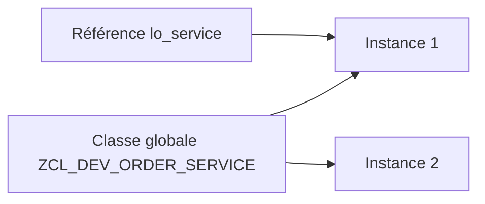

# PRINCIPES D’ABAP OBJECTS ET CLASSES GLOBALES

## RÉSULTAT ATTENDU

- Comprendre le rôle d’une classe globale dans un système ABAP.
- Distinguer classe, objet, référence et instance.
- Savoir quand créer une classe `ZCL_*` plutôt qu’un `FORM` ou un module fonction.
- Comprendre pourquoi les classes globales `SE24` constituent le fil conducteur de ce dossier.

## DÉFINITION

Une **classe** décrit un type d’objet : ses données, ses opérations et les règles qui maintiennent son état cohérent. Un **objet** est une instance concrète de cette classe. Une **référence** contient l’adresse logique permettant d’accéder à l’objet.

Une classe globale créée avec `SE24` est enregistrée dans le Repository ABAP. Elle peut être utilisée par les programmes du système, sous réserve de visibilité, de package et d’autorisations. Une classe locale, au contraire, n’est visible que dans son programme ou son Class Pool.



## POURQUOI UTILISER UNE CLASSE GLOBALE

Une classe globale est pertinente lorsque la logique doit être :

- réutilisée par plusieurs programmes ;
- encapsulée derrière une interface stable ;
- testée indépendamment de l’écran ou du report appelant ;
- transportée comme un objet Repository identifiable ;
- étendue sans dupliquer du code ;
- appelée depuis un report, un module fonction, une BAdI, un job ou un service.

## CAS D’USAGE

Un programme d’achat doit vérifier une quantité, lire les données article, calculer une date et produire un résultat. Si ces règles restent directement dans le report, elles deviennent difficiles à réutiliser et à tester. Une classe globale `ZCL_MM_PURCHASE_REQ_SERVICE` peut exposer une méthode `CREATE_REQUEST` et masquer les détails techniques.

## CHOISIR ENTRE LES PRINCIPAUX MÉCANISMES

| Besoin | Mécanisme généralement adapté |
|---|---|
| Logique métier réutilisable et testable | Classe globale |
| API distante ou interface historique | Module fonction RFC |
| Traitement local très court | Méthode privée ou classe locale |
| Extension du standard | BAdI ou enhancement appelant une classe globale |
| Simple orchestration d’un report | Report appelant des classes globales |

## COMMENT COMMENCER

1. Identifier une responsabilité unique : calcul, lecture, validation ou orchestration.
2. Choisir un nom de classe explicite, par exemple `ZCL_SD_PRICING_SERVICE`.
3. Définir l’API publique avant d’implémenter les détails.
4. Placer les données internes dans la section privée.
5. Créer un report de démonstration ou un test ABAP Unit.
6. Vérifier qu’un appelant n’a pas besoin de connaître l’implémentation interne.

## CODE À ADAPTER

```abap
" Construire les dépendances avant d’exécuter le traitement.
DATA(lo_service) = NEW zcl_dev_order_service( ).

TRY.
    DATA(ls_result) = lo_service->process(
      iv_order_id = p_order ).
  CATCH zcx_dev_order INTO DATA(lx_order).
    MESSAGE lx_order->get_text( ) TYPE 'E'.
ENDTRY.
```

> [!IMPORTANT]
> Le nom de classe, la méthode, le type de résultat et l’exception sont fictifs. Ils doivent être créés dans le namespace client.

## CONTRÔLE

Le chapitre est acquis lorsque le lecteur peut expliquer :

- pourquoi `lo_service` n’est pas l’objet lui-même mais une référence ;
- pourquoi une classe globale est réutilisable dans plusieurs programmes ;
- quelle responsabilité doit rester dans le report appelant.

## ERREURS FRÉQUENTES

- Créer une classe unique contenant toutes les règles du domaine.
- Exposer tous les attributs en `PUBLIC`.
- Utiliser une classe uniquement comme regroupement de méthodes statiques sans état ni abstraction.
- Mélanger accès aux données, dialogue utilisateur et calcul métier dans la même méthode.

## COMPATIBILITÉ S/4HANA

- Statut : compatible avec le développement ABAP classique sur SAP S/4HANA.
- Vérifier la syntaxe exacte avec l’aide `F1` du système cible lorsque plusieurs versions d’ABAP Platform sont prises en charge.
- Les objets globaux doivent être créés dans le package et l’ordre de transport du projet.

## RÉFÉRENCES OFFICIELLES SAP

- [ABAP Objects — ABAP Keyword Documentation](https://help.sap.com/doc/abapdocu_latest_index_htm/latest/en-US/ABENABAP_OBJECTS.html)
- [Classes — SAP Help Portal](https://help.sap.com/docs/PRODUCT_ID/10a002cd6c531014b5e1cb16d2455072/c3225b5c54f411d194a60000e8353423.html)
- [Class Builder — SAP Help Portal](https://help.sap.com/docs/ABAP_PLATFORM_BW4HANA/a602ff71a47c441bb3000504ec938fea/cac035baa6c611d1b4790000e8a52bed.html)

---

[Chapitre suivant — ANALYSER UNE CLASSE GLOBALE AVEC SE24](<./02 ├── ANALYSER UNE CLASSE GLOBALE AVEC SE24.md>)
