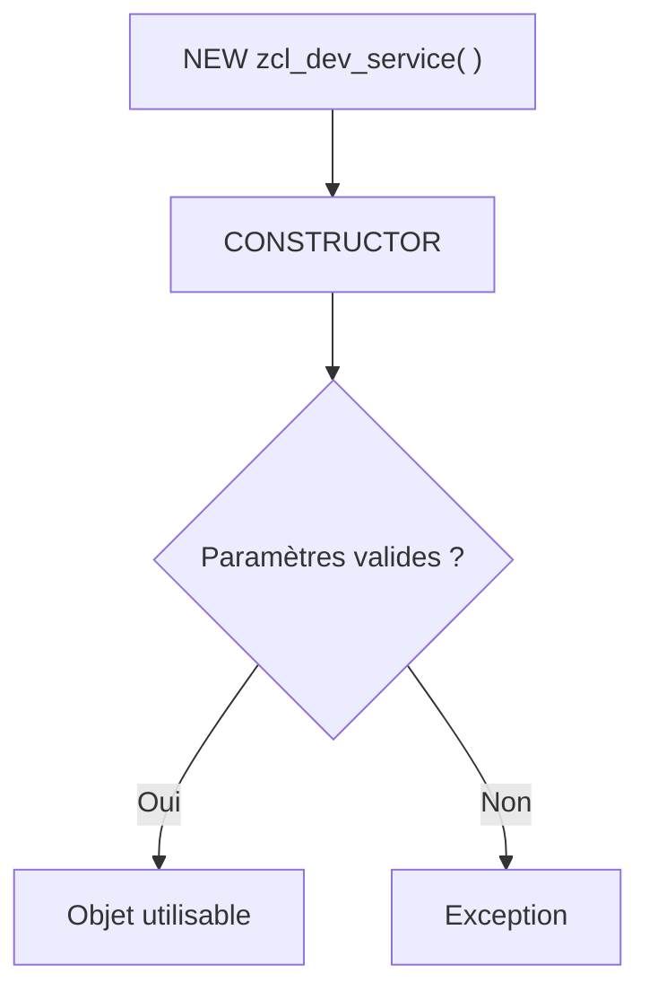

# 8. CONSTRUCTEURS ET INITIALISATION

## 8.A RÉSULTAT ATTENDU

- Utiliser le constructeur d’instance `CONSTRUCTOR`.
- Comprendre le constructeur de classe `CLASS_CONSTRUCTOR`.
- Garantir qu’un objet est valide immédiatement après sa création.

## 8.B CONSTRUCTEUR D’INSTANCE

Le constructeur d’instance s’exécute lors de `NEW` ou `CREATE OBJECT`. Il doit initialiser les dépendances et vérifier les invariants nécessaires.



## 8.C PROCESS

### 8.C.1 Étape 1 — Définir l’état valide minimal

Lister les dépendances et valeurs sans lesquelles l’objet ne peut pas fonctionner. Ces données doivent être fournies au constructeur plutôt que complétées par un setter après création.

### 8.C.2 Étape 2 — Définir la signature du constructeur

Dans `SE24`, ouvrir `CONSTRUCTOR`. Ajouter chaque dépendance obligatoire en `IMPORTING` avec son type d’interface ou DDIC, puis déclarer les exceptions autorisées par la signature du constructeur sur la release cible.

### 8.C.3 Étape 3 — Valider avant affectation

Dans l’implémentation, vérifier références liées, plages et cohérence. Lever l’exception avant de rendre une instance partiellement initialisée.

### 8.C.4 Étape 4 — Affecter l’état privé

Copier les paramètres validés vers les attributs privés. Éviter les appels externes ou commits dans le constructeur ; déplacer les traitements lourds vers une méthode ou une factory.

### 8.C.5 Étape 5 — Tester la création

Créer une instance valide avec `NEW`, appeler une méthode qui utilise l’état, puis tenter une création invalide et intercepter l’exception. Le constructeur est validé lorsque toute instance obtenue est immédiatement utilisable.

## 8.D CODE À ADAPTER

Signature du constructeur à créer dans `SE24` :

```abap
METHODS constructor
  IMPORTING
    io_repository   TYPE REF TO zif_dev_repository
    iv_company_code TYPE bukrs
  RAISING
    zcx_dev_configuration.
```

```abap
" Définir le contrat et limiter l’API publique au besoin réel.
METHOD constructor.
  IF io_repository IS NOT BOUND.
    RAISE EXCEPTION TYPE zcx_dev_configuration
      EXPORTING
        textid = zcx_dev_configuration=>missing_repository.
  ENDIF.

  mo_repository = io_repository.
  mv_company_code = iv_company_code.
ENDMETHOD.
```

## 8.E CONSTRUCTEUR DE CLASSE

`CLASS_CONSTRUCTOR` s’exécute automatiquement avant le premier accès à un composant statique de la classe. Il ne possède pas de paramètres. Il doit rester court et ne pas provoquer d’effets de bord difficiles à anticiper.

Déclaration dans la section privée :

```abap
CLASS-METHODS class_constructor.
```

```abap
" Définir le contrat et limiter l’API publique au besoin réel.
METHOD class_constructor.
  gv_default_timeout = 30.
ENDMETHOD.
```

## 8.F CAS D’USAGE

Une classe de service dépend d’un repository. Sans ce repository, aucune méthode ne peut fonctionner correctement. Le constructeur impose la dépendance et empêche la création d’un objet partiellement initialisé.

## 8.G CONTRÔLE

- Une référence non liée provoque l’exception attendue.
- Après création, toutes les méthodes publiques peuvent supposer l’invariant respecté.
- Le constructeur ne contient pas de `COMMIT WORK` ni de dialogue utilisateur.

## 8.H ERREURS FRÉQUENTES

- Faire des lectures massives ou des mises à jour en base dans le constructeur.
- Accepter des paramètres invalides puis reporter l’erreur à une méthode ultérieure.
- Utiliser `CLASS_CONSTRUCTOR` pour initialiser des données dépendantes du contexte sans possibilité de réinitialisation.

## 8.I COMPATIBILITÉ S/4HANA

- Statut : compatible avec le développement ABAP classique sur SAP S/4HANA.
- Vérifier la syntaxe exacte avec l’aide `F1` du système cible lorsque plusieurs versions d’ABAP Platform sont prises en charge.
- Les objets globaux doivent être créés dans le package et l’ordre de transport du projet.

## 8.J RÉFÉRENCES OFFICIELLES SAP

- [Instance Constructor — ABAP Keyword Documentation](https://help.sap.com/doc/abapdocu_latest_index_htm/latest/en-US/ABENINSTANCE_CONSTRUCTOR_GUIDL.html)
- [Classes — SAP Help Portal](https://help.sap.com/docs/PRODUCT_ID/10a002cd6c531014b5e1cb16d2455072/c3225b5c54f411d194a60000e8353423.html)

---

[Chapitre suivant — RÉFÉRENCES D’OBJET ET CYCLE DE VIE](<./09 ├── REFERENCES D OBJET ET CYCLE DE VIE.md>)
