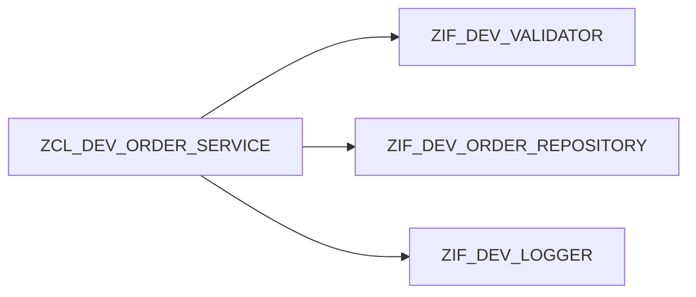

# COMPOS" Définir le contrat et limiter l’API publique au besoin réel.
ITION ET DÉLÉGATION

## RÉSULTAT ATTENDU

- Construire une classe à partir de collaborateurs.
- Déléguer une responsabilité au bon objet.
- Préférer la composition à l’héritage lorsque la relation est « utilise » plutôt que « est un ».

## CAS D’USAGE

Une classe de création de commande utilise un validateur, un repository et un journal. Elle n’est ni un validateur ni un repository : elle les compose.



## PROCÉDURE DE CONCEPTION

1. Identifier chaque responsabilité indépendante.
2. Définir une interface pour les collaborations variables ou testables.
3. Ajouter des attributs privés de type référence d’interface.
4. Recevoir les dépendances dans le constructeur.
5. Déléguer le traitement à chaque collaborateur.
6. Garder dans la classe principale uniquement l’orchestration métier.

## CODE À ADAPTER

```abap
" Définir le contrat et limiter l’API publique au besoin réel.
METHOD constructor.
  mo_validator  = io_validator.
  mo_repository = io_repository.
  mo_logger     = io_logger.
ENDMETHOD.

METHOD create_order.
  mo_validator->validate( is_order ).
  DATA(lv_id) = mo_repository->save( is_order ).
  mo_logger->info( |Commande { lv_id } créée| ).
  rv_order_id = lv_id.
ENDMETHOD.
```

## DÉLÉGATION

La méthode publique peut déléguer une partie de son travail sans exposer le collaborateur :

```abap
" Définir le contrat et limiter l’API publique au besoin réel.
METHOD is_valid.
  rv_valid = mo_validator->is_valid( is_order ).
ENDMETHOD.
```

## CONTRÔLE

- La classe principale ne connaît pas les détails de persistance.
- Chaque collaborateur peut être testé séparément.
- Remplacer le logger ne modifie pas la règle de création.
- Aucune sous-classe n’est créée uniquement pour changer une dépendance.

## ERREURS FRÉQUENTES

- Créer un objet collaborateur directement dans chaque méthode.
- Exposer les dépendances comme attributs publics.
- Introduire trop de petites interfaces sans responsabilité réelle.

## COMPATIBILITÉ S/4HANA

- Statut : compatible avec le développement ABAP classique sur SAP S/4HANA.
- Vérifier la syntaxe exacte avec l’aide `F1` du système cible lorsque plusieurs versions d’ABAP Platform sont prises en charge.
- Les objets globaux doivent être créés dans le package et l’ordre de transport du projet.

## RÉFÉRENCES OFFICIELLES SAP

- [ABAP Objects — ABAP Keyword Documentation](https://help.sap.com/doc/abapdocu_latest_index_htm/latest/en-US/ABENABAP_OBJECTS.html)
- [Defining Interfaces — SAP Learning](https://learning.sap.com/courses/deepening-your-abap-programming-knowledge/defining-interfaces_ab3c7c07-bb66-424b-ba06-6cfa7cc39439)

---

[Chapitre suivant — INJECTION DE DÉPENDANCES](<./20 ├── INJECTION DE DEPENDANCES.md>)
