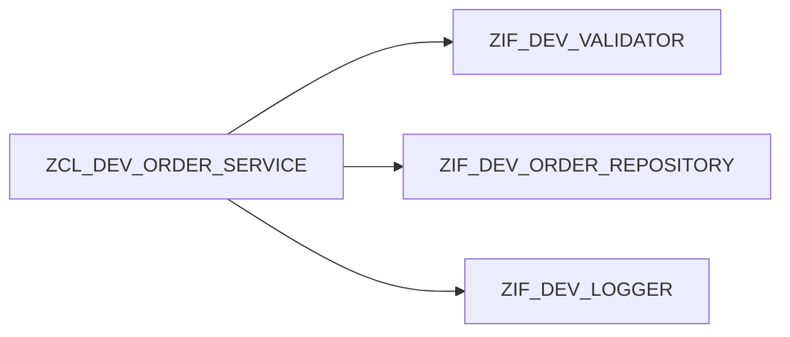

# COMPOS" Définir le contrat et limiter l’API publique au besoin réel.

ITION ET DÉLÉGATION

## RÉSULTAT ATTENDU

- Construire une classe à partir de collaborateurs.
- Déléguer une responsabilité au bon objet.
- Préférer la composition à l’héritage lorsque la relation est « utilise » plutôt que « est un ».

## CAS D’USAGE

Une classe de création de commande utilise un validateur, un repository et un journal. Elle n’est ni un validateur ni un repository : elle les compose.



## PROCESS

### Étape 1 — Séparer les responsabilités

Lister les actions de la classe et identifier celles appartenant à un service indépendant. Nommer chaque collaborateur par son rôle, pas par une étape technique.

### Étape 2 — Définir les contrats

Créer une interface pour chaque collaboration variable ou testable. Vérifier que sa signature ne dépend pas de l’orchestrateur.

### Étape 3 — Injecter les composants

Ajouter des références d’interface privées et les recevoir dans le constructeur. Refuser une référence non liée avant d’affecter l’état.

### Étape 4 — Déléguer

Dans la méthode métier, appeler chaque collaborateur et conserver uniquement séquence, décisions globales et gestion cohérente des erreurs.

### Étape 5 — Tester indépendamment

Injecter des doubles enregistrant les appels. Vérifier ordre, paramètres et arrêt après erreur. La composition est validée lorsque chaque responsabilité peut évoluer sans modifier les autres contrats.

## CODE À ADAPTER

Signatures publiques de la classe d’orchestration :

```abap
METHODS constructor
  IMPORTING
    io_validator  TYPE REF TO zif_dev_validator
    io_repository TYPE REF TO zif_dev_order_repository
    io_logger     TYPE REF TO zif_dev_logger.

METHODS create_order
  IMPORTING is_order TYPE zdev_order
  RETURNING VALUE(rv_order_id) TYPE zdev_order_id
  RAISING   zcx_dev_invalid_order.

METHODS is_valid
  IMPORTING is_order TYPE zdev_order
  RETURNING VALUE(rv_valid) TYPE abap_bool.
```

```abap
" Définir le contrat et limiter l’API publique au besoin réel.
METHOD constructor.
  mo_validator  = io_validator.
  mo_repository = io_repository.
  mo_logger     = io_logger.
ENDMETHOD.

METHOD create_order.
  mo_validator->validate( is_order ).
  DATA(lv_id) = mo_repository->save( is_order ).
  mo_logger->info( |Commande { lv_id } créée| ).
  rv_order_id = lv_id.
ENDMETHOD.
```

## DÉLÉGATION

La méthode publique peut déléguer une partie de son travail sans exposer le collaborateur :

```abap
" Définir le contrat et limiter l’API publique au besoin réel.
METHOD is_valid.
  rv_valid = mo_validator->is_valid( is_order ).
ENDMETHOD.
```

## CONTRÔLE

- La classe principale ne connaît pas les détails de persistance.
- Chaque collaborateur peut être testé séparément.
- Remplacer le logger ne modifie pas la règle de création.
- Aucune sous-classe n’est créée uniquement pour changer une dépendance.

## ERREURS FRÉQUENTES

- Créer un objet collaborateur directement dans chaque méthode.
- Exposer les dépendances comme attributs publics.
- Introduire trop de petites interfaces sans responsabilité réelle.

## COMPATIBILITÉ S/4HANA

- Statut : compatible avec le développement ABAP classique sur SAP S/4HANA.
- Vérifier la syntaxe exacte avec l’aide `F1` du système cible lorsque plusieurs versions d’ABAP Platform sont prises en charge.
- Les objets globaux doivent être créés dans le package et l’ordre de transport du projet.

## RÉFÉRENCES OFFICIELLES SAP

- [ABAP Objects — ABAP Keyword Documentation](https://help.sap.com/doc/abapdocu_latest_index_htm/latest/en-US/ABENABAP_OBJECTS.html)
- [Defining Interfaces — SAP Learning](https://learning.sap.com/courses/deepening-your-abap-programming-knowledge/defining-interfaces_ab3c7c07-bb66-424b-ba06-6cfa7cc39439)

---

[Chapitre suivant — INJECTION DE DÉPENDANCES](<./20 ├── INJECTION DE DEPENDANCES.md>)
