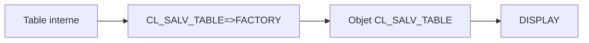

# 3. PREMIER ALV AVEC CL_SALV_TABLE

## 3.A RÉSULTAT ATTENDU

- Afficher une table interne avec SALV
- Comprendre le rôle de `FACTORY` et `DISPLAY`
- Gérer l’exception de création

## 3.B EXEMPLE COMPLET

```abap
REPORT zdev_salv_basic.

TYPES:
  BEGIN OF ty_flight,
    carrid   TYPE sflight-carrid,
    connid   TYPE sflight-connid,
    fldate   TYPE sflight-fldate,
    price    TYPE sflight-price,
    currency TYPE sflight-currency,
  END OF ty_flight.

DATA:
  gt_flights TYPE STANDARD TABLE OF ty_flight,
  go_alv     TYPE REF TO cl_salv_table.

START-OF-SELECTION.
  SELECT carrid connid fldate price currency
    FROM sflight
    INTO TABLE gt_flights
    UP TO 100 ROWS.

  TRY.
      cl_salv_table=>factory(
        IMPORTING
          r_salv_table = go_alv
        CHANGING
          t_table      = gt_flights ).

      go_alv->display( ).

    CATCH cx_salv_msg INTO DATA(lx_salv).
      MESSAGE lx_salv->get_text( ) TYPE 'E'.
  ENDTRY.
```

## 3.C MÉCANISME

`CL_SALV_TABLE=>FACTORY` analyse la structure de la table interne et crée les objets nécessaires à l’affichage. `DISPLAY` déclenche ensuite la présentation.



## 3.D POINTS DE CONTRÔLE

- La table de sortie doit avoir une structure exploitable par l’ALV.
- Utiliser une structure plate pour les affichages standards.
- Sélectionner uniquement les colonnes nécessaires.
- Traiter `CX_SALV_MSG`.
- Configurer l’ALV avant l’appel de `DISPLAY`.

## 3.E TABLE VIDE

Un SALV peut afficher une table vide. Le programme peut toutefois arrêter le traitement avant l’affichage lorsque l’absence de données constitue un résultat métier particulier.

```abap
IF gt_flights IS INITIAL.
  MESSAGE 'Aucune donnée trouvée' TYPE 'S' DISPLAY LIKE 'I'.
  RETURN.
ENDIF.
```

## 3.F PROCESS

### 3.F.1 Étape 1 — Définir une table de sortie stable

Créer un type de ligne contenant uniquement les colonnes à afficher. Charger un volume borné et ordonné ; l’ALV ne doit pas compenser une sélection base de données non maîtrisée.

### 3.F.2 Étape 2 — Créer l’instance SALV

Déclarer une référence `CL_SALV_TABLE`, puis appeler `CL_SALV_TABLE=>FACTORY` en transmettant la table de sortie dans `CHANGING T_TABLE`. Conserver cette table disponible pendant tout l’affichage.

### 3.F.3 Étape 3 — Configurer l’affichage avant `DISPLAY`

Récupérer les objets de configuration nécessaires : fonctions, colonnes, tris, agrégations, sélection et layout. Appliquer toutes les options avant le premier affichage.

### 3.F.4 Étape 4 — Afficher et traiter l’exception SALV

Appeler `DISPLAY` dans le même bloc `TRY`. Intercepter au minimum `CX_SALV_MSG` et retourner un message contrôlé au lieu de masquer l’erreur.

### 3.F.5 Étape 5 — Tester les volumes limites

Vérifier une table vide, une ligne, plusieurs lignes et le volume maximal prévu. Contrôler les libellés, les conversions DDIC et le temps de réponse.

## 3.G VÉRIFICATION

- Le contrôle syntaxique réussit.
- La version active correspond au code sauvegardé.
- L’exécution produit le résultat décrit dans le chapitre.
- Les cas vide, limite et erreur sont testés séparément lorsque la syntaxe le permet.

## 3.H ERREURS FRÉQUENTES

- Copier un exemple sans adapter les types, noms d’objets et données disponibles dans le système.
- Tester uniquement le cas nominal et ignorer les valeurs initiales, absentes ou invalides.
- Afficher un volume non borné dans l’ALV.
- Rendre une cellule éditable sans validation ni sauvegarde transactionnelle.

## 3.I SNIPPET À RÉUTILISER

> [!NOTE]
> Adapter les noms `Z*`, les types DDIC, les données et les autorisations au système cible. Effectuer un contrôle syntaxique avant activation.

```abap
REPORT zdev_salv_basic.

TYPES:
  BEGIN OF ty_flight,
    carrid   TYPE sflight-carrid,
    connid   TYPE sflight-connid,
    fldate   TYPE sflight-fldate,
    price    TYPE sflight-price,
    currency TYPE sflight-currency,
  END OF ty_flight.

DATA:
  gt_flights TYPE STANDARD TABLE OF ty_flight,
  go_alv     TYPE REF TO cl_salv_table.

START-OF-SELECTION.
  SELECT carrid connid fldate price currency
    FROM sflight
    INTO TABLE gt_flights
    UP TO 100 ROWS.

  TRY.
      cl_salv_table=>factory(
        IMPORTING
          r_salv_table = go_alv
        CHANGING
          t_table      = gt_flights ).

      go_alv->display( ).

    CATCH cx_salv_msg INTO DATA(lx_salv).
      MESSAGE lx_salv->get_text( ) TYPE 'E'.
  ENDTRY.
```

## 3.J TERMES DU LEXIQUE

- [SALV](<../🧩 00 ├── LEXIQUE SAP ET ABAP/10 └── ACRONYMES SAP.md#acro-salv>)
- [ALV](<../🧩 00 ├── LEXIQUE SAP ET ABAP/10 └── ACRONYMES SAP.md#acro-alv>)
- [Table interne](<../🧩 00 ├── LEXIQUE SAP ET ABAP/04 ├── LANGAGE ET DEVELOPPEMENT ABAP.md#table-interne>)

## 3.K MODÈLE DE DÉMONSTRATION SFLIGHT

> [!NOTE]
> Les tables `SCARR`, `SPFLI` et `SFLIGHT` appartiennent au modèle de démonstration SAP et peuvent être absentes ou non alimentées dans certains systèmes. Dans ce cas, remplacer les exemples par une table Z de démonstration ou par une source en lecture seule autorisée, sans modifier une table applicative standard.

## 3.L RÉFÉRENCES OFFICIELLES SAP

- [Main ALV Classes — SAP Help Portal](https://help.sap.com/docs/ABAP_PLATFORM_NEW/b1c834a22d05483b8a75710743b5ff26/4ec1f117076868b8e10000000a42189e.html)
- [Object-Oriented ALV Guide — SAP Help Portal](https://help.sap.com/docs/SUPPORT_CONTENT/abap/3353523914.html)

---

[Chapitre suivant — FONCTIONS STANDARD DU SALV](<./04 ├── FONCTIONS STANDARD DU SALV.md>)
