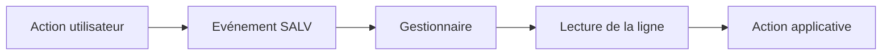

# ÉVÉNEMENTS ET INTERACTIONS SALV

## RÉSULTAT ATTENDU

- Déclarer une classe gestionnaire
- Réagir au double-clic et aux liens
- Retrouver la ligne sélectionnée de manière sûre

## CLASSE GESTIONNAIRE

```abap
CLASS lcl_events DEFINITION FINAL.
  PUBLIC SECTION.
    CLASS-METHODS on_double_click
      FOR EVENT double_click OF cl_salv_events_table
      IMPORTING row column.
ENDCLASS.

CLASS lcl_events IMPLEMENTATION.
  METHOD on_double_click.
    READ TABLE gt_flights INDEX row INTO DATA(ls_flight).
    IF sy-subrc = 0.
      MESSAGE |{ column }: { ls_flight-carrid }| TYPE 'S'.
    ENDIF.
  ENDMETHOD.
ENDCLASS.
```

## ENREGISTRER LE GESTIONNAIRE

```abap
DATA lo_events TYPE REF TO cl_salv_events_table.

lo_events = go_alv->get_event( ).
SET HANDLER lcl_events=>on_double_click FOR lo_events.
```

## LIENS ET CELLULES INTERACTIVES

Une colonne configurée comme hotspot ou lien déclenche l’événement `LINK_CLICK`. Le gestionnaire reçoit la ligne et la colonne concernées.

## PRÉCAUTIONS

- Vérifier que l’index reçu existe encore dans la table affichée.
- Ne pas exécuter une mise à jour métier sur un simple double-clic sans confirmation.
- Contrôler les autorisations avant d’ouvrir une transaction ou un objet.
- Éviter les sélections SQL répétées pour chaque clic lorsque les données peuvent être préparées en amont.

## FLUX



## VÉRIFICATION

- Le contrôle syntaxique réussit.
- La version active correspond au code sauvegardé.
- L’exécution produit le résultat décrit dans le chapitre.
- Les cas vide, limite et erreur sont testés séparément lorsque la syntaxe le permet.

## ERREURS FRÉQUENTES

- Copier un exemple sans adapter les types, noms d’objets et données disponibles dans le système.
- Tester uniquement le cas nominal et ignorer les valeurs initiales, absentes ou invalides.
- Afficher un volume non borné dans l’ALV.
- Rendre une cellule éditable sans validation ni sauvegarde transactionnelle.

## SNIPPET À RÉUTILISER

> [!NOTE]
> Adapter les noms `Z*`, les types DDIC, les données et les autorisations au système cible. Effectuer un contrôle syntaxique avant activation.

```abap
CLASS lcl_events DEFINITION FINAL.
  PUBLIC SECTION.
    CLASS-METHODS on_double_click
      FOR EVENT double_click OF cl_salv_events_table
      IMPORTING row column.
ENDCLASS.

CLASS lcl_events IMPLEMENTATION.
  METHOD on_double_click.
    READ TABLE gt_flights INDEX row INTO DATA(ls_flight).
    IF sy-subrc = 0.
      MESSAGE |{ column }: { ls_flight-carrid }| TYPE 'S'.
    ENDIF.
  ENDMETHOD.
ENDCLASS.
```

## TERMES DU LEXIQUE

- [SALV](<../🧩 00 ├── LEXIQUE SAP ET ABAP/10 └── ACRONYMES SAP.md#acro-salv>)
- [ALV](<../🧩 00 ├── LEXIQUE SAP ET ABAP/10 └── ACRONYMES SAP.md#acro-alv>)
- [Table interne](<../🧩 00 ├── LEXIQUE SAP ET ABAP/04 ├── LANGAGE ET DEVELOPPEMENT ABAP.md#table-interne>)

## RÉFÉRENCES OFFICIELLES SAP

- [Handling Single and Double Clicks — SAP Help Portal](https://help.sap.com/docs/ABAP_PLATFORM_NEW/b1c834a22d05483b8a75710743b5ff26/4ebc7038f39c68bbe10000000a42189e.html)
- [Displaying Interactive Elements — SAP Help Portal](https://help.sap.com/docs/ABAP_PLATFORM_NEW/b1c834a22d05483b8a75710743b5ff26/4ec1afd0087c2b91e10000000a42189d.html)


---

[Chapitre suivant — SALV EN PLEIN ÉCRAN, CONTENEUR ET FENÊTRE](<./09 ├── SALV EN PLEIN ECRAN CONTENEUR ET FENETRE.md>)
