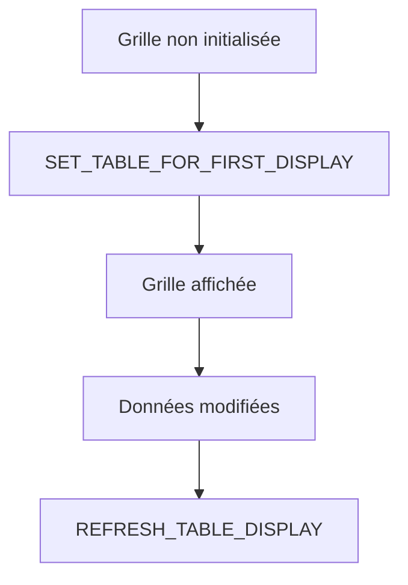

# 14. PREMIER AFFICHAGE AVEC SET_TABLE_FOR_FIRST_DISPLAY

## 14.A RÉSULTAT ATTENDU

- Appeler correctement la méthode d’affichage initial
- Distinguer premier affichage et rafraîchissement
- Traiter les erreurs du Control Framework

## 14.B APPEL COMPLET

```abap
FORM display_grid.
  DATA ls_variant TYPE disvariant.

  ls_variant-report = sy-repid.

  go_grid->set_table_for_first_display(
    EXPORTING
      is_variant      = ls_variant
      i_save          = 'A'
      is_layout       = gs_layout
    CHANGING
      it_outtab       = gt_output
      it_fieldcatalog = gt_fieldcat
    EXCEPTIONS
      invalid_parameter_combination = 1
      program_error                 = 2
      too_many_lines                = 3
      OTHERS                        = 4 ).

  IF sy-subrc <> 0.
    MESSAGE 'Impossible d afficher l ALV' TYPE 'E'.
  ENDIF.
ENDFORM.
```

## 14.C STRUCTURE DDIC OU CATALOGUE

Deux modèles principaux :

```abap
" Structure DDIC
EXPORTING i_structure_name = 'ZDEV_S_ALV_OUTPUT'
```

ou :

```abap
" Catalogue explicite
CHANGING it_fieldcatalog = gt_fieldcat
```

Éviter de mélanger des définitions contradictoires.

## 14.D PREMIER AFFICHAGE

`SET_TABLE_FOR_FIRST_DISPLAY` doit être appelé pour initialiser le contrôle. Pour les modifications ultérieures de données, utiliser `REFRESH_TABLE_DISPLAY`.



## 14.E PROCESS

### 14.E.1 Étape 1 — Créer le conteneur et la grille une seule fois

Dans le PBO, tester si les références sont initiales. Instancier `CL_GUI_CUSTOM_CONTAINER`, puis `CL_GUI_ALV_GRID` uniquement lors du premier passage.

### 14.E.2 Étape 2 — Préparer la table de sortie

Charger la table avant l’appel. Sa référence et sa structure doivent rester valides pendant toute la durée de vie de la grille.

### 14.E.3 Étape 3 — Préparer les métadonnées

Choisir une structure DDIC ou construire le catalogue de champs. Préparer aussi le layout, la variante et les fonctions à exclure avant le premier affichage.

### 14.E.4 Étape 4 — Appeler `SET_TABLE_FOR_FIRST_DISPLAY`

Transmettre la table avec `IT_OUTTAB` et les métadonnées correspondantes. Traiter les exceptions déclarées par la méthode et ne pas poursuivre avec une grille partiellement initialisée.

### 14.E.5 Étape 5 — Utiliser le rafraîchissement aux passages suivants

Après modification des données, appeler `REFRESH_TABLE_DISPLAY`. Ne pas rappeler `SET_TABLE_FOR_FIRST_DISPLAY` à chaque PBO, car cela réinitialise inutilement l’état de la grille.

### 14.E.6 Étape 6 — Tester le cycle dynpro

Vérifier le premier affichage, un retour PBO, un rafraîchissement, la navigation arrière et la fermeture. Contrôler que la barre d’outils et les événements ne sont pas enregistrés plusieurs fois.

## 14.F VÉRIFICATION

- Le contrôle syntaxique réussit.
- La version active correspond au code sauvegardé.
- L’exécution produit le résultat décrit dans le chapitre.
- Les cas vide, limite et erreur sont testés séparément lorsque la syntaxe le permet.

## 14.G ERREURS FRÉQUENTES

- Copier un exemple sans adapter les types, noms d’objets et données disponibles dans le système.
- Tester uniquement le cas nominal et ignorer les valeurs initiales, absentes ou invalides.
- Afficher un volume non borné dans l’ALV.
- Rendre une cellule éditable sans validation ni sauvegarde transactionnelle.

## 14.H SNIPPET À RÉUTILISER

> [!NOTE]
> Adapter les noms `Z*`, les types DDIC, les données et les autorisations au système cible. Effectuer un contrôle syntaxique avant activation.

```abap
FORM display_grid.
  DATA ls_variant TYPE disvariant.

  ls_variant-report = sy-repid.

  go_grid->set_table_for_first_display(
    EXPORTING
      is_variant      = ls_variant
      i_save          = 'A'
      is_layout       = gs_layout
    CHANGING
      it_outtab       = gt_output
      it_fieldcatalog = gt_fieldcat
    EXCEPTIONS
      invalid_parameter_combination = 1
      program_error                 = 2
      too_many_lines                = 3
      OTHERS                        = 4 ).

  IF sy-subrc <> 0.
    MESSAGE 'Impossible d afficher l ALV' TYPE 'E'.
  ENDIF.
ENDFORM.
```

## 14.I TERMES DU LEXIQUE

- [ALV](<../🧩 00 ├── LEXIQUE SAP ET ABAP/10 └── ACRONYMES SAP.md#acro-alv>)
- [SALV](<../🧩 00 ├── LEXIQUE SAP ET ABAP/10 └── ACRONYMES SAP.md#acro-salv>)
- [Table interne](<../🧩 00 ├── LEXIQUE SAP ET ABAP/04 ├── LANGAGE ET DEVELOPPEMENT ABAP.md#table-interne>)

## 14.J RÉFÉRENCES OFFICIELLES SAP

- [Methods of Class CL_GUI_ALV_GRID — SAP Help Portal](https://help.sap.com/docs/ABAP_PLATFORM_NEW/70396d7dec4c4f19b9ca3b2e47559d12/22a3f5ecd2fe11d2b467006094192fe3.html)
- [Getting Started with ALV Grid Control — SAP Help Portal](https://help.sap.com/docs/ABAP_PLATFORM_NEW/70396d7dec4c4f19b9ca3b2e47559d12/4eba23f5250f568be10000000a421937.html)

---

[Chapitre suivant — ÉVÉNEMENTS ET CLASSE RÉCEPTRICE](<./15 ├── EVENEMENTS ET CLASSE RECEPTRICE.md>)
