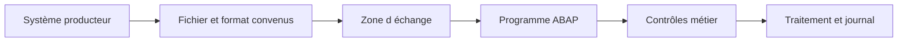

# PRINCIPES DES INTERFACES FICHIERS

## RÉSULTAT ATTENDU

- Identifier le rôle d’une interface fichier
- Distinguer transport, format et traitement métier
- Structurer un échange robuste et exploitable
- Délimiter le périmètre par rapport aux RFC et BAPI

## DÉFINITION

Une **interface fichier** échange des données au moyen d’un fichier déposé ou récupéré dans un emplacement convenu. Le fichier constitue un contrat entre un producteur et un consommateur.

Une interface ne se limite pas à lire ou écrire des octets. Elle doit définir :

- le propriétaire du fichier ;
- l’emplacement de dépôt ;
- le nommage ;
- le format et l’encodage ;
- la fréquence ;
- les contrôles ;
- la gestion des doublons ;
- la stratégie de reprise ;
- la conservation et l’archivage.

## COUCHES À SÉPARER

| Couche               | Responsabilité                                 |
| -------------------- | ---------------------------------------------- |
| Transport            | Dépôt, accès, déplacement ou téléchargement    |
| Sérialisation        | CSV, largeur fixe, XML, JSON ou binaire        |
| Validation technique | Structure, types, nombre de colonnes, encodage |
| Validation métier    | Existence et cohérence des données SAP         |
| Traitement           | Création ou modification via API métier        |
| Traçabilité          | Logs, statuts, compteurs et erreurs            |

## PÉRIMÈTRE

Ce dossier traite les fichiers du serveur d’application et du poste utilisateur dans SAP GUI. Les RFC, BAPI et appels distants sont traités dans le dossier précédent. Les IDoc, services web et technologies d’intégration pourront faire l’objet de dossiers dédiés.

## RÈGLE DIRECTRICE

Le programme doit pouvoir expliquer précisément :

1. quel fichier a été traité ;
2. avec quel format ;
3. quelles lignes ont été acceptées ou rejetées ;
4. quelles opérations SAP ont été exécutées ;
5. comment reprendre sans créer de doublons.

## PROCÉDURE PAS À PAS

1. Lire la définition et identifier les prérequis du chapitre.
2. Choisir un objet Z ou un scénario de démonstration sans impact métier.
3. Reproduire l’exemple dans un système de développement et relever les données d’entrée.
4. Contrôler la syntaxe ou la configuration avant activation/exécution.
5. Comparer le résultat observé avec la section **Vérification**.
6. Documenter toute différence liée à la release, aux autorisations ou au paramétrage du système.

## VÉRIFICATION

- Le fichier est créé ou lu dans l’emplacement attendu.
- Le nombre de lignes, la taille et l’encodage correspondent au contrat.
- Les caractères accentués, séparateurs, guillemets et fins de ligne sont testés.
- Le traitement journalise les rejets et permet une reprise sans doublon.

## ERREURS FRÉQUENTES

- Mélanger fichiers frontend et serveur dans un même scénario.
- Parser un CSV par simple séparation alors que les champs peuvent être échappés.

## TERMES DU LEXIQUE

- [Interface](<../🧩 00 ├── LEXIQUE SAP ET ABAP/07 ├── INTERFACES ET INTEGRATION.md#interface-integration>)
- [Flux entrant](<../🧩 00 ├── LEXIQUE SAP ET ABAP/07 ├── INTERFACES ET INTEGRATION.md#flux-entrant>)
- [Flux sortant](<../🧩 00 ├── LEXIQUE SAP ET ABAP/07 ├── INTERFACES ET INTEGRATION.md#flux-sortant>)
- [CSV](<../🧩 00 ├── LEXIQUE SAP ET ABAP/07 ├── INTERFACES ET INTEGRATION.md#csv>)
- [Encodage](<../🧩 00 ├── LEXIQUE SAP ET ABAP/07 ├── INTERFACES ET INTEGRATION.md#encodage>)
- [Serveur d’application](<../🧩 00 ├── LEXIQUE SAP ET ABAP/07 ├── INTERFACES ET INTEGRATION.md#fichier-serveur-application>)

## RÉFÉRENCES OFFICIELLES SAP

- [ABAP File Interface — SAP Help Portal](https://help.sap.com/docs/ABAP_PLATFORM_NEW/7bfe8cdcfbb040dcb6702dada8c3e2f0/fa2fd3be291f469f862c4c8215e0549b.html)
- [Physical and Logical File Names — SAP Help Portal](https://help.sap.com/docs/ABAP_PLATFORM_NEW/7bfe8cdcfbb040dcb6702dada8c3e2f0/9e49819d5b2a440fb508772494b9a473.html)

---

[Chapitre suivant — SERVEUR D’APPLICATION OU POSTE UTILISATEUR](<./02 ├── SERVEUR D APPLICATION OU POSTE UTILISATEUR.md>)
