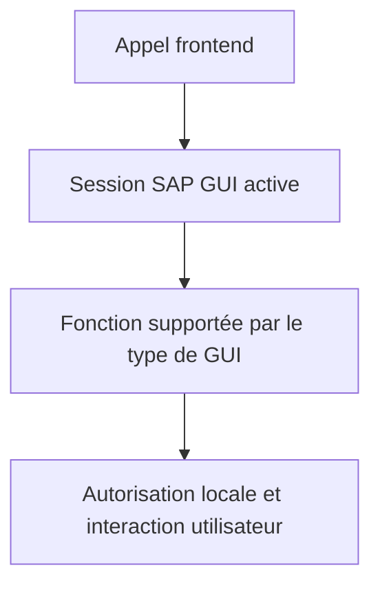

# 13. SERVICES FICHIERS DU FRONTEND

## 13.A RÉSULTAT ATTENDU

- Utiliser les services du poste SAP GUI
- Comprendre leurs dépendances techniques
- Éviter les anciens modules fonction obsolètes

## 13.B CLASSE PRINCIPALE

`CL_GUI_FRONTEND_SERVICES` fournit des méthodes statiques pour interagir avec le système de fichiers du poste utilisateur :

- sélection de fichiers ;
- import et export ;
- interrogation de répertoires ;
- opérations de copie ou suppression locales ;
- accès à certaines fonctions du frontend.

Les anciennes fonctions comme `WS_UPLOAD`, `WS_DOWNLOAD` ou `WS_FILENAME_GET` ne doivent pas être utilisées dans un nouveau développement.

## 13.C CONTRAINTES



- Aucun fonctionnement fiable en job de fond.
- Le comportement peut varier entre SAP GUI for Windows, Java et WebGUI.
- Certaines opérations déclenchent des contrôles de sécurité frontend.
- Le chemin appartient au poste, pas au serveur SAP.

## 13.D TEST DE DISPONIBILITÉ

Avant une opération locale, contrôler le contexte d’exécution. Les méthodes et constantes disponibles doivent être inspectées dans `SE24` sur la version cible.

## 13.E RÈGLE D’ARCHITECTURE

Le traitement métier ne doit pas dépendre directement d’une boîte de dialogue. Séparer :

1. la sélection ou le téléchargement local ;
2. la lecture du contenu ;
3. la validation ;
4. le traitement métier.

Cette séparation permet de réutiliser le même cœur de traitement avec un fichier serveur.

## 13.F PROCESS

### 13.F.1 ÉTAPE 1 — CONFIRMER QUE LE FRONTEND EST DISPONIBLE

Exécuter le traitement en mode dialogue depuis SAP GUI. Avant toute boîte de dialogue ou tout transfert, vérifier la disponibilité des services frontend avec la méthode prévue par `CL_GUI_FRONTEND_SERVICES` sur la release cible. Interrompre proprement le scénario si aucun frontend n’est disponible ; un job ou un appel sans session SAP GUI ne doit pas poursuivre vers une méthode locale.

### 13.F.2 ÉTAPE 2 — SÉPARER LE CHOIX DU FICHIER DU TRAITEMENT

Créer une méthode dédiée à la sélection du chemin et une autre au chargement ou au téléchargement. Le parseur et le traitement métier reçoivent des données ABAP, jamais une dépendance directe à une boîte de dialogue. Cette séparation permet de tester le traitement sans intervention utilisateur et de remplacer ultérieurement la source locale par un fichier serveur.

### 13.F.3 ÉTAPE 3 — OUVRIR LA BOÎTE DE DIALOGUE ADAPTÉE

Utiliser `FILE_OPEN_DIALOG` pour sélectionner un fichier existant et `FILE_SAVE_DIALOG` pour choisir une destination. Limiter les extensions visibles au contrat attendu. Après le retour, distinguer explicitement l’annulation de l’utilisateur, l’absence de sélection et l’erreur technique ; aucune de ces situations ne doit déclencher un traitement avec un chemin initial ou vide.

### 13.F.4 ÉTAPE 4 — TRANSFÉRER SELON LA NATURE DU CONTENU

Utiliser `GUI_UPLOAD` ou `GUI_DOWNLOAD` avec un type de fichier cohérent : texte pour des lignes textuelles, binaire pour un contenu `XSTRING` converti en table binaire. Définir l’encodage lorsque le contrat l’impose. Ne pas supposer qu’une extension de fichier transforme le contenu.

### 13.F.5 ÉTAPE 5 — TRAITER LES EXCEPTIONS AU NIVEAU FRONTEND

Intercepter les exceptions déclarées par la méthode réellement disponible dans `SE24`. Restituer une erreur exploitable indiquant l’opération, le nom du fichier et la cause, sans exposer inutilement un chemin utilisateur sensible. Ne pas masquer un refus de sécurité SAP GUI sous un message métier générique.

### 13.F.6 ÉTAPE 6 — TESTER LES CONTEXTES POSITIFS ET NÉGATIFS

Tester un fichier valide, une annulation, un fichier absent, un fichier verrouillé, un nom contenant des espaces ou des accents et un volume représentatif. Planifier aussi une exécution en arrière-plan : le programme doit refuser le scénario frontend de manière contrôlée avant tout accès au fichier.

## 13.G VÉRIFICATION

- Le fichier est créé ou lu dans l’emplacement attendu.
- Le nombre de lignes, la taille et l’encodage correspondent au contrat.
- Les caractères accentués, séparateurs, guillemets et fins de ligne sont testés.
- Le traitement journalise les rejets et permet une reprise sans doublon.

## 13.H ERREURS FRÉQUENTES

- Mélanger fichiers frontend et serveur dans un même scénario.
- Parser un CSV par simple séparation alors que les champs peuvent être échappés.

## 13.I FICHE DE CONTRÔLE À COPIER

```text
Système / SID       :
Mandant             :
Utilisateur         :
Transaction / outil :
Objet technique     :
Jeu de données      :
Résultat attendu    :
Résultat observé    :
Horodatage          :
Ordre de transport  :
```

## 13.J TERMES DU LEXIQUE

- [Frontend](<../🧩 00 ├── LEXIQUE SAP ET ABAP/01 ├── SYSTEMES ENVIRONNEMENTS ET MANDANTS.md#frontend>)
- [Interface](<../🧩 00 ├── LEXIQUE SAP ET ABAP/07 ├── INTERFACES ET INTEGRATION.md#interface-integration>)
- [Flux entrant](<../🧩 00 ├── LEXIQUE SAP ET ABAP/07 ├── INTERFACES ET INTEGRATION.md#flux-entrant>)
- [Flux sortant](<../🧩 00 ├── LEXIQUE SAP ET ABAP/07 ├── INTERFACES ET INTEGRATION.md#flux-sortant>)
- [CSV](<../🧩 00 ├── LEXIQUE SAP ET ABAP/07 ├── INTERFACES ET INTEGRATION.md#csv>)
- [Encodage](<../🧩 00 ├── LEXIQUE SAP ET ABAP/07 ├── INTERFACES ET INTEGRATION.md#encodage>)

## 13.K RÉFÉRENCES OFFICIELLES SAP

- [Files on the Presentation Server — ABAP Keyword Documentation](https://help.sap.com/doc/abapdocu_latest_index_htm/latest/en-US/ABENFRONTEND_FILES.html)
- [File Upload and Download — SAP Help Portal](https://help.sap.com/docs/ABAP_PLATFORM_NEW/5a005e044eef436f8b27bbd3f73a3cfc/9ff8506b2b8f4812904912c4b207096c.html)

---

[Chapitre suivant — DIALOGUES DE SÉLECTION ET SAUVEGARDE](<./14 ├── DIALOGUES DE SELECTION ET SAUVEGARDE.md>)
