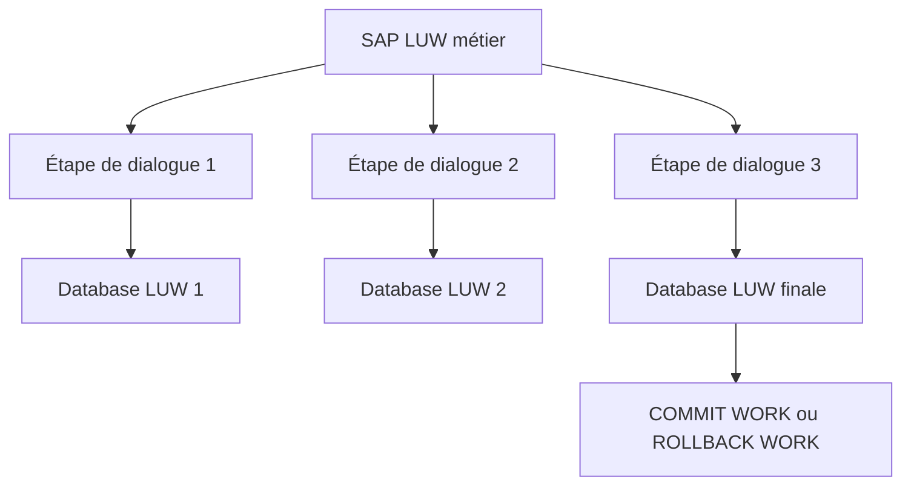

# 2. LUW BASE DE DONNÉES ET SAP LUW

## 2.A RÉSULTAT ATTENDU

- Distinguer une LUW de base de données d’une SAP LUW
- Comprendre pourquoi une transaction SAP peut couvrir plusieurs étapes de dialogue
- Identifier les responsabilités de chaque niveau

## 2.B LUW DE BASE DE DONNÉES

Une **database LUW** est une séquence indivisible d’opérations sur la base, terminée par un commit ou un rollback de base de données. Elle est liée à une connexion et à un processus de travail.

## 2.C SAP LUW

Une **SAP LUW** regroupe toutes les modifications appartenant à une même opération métier, même si le traitement traverse plusieurs étapes de dialogue et donc plusieurs database LUW.

## 2.D DIFFÉRENCE ESSENTIELLE

| Question                 | Database LUW                 | SAP LUW                          |
| ------------------------ | ---------------------------- | -------------------------------- |
| Portée                   | Connexion et étape technique | Opération métier                 |
| Fin                      | Commit ou rollback DB        | `COMMIT WORK` ou `ROLLBACK WORK` |
| Plusieurs écrans         | Non                          | Oui                              |
| Verrous SAP longue durée | Non                          | Oui                              |
| Update task              | Non                          | Oui                              |

Le mécanisme SAP est nécessaire parce qu’un verrou de base de données ne doit pas rester actif pendant qu’un utilisateur réfléchit sur un écran.

## 2.E PROCESS

### 2.E.1 ÉTAPE 1 — DESSINER LE SCÉNARIO MÉTIER COMPLET

Décrire depuis la première lecture jusqu’au résultat visible par l’utilisateur. Marquer les étapes de dialogue, appels de fonctions, mises à jour différées et effets externes. Cette chaîne représente la SAP LUW attendue, qui peut couvrir plusieurs LUW de base de données.

### 2.E.2 ÉTAPE 2 — MARQUER CHAQUE FIN DE LUW BASE

Identifier les `COMMIT WORK`, `ROLLBACK WORK` et changements de contexte qui terminent une LUW de base de données. Examiner la documentation des API appelées pour détecter leur propre gestion transactionnelle. Ne pas supposer qu’une méthode conserve la même transaction uniquement parce qu’elle est appelée dans la même pile ABAP.

### 2.E.3 ÉTAPE 3 — PLACER L’UPDATE TASK

Pour les écritures qui doivent attendre la décision finale, enregistrer des modules de mise à jour avec `CALL FUNCTION ... IN UPDATE TASK`. Fournir uniquement des paramètres sérialisables et complets. L’enregistrement appartient à la SAP LUW courante ; son exécution dépend du commit final.

### 2.E.4 ÉTAPE 4 — ATTRIBUER LA RESPONSABILITÉ DU COMMIT

Désigner un seul orchestrateur pour valider ou annuler l’unité métier. Les méthodes réutilisables documentent si elles enregistrent une update, mais n’exécutent pas de commit caché. Cette règle évite qu’un appel interne valide prématurément les modifications de son appelant.

### 2.E.5 ÉTAPE 5 — OBSERVER LES DEUX NIVEAUX

Exécuter un scénario de test avec un identifiant unique. Avant le commit, vérifier que les mises à jour différées ne sont pas encore visibles comme résultat final. Après `COMMIT WORK AND WAIT`, contrôler les données et `SM13`; après `ROLLBACK WORK`, vérifier que les appels enregistrés n’ont pas été exécutés.

### 2.E.6 ÉTAPE 6 — TESTER UNE INTERRUPTION ENTRE DEUX ÉTAPES

Provoquer une erreur contrôlée avant la décision finale. Vérifier que les LUW de base déjà terminées n’ont pas créé un état métier incomplet et que la SAP LUW possède une stratégie de reprise. Si ce test échoue, déplacer la borne transactionnelle ou introduire une compensation explicite.

## 2.F VÉRIFICATION

- Les données sont toutes validées ou toutes annulées selon le cas testé.
- Les verrous sont libérés à la fin du traitement normal et après erreur.
- Aucune update en erreur inattendue ne reste dans `SM13`.
- Les collisions concurrentes produisent un message contrôlé, pas une incohérence.

## 2.G ERREURS FRÉQUENTES

- Supprimer manuellement un verrou sans comprendre son propriétaire.
- Relancer une update en erreur sans vérifier l’état métier.

## 2.H TERMES DU LEXIQUE

- [LUW base de données](<../🧩 00 ├── LEXIQUE SAP ET ABAP/08 ├── EXECUTION EXPLOITATION ET ADMINISTRATION.md#luw-base>)
- [SAP LUW](<../🧩 00 ├── LEXIQUE SAP ET ABAP/08 ├── EXECUTION EXPLOITATION ET ADMINISTRATION.md#sap-luw>)
- [COMMIT WORK](<../🧩 00 ├── LEXIQUE SAP ET ABAP/08 ├── EXECUTION EXPLOITATION ET ADMINISTRATION.md#commit-work>)
- [ROLLBACK WORK](<../🧩 00 ├── LEXIQUE SAP ET ABAP/08 ├── EXECUTION EXPLOITATION ET ADMINISTRATION.md#rollback-work>)
- [Enqueue server](<../🧩 00 ├── LEXIQUE SAP ET ABAP/08 ├── EXECUTION EXPLOITATION ET ADMINISTRATION.md#enqueue-server>)
- [Update task](<../🧩 00 ├── LEXIQUE SAP ET ABAP/08 ├── EXECUTION EXPLOITATION ET ADMINISTRATION.md#update-task>)

## 2.I RÉFÉRENCES OFFICIELLES SAP

- [Database Logical Unit of Work — SAP Help Portal](https://help.sap.com/docs/SAP_NETWEAVER_703/a0f7f14dd0414b13aaf81261cc50f809/417af4bca79e11d1950f0000e82de14a.html)
- [LUWs in ABAP — SAP Help Portal](https://help.sap.com/docs/ABAP_PLATFORM_NEW/8132142fd1a144a59303663a03a7c2d4/54f5462a9604498382319304869a4280.html)

---

[Chapitre suivant — BORNES DE TRANSACTION ET COMMITS IMPLICITES](<./03 ├── BORNES DE TRANSACTION ET COMMITS IMPLICITES.md>)
