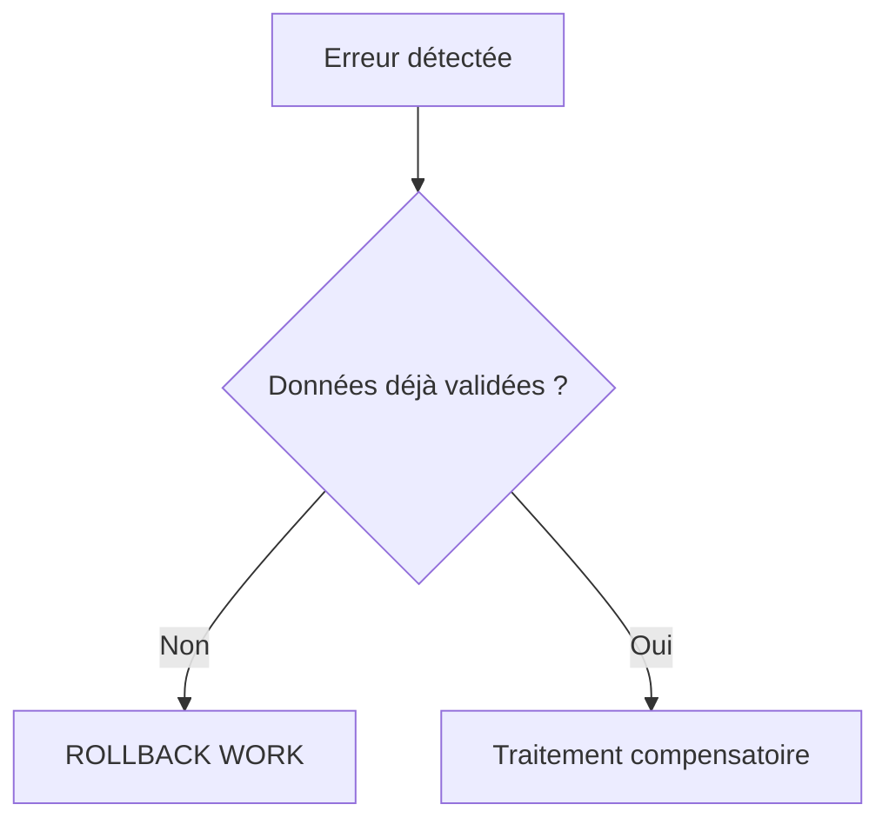

# 5. `ROLLBACK WORK` ET ANNULATION

## 5.A RÉSULTAT ATTENDU

- Annuler la SAP LUW courante
- Comprendre les effets sur les mises à jour enregistrées
- Différencier annulation technique et compensation métier

## 5.B UTILISATION

```abap
UPDATE zdev_order
  SET status = @lv_status
  WHERE order_id = @lv_order_id.

IF sy-subrc <> 0.
  ROLLBACK WORK.
  MESSAGE e002(zdev_msg) WITH lv_order_id.
ENDIF.
```

`ROLLBACK WORK` déclenche un rollback des modifications non validées et supprime les modules de mise à jour enregistrés dans la SAP LUW courante.

## 5.C LIMITES

Un rollback ne peut pas annuler :

- une modification déjà validée par un commit antérieur ;
- un effet externe déjà exécuté dans un autre système ;
- un fichier déjà publié ;
- un e-mail déjà envoyé ;
- une écriture effectuée sur une connexion transactionnellement indépendante.

Ces situations nécessitent une **compensation métier**, pas un rollback technique.



## 5.D RÈGLE

Détecter les erreurs avant les effets irréversibles. Une architecture qui dépend d’un rollback après des appels externes est fragile.

## 5.E PROCESS

### 5.E.1 ÉTAPE 1 — DÉFINIR CE QUI EST ENCORE ANNULABLE

Lister les écritures effectuées depuis la dernière borne transactionnelle. Séparer les modifications non validées, les modules de mise à jour seulement enregistrés, les données déjà commitées et les effets externes. `ROLLBACK WORK` ne couvre que le contexte transactionnel encore ouvert.

### 5.E.2 ÉTAPE 2 — DÉTECTER L’ERREUR AVANT UN EFFET IRRÉVERSIBLE

Exécuter les contrôles structurels et métier avant l’envoi d’un fichier, d’un message ou d’un appel externe. Après chaque écriture Open SQL ou appel d’API, traiter le retour au niveau qui connaît l’unité métier complète.

### 5.E.3 ÉTAPE 3 — EXÉCUTER LE ROLLBACK DEPUIS L’ORCHESTRATEUR

Lorsque l’unité ne peut plus réussir, appeler `ROLLBACK WORK` une seule fois au niveau d’orchestration. Ne pas exécuter de commit dans un gestionnaire d’erreur. Restituer ensuite la cause initiale sans la remplacer par un message générique d’annulation.

### 5.E.4 ÉTAPE 4 — TRAITER LES VERROUS ET RESSOURCES

Vérifier la libération des verrous selon leur `_SCOPE`. Libérer explicitement ceux dont le contrat l’exige et fermer les ressources non transactionnelles ouvertes par le programme. Un rollback base de données ne ferme pas automatiquement un fichier externe selon l’intention métier.

### 5.E.5 ÉTAPE 5 — DÉCLENCHER UNE COMPENSATION SI NÉCESSAIRE

Si une étape a déjà été validée ou exécutée dans un autre système, appeler une procédure métier dédiée : annulation de document, contre-écriture ou message compensatoire. Journaliser séparément l’échec initial et le résultat de la compensation.

### 5.E.6 ÉTAPE 6 — VÉRIFIER L’ÉTAT FINAL

Contrôler les tables, `SM13`, `SM12` et les systèmes externes. Tester une erreur avant écriture, après écriture non validée et après effet externe. Chaque scénario doit aboutir à un état cohérent ou à un statut de reprise explicite.

## 5.F VÉRIFICATION

- Les données sont toutes validées ou toutes annulées selon le cas testé.
- Les verrous sont libérés à la fin du traitement normal et après erreur.
- Aucune update en erreur inattendue ne reste dans `SM13`.
- Les collisions concurrentes produisent un message contrôlé, pas une incohérence.

## 5.G ERREURS FRÉQUENTES

- Copier un exemple sans adapter les types, noms d’objets et données disponibles dans le système.
- Tester uniquement le cas nominal et ignorer les valeurs initiales, absentes ou invalides.
- Supprimer manuellement un verrou sans comprendre son propriétaire.
- Relancer une update en erreur sans vérifier l’état métier.

## 5.H SNIPPET À RÉUTILISER

> [!NOTE]
> Adapter les noms `Z*`, les types DDIC, les données et les autorisations au système cible. Effectuer un contrôle syntaxique avant activation.

```abap
UPDATE zdev_order
  SET status = @lv_status
  WHERE order_id = @lv_order_id.

IF sy-subrc <> 0.
  ROLLBACK WORK.
  MESSAGE e002(zdev_msg) WITH lv_order_id.
ENDIF.
```

## 5.I TERMES DU LEXIQUE

- [ROLLBACK WORK](<../🧩 00 ├── LEXIQUE SAP ET ABAP/08 ├── EXECUTION EXPLOITATION ET ADMINISTRATION.md#rollback-work>)
- [SAP LUW](<../🧩 00 ├── LEXIQUE SAP ET ABAP/08 ├── EXECUTION EXPLOITATION ET ADMINISTRATION.md#sap-luw>)
- [LUW base de données](<../🧩 00 ├── LEXIQUE SAP ET ABAP/08 ├── EXECUTION EXPLOITATION ET ADMINISTRATION.md#luw-base>)
- [COMMIT WORK](<../🧩 00 ├── LEXIQUE SAP ET ABAP/08 ├── EXECUTION EXPLOITATION ET ADMINISTRATION.md#commit-work>)
- [Enqueue server](<../🧩 00 ├── LEXIQUE SAP ET ABAP/08 ├── EXECUTION EXPLOITATION ET ADMINISTRATION.md#enqueue-server>)
- [Update task](<../🧩 00 ├── LEXIQUE SAP ET ABAP/08 ├── EXECUTION EXPLOITATION ET ADMINISTRATION.md#update-task>)

## 5.J RÉFÉRENCES OFFICIELLES SAP

- [ROLLBACK WORK — ABAP Keyword Documentation](https://help.sap.com/docs/ABAP_PLATFORM_NEW/8132142fd1a144a59303663a03a7c2d4/54f5462a9604498382319304869a4280.html)
- [LUWs in ABAP — SAP Help Portal](https://help.sap.com/docs/ABAP_PLATFORM_NEW/8132142fd1a144a59303663a03a7c2d4/54f5462a9604498382319304869a4280.html)

---

[Chapitre suivant — CONCEPT DE VERROUILLAGE SAP](<./06 ├── CONCEPT DE VERROUILLAGE SAP.md>)
