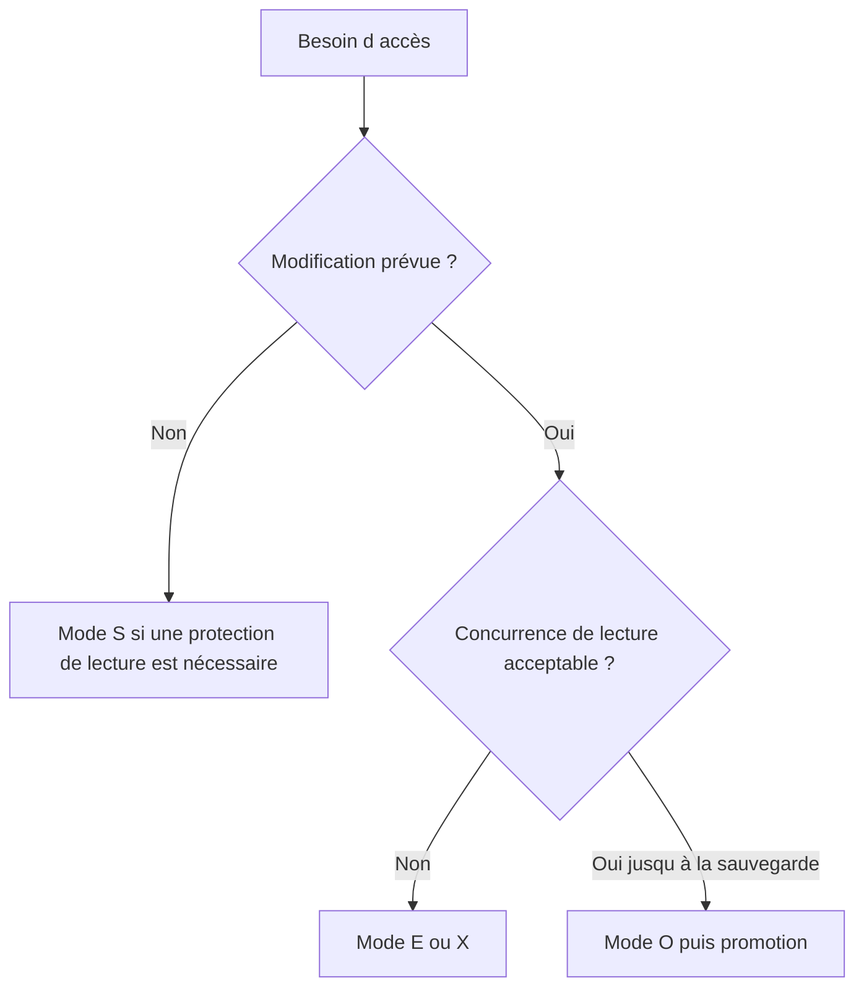

# MODES DE VERROUILLAGE `S`, `E`, `X` ET `O`

## RÉSULTAT ATTENDU

- Choisir un mode adapté au besoin
- Comprendre les collisions
- Éviter l’usage systématique d’un verrou exclusif trop fort

## MODES PRINCIPAUX

| Mode | Signification           | Principe                                                                                      |
| ---- | ----------------------- | --------------------------------------------------------------------------------------------- |
| `S`  | Shared                  | Plusieurs propriétaires peuvent lire ; verrou incompatible avec une écriture exclusive        |
| `E`  | Exclusive cumulatif     | Lecture et écriture réservées au propriétaire ; le même propriétaire peut reprendre le verrou |
| `X`  | Exclusive non cumulatif | Verrou exclusif qui ne peut pas être repris une seconde fois par le même propriétaire         |
| `O`  | Optimistic              | Plusieurs propriétaires peuvent poser un verrou optimiste avant une tentative de promotion    |

## CHOIX PRATIQUE

Le mode `E` est courant pour une modification métier classique. Le mode `X` doit être utilisé lorsque la non-cumulativité est réellement requise. Le verrou optimiste demande une conception explicite de la phase de promotion et du traitement des collisions.

## PROCESS

### ÉTAPE 1 — QUALIFIER L’ACCÈS À PROTÉGER

Déterminer si le scénario lit seulement une ressource partagée, la modifie, exige une exclusivité absolue ou repose sur un verrou optimiste. Partir de l’invariant métier et non du mode utilisé dans un exemple voisin.

### ÉTAPE 2 — VÉRIFIER LE MODE DÉFINI DANS `SE11`

Afficher l’objet de verrouillage et contrôler le mode associé à chaque table. Ouvrir ensuite le module `ENQUEUE_*` généré dans `SE37` pour identifier le paramètre de mode et sa valeur par défaut. Ne pas coder une valeur différente sans test de compatibilité.

### ÉTAPE 3 — CONSERVER UN MODE COHÉRENT SUR TOUT LE CYCLE

Passer le mode choisi lors de l’enqueue et utiliser une valeur compatible lors du dequeue. Documenter les scénarios concurrents autorisés et interdits. Un verrou partagé n’est correct que si aucun des détenteurs ne réalise ensuite une modification incompatible.

### ÉTAPE 4 — TESTER LA MATRICE DE CONCURRENCE

Ouvrir deux sessions avec la même clé. Tester successivement les combinaisons pertinentes de modes et relever si la seconde demande réussit ou produit `foreign_lock`. Répéter avec deux clés différentes pour contrôler la granularité.

### ÉTAPE 5 — TESTER LE MODE OPTIMISTE AVEC SON CYCLE COMPLET

Si le mode `O` est utilisé, tester explicitement la transition prévue avant modification et le comportement lorsque plusieurs propriétaires optimistes existent. Ne pas considérer un verrou optimiste comme une protection d’écriture tant que sa conversion n’a pas réussi.

### ÉTAPE 6 — VALIDER DANS `SM12`

Pendant chaque test, filtrer sur l’objet ou l’argument et contrôler le propriétaire, le mode et la clé enregistrée. Après commit, rollback ou dequeue, vérifier que l’entrée disparaît au moment prévu.

## VÉRIFICATION

- Les données sont toutes validées ou toutes annulées selon le cas testé.
- Les verrous sont libérés à la fin du traitement normal et après erreur.
- Aucune update en erreur inattendue ne reste dans `SM13`.
- Les collisions concurrentes produisent un message contrôlé, pas une incohérence.

## ERREURS FRÉQUENTES

- Supprimer manuellement un verrou sans comprendre son propriétaire.
- Relancer une update en erreur sans vérifier l’état métier.

## TERMES DU LEXIQUE

- [SAP LUW](<../🧩 00 ├── LEXIQUE SAP ET ABAP/08 ├── EXECUTION EXPLOITATION ET ADMINISTRATION.md#sap-luw>)
- [LUW base de données](<../🧩 00 ├── LEXIQUE SAP ET ABAP/08 ├── EXECUTION EXPLOITATION ET ADMINISTRATION.md#luw-base>)
- [COMMIT WORK](<../🧩 00 ├── LEXIQUE SAP ET ABAP/08 ├── EXECUTION EXPLOITATION ET ADMINISTRATION.md#commit-work>)
- [ROLLBACK WORK](<../🧩 00 ├── LEXIQUE SAP ET ABAP/08 ├── EXECUTION EXPLOITATION ET ADMINISTRATION.md#rollback-work>)
- [Enqueue server](<../🧩 00 ├── LEXIQUE SAP ET ABAP/08 ├── EXECUTION EXPLOITATION ET ADMINISTRATION.md#enqueue-server>)
- [Update task](<../🧩 00 ├── LEXIQUE SAP ET ABAP/08 ├── EXECUTION EXPLOITATION ET ADMINISTRATION.md#update-task>)

## RÉFÉRENCES OFFICIELLES SAP

- [SAP Lock Concept — SAP Help Portal](https://help.sap.com/docs/ABAP_PLATFORM_NEW/7bbf03267f654b5cb06a8bf78f61fca1/9101274dc2e048d4b473fe5c45ae4e29.html)
- [Function Modules for Lock Requests — SAP Help Portal](https://help.sap.com/docs/ABAP_PLATFORM_NEW/ec1c9c8191b74de98feb94001a95dd76/cf21eebf446011d189700000e8322d00.html)
- [Programming with Optimistic Locks — SAP Help Portal](https://help.sap.com/docs/ABAP_PLATFORM_NEW/6568469cf5a1460a8d85c58b83d21ec2/47dc35b35bc33b8be10000000a421937.html)

---

[Chapitre suivant — APPELER `ENQUEUE` ET TRAITER LES COLLISIONS](<./09 ├── APPELER ENQUEUE ET TRAITER LES COLLISIONS.md>)
