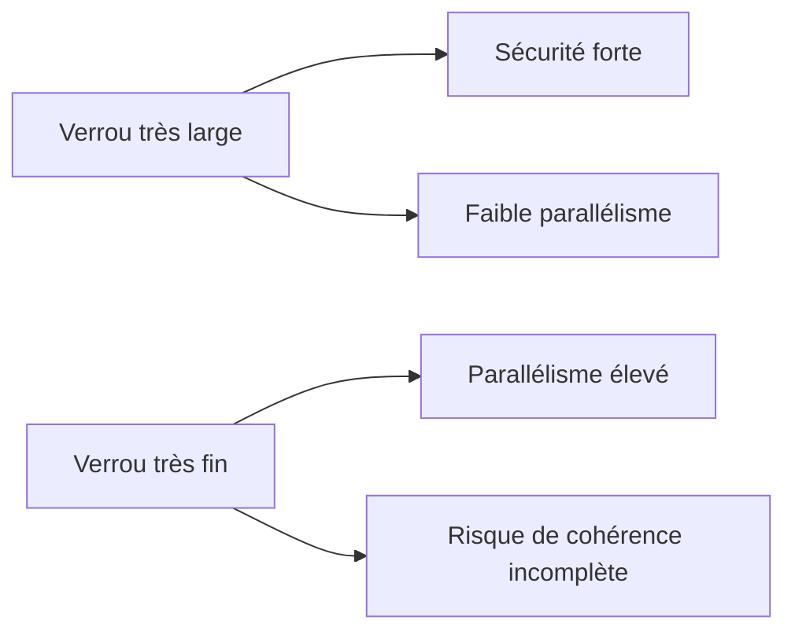

# 11. `_WAIT`, `_COLLECT` ET GRANULARITÉ DES VERROUS

## 11.A RÉSULTAT ATTENDU

- Comprendre les paramètres techniques générés
- Éviter les attentes bloquantes non maîtrisées
- Réduire le nombre et la largeur des entrées de verrou

## 11.B PARAMÈTRE `_WAIT`

`_WAIT` demande au système de répéter temporairement une demande qui rencontre une collision. Sans attente, l’appel retourne immédiatement `foreign_lock`.

Utiliser l’attente uniquement si :

- la durée attendue est courte ;
- l’utilisateur comprend pourquoi l’écran attend ;
- le traitement ne risque pas de bloquer en chaîne ;
- un message clair existe en cas d’échec final.

## 11.C PARAMÈTRE `_COLLECT`

`_COLLECT` permet de placer la demande dans un conteneur local avant sa transmission groupée au service de verrouillage. Ce mécanisme est spécialisé et ne doit pas être activé sans besoin mesuré.

## 11.D GRANULARITÉ

La bonne clé correspond à l’unité métier qui doit rester cohérente. Mesurer les collisions plutôt que réduire arbitrairement la portée.

## 11.E PROCESS

### 11.E.1 ÉTAPE 1 — MESURER LA CLÉ DE VERROUILLAGE RÉELLE

Afficher l’objet dans `SE11` et relever les champs formant l’argument de verrou. Tester une clé complète puis une clé partielle dans un environnement contrôlé. Dans `SM12`, vérifier quelles entrées sont réellement créées et quelles données concurrentes elles bloquent.

### 11.E.2 ÉTAPE 2 — RÉDUIRE LA GRANULARITÉ AU JUSTE NÉCESSAIRE

Verrouiller l’unité métier minimale qui protège l’invariant. Éviter une clé initiale ou trop courte qui transforme un verrou d’enregistrement en verrou de plage excessif. Ne pas réduire la clé si deux enregistrements distincts participent à la même règle métier.

### 11.E.3 ÉTAPE 3 — CHOISIR LE COMPORTEMENT DE COLLISION

Utiliser `_WAIT = abap_false` lorsqu’un retour immédiat et un message utilisateur sont attendus. N’activer `_WAIT` que si l’attente est acceptable et bornée par le comportement du système. Dans tous les cas, traiter `foreign_lock` et permettre une nouvelle tentative contrôlée au niveau applicatif.

### 11.E.4 ÉTAPE 4 — N’UTILISER `_COLLECT` QU’AVEC UN BESOIN MESURÉ

Vérifier dans la documentation et la signature générée le comportement de collecte disponible sur la release. Si des demandes sont collectées localement, prévoir leur transmission explicite au service de verrouillage avant la section critique. Une demande seulement collectée ne constitue pas encore une protection distante prouvée.

### 11.E.5 ÉTAPE 5 — TESTER SOUS CONCURRENCE RÉALISTE

Exécuter deux sessions sur la même clé, puis sur des clés voisines. Mesurer le temps d’attente, le taux de collision et la durée de détention. Observer `SM12` pendant le traitement afin de confirmer la granularité et la propriété.

### 11.E.6 ÉTAPE 6 — CORRIGER LA CAUSE DES CONTENTIONS

Réduire la durée sous verrou, déplacer les opérations lentes hors de la section critique ou revoir la clé. Ne pas masquer une contention structurelle par une attente plus longue : le résultat doit rester prévisible en dialogue comme en traitement de masse.

## 11.F VÉRIFICATION

- Les données sont toutes validées ou toutes annulées selon le cas testé.
- Les verrous sont libérés à la fin du traitement normal et après erreur.
- Aucune update en erreur inattendue ne reste dans `SM13`.
- Les collisions concurrentes produisent un message contrôlé, pas une incohérence.

## 11.G ERREURS FRÉQUENTES

- Supprimer manuellement un verrou sans comprendre son propriétaire.
- Relancer une update en erreur sans vérifier l’état métier.

## 11.H TERMES DU LEXIQUE

- [SAP LUW](<../🧩 00 ├── LEXIQUE SAP ET ABAP/08 ├── EXECUTION EXPLOITATION ET ADMINISTRATION.md#sap-luw>)
- [LUW base de données](<../🧩 00 ├── LEXIQUE SAP ET ABAP/08 ├── EXECUTION EXPLOITATION ET ADMINISTRATION.md#luw-base>)
- [COMMIT WORK](<../🧩 00 ├── LEXIQUE SAP ET ABAP/08 ├── EXECUTION EXPLOITATION ET ADMINISTRATION.md#commit-work>)
- [ROLLBACK WORK](<../🧩 00 ├── LEXIQUE SAP ET ABAP/08 ├── EXECUTION EXPLOITATION ET ADMINISTRATION.md#rollback-work>)
- [Enqueue server](<../🧩 00 ├── LEXIQUE SAP ET ABAP/08 ├── EXECUTION EXPLOITATION ET ADMINISTRATION.md#enqueue-server>)
- [Update task](<../🧩 00 ├── LEXIQUE SAP ET ABAP/08 ├── EXECUTION EXPLOITATION ET ADMINISTRATION.md#update-task>)

## 11.I RÉFÉRENCES OFFICIELLES SAP

- [Function Modules for Lock Requests — SAP Help Portal](https://help.sap.com/docs/ABAP_PLATFORM_NEW/ec1c9c8191b74de98feb94001a95dd76/cf21eebf446011d189700000e8322d00.html)
- [Frequently Asked Questions: Lock Concept — SAP Help Portal](https://help.sap.com/docs/ABAP_PLATFORM_BW4HANA/6568469cf5a1460a8d85c58b83d21ec2/47db6c1ae4282972e10000000a42189b.html)

---

[Chapitre suivant — ANALYSER LES VERROUS AVEC `SM12`](<./12 ├── ANALYSER LES VERROUS AVEC SM12.md>)
