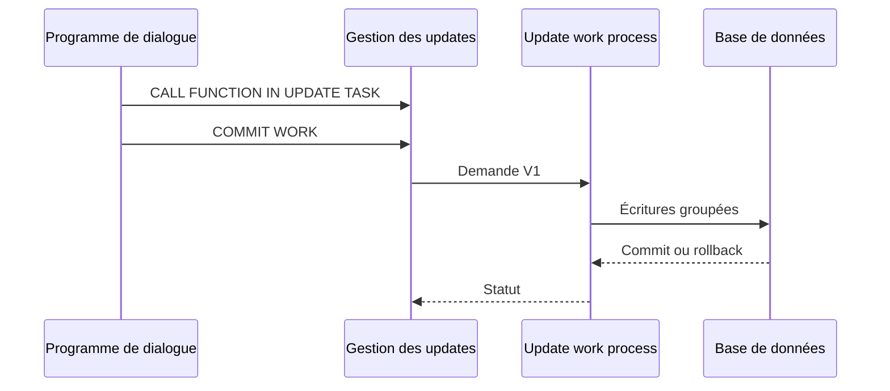

# 13. ARCHITECTURE DE LA MISE À JOUR SAP

## 13.A RÉSULTAT ATTENDU

- Comprendre la séparation entre dialogue et update task
- Identifier le rôle des processus de travail de mise à jour
- Visualiser le cycle d’une demande

## 13.B PRINCIPE

Le programme de dialogue enregistre des appels de modules fonction de mise à jour. Lors du `COMMIT WORK`, le système transmet la demande à un processus de travail d’update, qui exécute les écritures dans une database LUW dédiée.

## 13.C INTÉRÊTS

- raccourcir le temps occupé par le processus de dialogue ;
- regrouper les écritures liées ;
- centraliser le statut de l’update ;
- permettre le diagnostic et, selon le type de demande, une reprise administrative.

## 13.D LIMITES

L’update task n’est pas une file d’intégration générique. Elle fait partie de la SAP LUW et doit exécuter des changements persistants déterministes, sans interaction utilisateur ni commit interne.

## 13.E PROCESS

### 13.E.1 ÉTAPE 1 — SÉPARER PRÉPARATION ET PERSISTANCE

Dans le traitement de dialogue, valider les entrées, poser les verrous et construire des paramètres complets. Dans le module de mise à jour, limiter le code à la persistance déterministe de ces paramètres. Ne pas dépendre d’un état global du programme appelant.

### 13.E.2 ÉTAPE 2 — CLASSER LES ÉCRITURES

Placer en V1 les écritures indispensables à la cohérence du résultat métier. Réserver V2 aux mises à jour secondaires qui peuvent être exécutées après V1. Une donnée nécessaire pour confirmer le succès à l’utilisateur ne doit pas être reléguée en V2 par simple recherche de performance.

### 13.E.3 ÉTAPE 3 — CRÉER DES INTERFACES SÉRIALISABLES

Définir les paramètres du module fonction avec des types DDIC compatibles avec l’update task. Transmettre les valeurs nécessaires au moment de l’enregistrement. Éviter les références d’objet, dépendances frontend et lectures ambiguës qui pourraient changer avant l’exécution.

### 13.E.4 ÉTAPE 4 — ENREGISTRER LES APPELS DANS LA SAP LUW

Appeler les modules avec `CALL FUNCTION ... IN UPDATE TASK` après validation. Regrouper les appels appartenant à la même unité métier. L’enregistrement n’est pas une preuve de mise à jour : le traitement ne démarre qu’à la borne de commit.

### 13.E.5 ÉTAPE 5 — DÉCLENCHER ET OBSERVER LA MISE À JOUR

Exécuter le commit dans l’orchestrateur. Utiliser `COMMIT WORK AND WAIT` uniquement lorsque l’appelant doit connaître immédiatement le résultat V1. Contrôler `sy-subrc`, les données persistées et `SM13` au lieu de déduire le succès du seul retour de l’enregistrement.

### 13.E.6 ÉTAPE 6 — TESTER UNE PANNE DE MODULE

Provoquer une erreur contrôlée dans un module Z en développement. Vérifier le statut de l’update dans `SM13`, l’absence d’état V1 partiel et le comportement des mises à jour secondaires. Corriger la cause et valider la procédure de reprise avant livraison.

## 13.F VÉRIFICATION

- Les données sont toutes validées ou toutes annulées selon le cas testé.
- Les verrous sont libérés à la fin du traitement normal et après erreur.
- Aucune update en erreur inattendue ne reste dans `SM13`.
- Les collisions concurrentes produisent un message contrôlé, pas une incohérence.

## 13.G ERREURS FRÉQUENTES

- Supprimer manuellement un verrou sans comprendre son propriétaire.
- Relancer une update en erreur sans vérifier l’état métier.

## 13.H TERMES DU LEXIQUE

- [SAP LUW](<../🧩 00 ├── LEXIQUE SAP ET ABAP/08 ├── EXECUTION EXPLOITATION ET ADMINISTRATION.md#sap-luw>)
- [LUW base de données](<../🧩 00 ├── LEXIQUE SAP ET ABAP/08 ├── EXECUTION EXPLOITATION ET ADMINISTRATION.md#luw-base>)
- [COMMIT WORK](<../🧩 00 ├── LEXIQUE SAP ET ABAP/08 ├── EXECUTION EXPLOITATION ET ADMINISTRATION.md#commit-work>)
- [ROLLBACK WORK](<../🧩 00 ├── LEXIQUE SAP ET ABAP/08 ├── EXECUTION EXPLOITATION ET ADMINISTRATION.md#rollback-work>)
- [Enqueue server](<../🧩 00 ├── LEXIQUE SAP ET ABAP/08 ├── EXECUTION EXPLOITATION ET ADMINISTRATION.md#enqueue-server>)
- [Update task](<../🧩 00 ├── LEXIQUE SAP ET ABAP/08 ├── EXECUTION EXPLOITATION ET ADMINISTRATION.md#update-task>)

## 13.I RÉFÉRENCES OFFICIELLES SAP

- [The Update Process — SAP Help Portal](https://help.sap.com/docs/SAP_NETWEAVER_AS_ABAP_752/979cf1522d164bf7a781796efd8850ee/c8ed15db039b4f45a8507015f531976b.html)
- [Work Processes in Application Server ABAP — SAP Help Portal](https://help.sap.com/docs/ABAP_PLATFORM_NEW/e067931e0b0a4b2089f4db327879cd55/22d85d37ab534b86a5098ded38c06c0f.html)
- [Synchronous and Asynchronous Updating — SAP Help Portal](https://help.sap.com/docs/ABAP_PLATFORM_NEW/979cf1522d164bf7a781796efd8850ee/6b96ee764b054c5f929dea77ffcf7a6b.html)

---

[Chapitre suivant — CRÉER UN MODULE FONCTION DE MISE À JOUR](<./14 ├── CREER UN MODULE FONCTION DE MISE A JOUR.md>)
