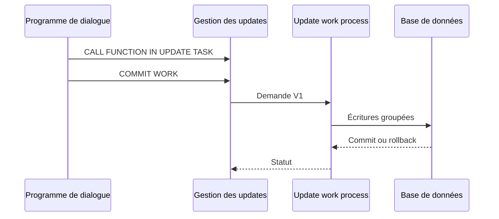

# ARCHITECTURE DE LA MISE À JOUR SAP

## RÉSULTAT ATTENDU

- Comprendre la séparation entre dialogue et update task
- Identifier le rôle des processus de travail de mise à jour
- Visualiser le cycle d’une demande

## PRINCIPE

Le programme de dialogue enregistre des appels de modules fonction de mise à jour. Lors du `COMMIT WORK`, le système transmet la demande à un processus de travail d’update, qui exécute les écritures dans une database LUW dédiée.

## INTÉRÊTS

- raccourcir le temps occupé par le processus de dialogue ;
- regrouper les écritures liées ;
- centraliser le statut de l’update ;
- permettre le diagnostic et, selon le type de demande, une reprise administrative.

## LIMITES

L’update task n’est pas une file d’intégration générique. Elle fait partie de la SAP LUW et doit exécuter des changements persistants déterministes, sans interaction utilisateur ni commit interne.

## PROCÉDURE PAS À PAS

1. Lire la définition et identifier les prérequis du chapitre.
2. Choisir un objet Z ou un scénario de démonstration sans impact métier.
3. Reproduire l’exemple dans un système de développement et relever les données d’entrée.
4. Contrôler la syntaxe ou la configuration avant activation/exécution.
5. Comparer le résultat observé avec la section **Vérification**.
6. Documenter toute différence liée à la release, aux autorisations ou au paramétrage du système.

## VÉRIFICATION

- Les données sont toutes validées ou toutes annulées selon le cas testé.
- Les verrous sont libérés à la fin du traitement normal et après erreur.
- Aucune update en erreur inattendue ne reste dans `SM13`.
- Les collisions concurrentes produisent un message contrôlé, pas une incohérence.

## ERREURS FRÉQUENTES

- Supprimer manuellement un verrou sans comprendre son propriétaire.
- Relancer une update en erreur sans vérifier l’état métier.

## TERMES DU LEXIQUE

- [SAP LUW](<../🧩 00 ├── LEXIQUE SAP ET ABAP/08 ├── EXECUTION EXPLOITATION ET ADMINISTRATION.md#sap-luw>)
- [LUW base de données](<../🧩 00 ├── LEXIQUE SAP ET ABAP/08 ├── EXECUTION EXPLOITATION ET ADMINISTRATION.md#luw-base>)
- [COMMIT WORK](<../🧩 00 ├── LEXIQUE SAP ET ABAP/08 ├── EXECUTION EXPLOITATION ET ADMINISTRATION.md#commit-work>)
- [ROLLBACK WORK](<../🧩 00 ├── LEXIQUE SAP ET ABAP/08 ├── EXECUTION EXPLOITATION ET ADMINISTRATION.md#rollback-work>)
- [Enqueue server](<../🧩 00 ├── LEXIQUE SAP ET ABAP/08 ├── EXECUTION EXPLOITATION ET ADMINISTRATION.md#enqueue-server>)
- [Update task](<../🧩 00 ├── LEXIQUE SAP ET ABAP/08 ├── EXECUTION EXPLOITATION ET ADMINISTRATION.md#update-task>)

## RÉFÉRENCES OFFICIELLES SAP

- [The Update Process — SAP Help Portal](https://help.sap.com/docs/SAP_NETWEAVER_AS_ABAP_752/979cf1522d164bf7a781796efd8850ee/c8ed15db039b4f45a8507015f531976b.html)
- [Work Processes in Application Server ABAP — SAP Help Portal](https://help.sap.com/docs/ABAP_PLATFORM_NEW/e067931e0b0a4b2089f4db327879cd55/22d85d37ab534b86a5098ded38c06c0f.html)
- [Synchronous and Asynchronous Updating — SAP Help Portal](https://help.sap.com/docs/ABAP_PLATFORM_NEW/979cf1522d164bf7a781796efd8850ee/6b96ee764b054c5f929dea77ffcf7a6b.html)

---

[Chapitre suivant — CRÉER UN MODULE FONCTION DE MISE À JOUR](<./14 ├── CREER UN MODULE FONCTION DE MISE A JOUR.md>)
