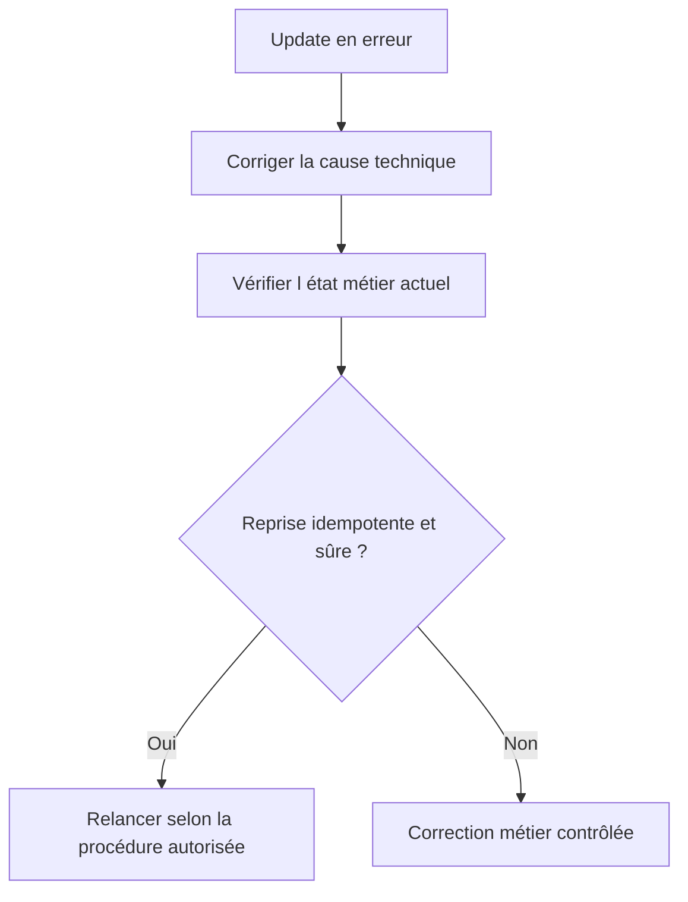

# ANALYSER ET REPRENDRE LES UPDATES AVEC `SM13`

## RÉSULTAT ATTENDU

- Rechercher une demande de mise à jour en erreur
- Identifier le module et la cause
- Décider si une reprise est sûre

## RECHERCHE

Dans `SM13`, filtrer notamment par :

- utilisateur ;
- date et heure ;
- mandant ;
- statut ;
- transaction ou identifiant de demande.

Analyser ensuite :

- le module fonction en erreur ;
- le message ou le dump associé ;
- les paramètres enregistrés ;
- les modules V1 et V2 de la demande ;
- l’état actuel des données métier.

## REPRISE



Ne pas relancer mécaniquement une demande ancienne. Les données ou le customizing peuvent avoir changé, et un traitement manuel peut avoir déjà compensé l’erreur.

## OUTILS ASSOCIÉS

- `ST22` pour un dump du module de mise à jour ;
- `SM12` pour les verrous ;
- `SM21` pour le journal système ;
- `SLG1` si l’application écrit un journal applicatif ;
- `SM14` pour l’état administratif du système de mise à jour.

## PROCESS

### ÉTAPE 1 — DÉLIMITER L’INCIDENT

Relever l’utilisateur, le mandant, la transaction, l’heure, le document métier et le message reçu. Vérifier dans `ST22` si un dump correspond au même intervalle. Ces éléments évitent de diagnostiquer une update homonyme appartenant à un autre traitement.

### ÉTAPE 2 — RECHERCHER L’UPDATE DANS `SM13`

Saisir `/nSM13`, renseigner l’utilisateur et la période la plus courte possible, puis sélectionner le statut pertinent. Ouvrir l’entrée correspondant à l’heure et à l’identifiant métier attendus. Relever son identifiant, son statut et sa séquence de modules.

### ÉTAPE 3 — LOCALISER LE PREMIER MODULE EN ÉCHEC

Consulter les détails et les données enregistrées pour identifier le module qui a échoué, son message et ses paramètres. Distinguer la première erreur des modules seulement non exécutés ensuite. Corréler le code actif et les valeurs enregistrées au moment de la SAP LUW initiale.

### ÉTAPE 4 — CONTRÔLER L’ÉTAT MÉTIER PERSISTANT

Vérifier les tables V1 et V2, les documents créés et les verrous restants. Déterminer précisément ce qui a été validé avant l’échec. Ne pas conclure qu’aucune donnée n’existe uniquement parce que l’update porte le statut d’erreur.

### ÉTAPE 5 — CORRIGER LA CAUSE RACINE

Corriger la donnée de référence, l’autorisation, le paramétrage ou le programme identifié. Tester la correction avec les mêmes caractéristiques en développement ou en qualité. Conserver les preuves de l’update initiale avant toute suppression ou répétition.

### ÉTAPE 6 — ÉVALUER LA RÉPÉTITION

Vérifier que les modules sont idempotents ou que leur état partiel est compatible avec une répétition. Si une unité déjà créée peut être dupliquée, appliquer d’abord la procédure métier de remise en cohérence. Une répétition dans `SM13` est une action de production, pas un test technique.

### ÉTAPE 7 — RÉPÉTER ET VALIDER

Après autorisation opérationnelle, répéter l’update ciblée. Contrôler son nouveau statut, les tables concernées, les compteurs métier et l’absence de doublons. Documenter l’identifiant initial, la cause, la correction et le résultat final.

## VÉRIFICATION

- Les données sont toutes validées ou toutes annulées selon le cas testé.
- Les verrous sont libérés à la fin du traitement normal et après erreur.
- Aucune update en erreur inattendue ne reste dans `SM13`.
- Les collisions concurrentes produisent un message contrôlé, pas une incohérence.

## ERREURS FRÉQUENTES

- Supprimer manuellement un verrou sans comprendre son propriétaire.
- Relancer une update en erreur sans vérifier l’état métier.

## FICHE DE CONTRÔLE À COPIER

```text
Système / SID       :
Mandant             :
Utilisateur         :
Transaction / outil :
Objet technique     :
Jeu de données      :
Résultat attendu    :
Résultat observé    :
Horodatage          :
Ordre de transport  :
```

## TERMES DU LEXIQUE

- [SAP LUW](<../🧩 00 ├── LEXIQUE SAP ET ABAP/08 ├── EXECUTION EXPLOITATION ET ADMINISTRATION.md#sap-luw>)
- [LUW base de données](<../🧩 00 ├── LEXIQUE SAP ET ABAP/08 ├── EXECUTION EXPLOITATION ET ADMINISTRATION.md#luw-base>)
- [COMMIT WORK](<../🧩 00 ├── LEXIQUE SAP ET ABAP/08 ├── EXECUTION EXPLOITATION ET ADMINISTRATION.md#commit-work>)
- [ROLLBACK WORK](<../🧩 00 ├── LEXIQUE SAP ET ABAP/08 ├── EXECUTION EXPLOITATION ET ADMINISTRATION.md#rollback-work>)
- [Enqueue server](<../🧩 00 ├── LEXIQUE SAP ET ABAP/08 ├── EXECUTION EXPLOITATION ET ADMINISTRATION.md#enqueue-server>)
- [Update task](<../🧩 00 ├── LEXIQUE SAP ET ABAP/08 ├── EXECUTION EXPLOITATION ET ADMINISTRATION.md#update-task>)

## RÉFÉRENCES OFFICIELLES SAP

- [Update Management — SAP Help Portal](https://help.sap.com/docs/SAP_NETWEAVER_AS_ABAP_752/979cf1522d164bf7a781796efd8850ee/078cb02dc14d497f9779f7a309c1a7bc.html)
- [Update Statuses — SAP Help Portal](https://help.sap.com/docs/ABAP_PLATFORM_NEW/979cf1522d164bf7a781796efd8850ee/3c7ad8b964b74aac9e1d3e709b33e794.html)
- [SM13 - Update Request — SAP Help Portal](https://help.sap.com/docs/SUPPORT_CONTENT/basis/3354611548.html)

---

[Chapitre suivant — CONCEPTION, DIAGNOSTIC ET BONNES PRATIQUES](<./20 └── CONCEPTION DIAGNOSTIC ET BONNES PRATIQUES.md>)
