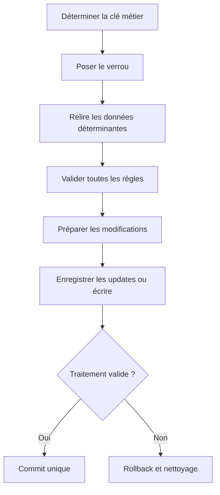

# 20. CONCEPTION, DIAGNOSTIC ET BONNES PRATIQUES

## 20.A RÉSULTAT ATTENDU

- Concevoir une transaction robuste
- Éviter les commits cachés et les verrous incohérents
- Appliquer une checklist de livraison

## 20.B SÉQUENCE RECOMMANDÉE



## 20.C ERREURS CLASSIQUES

- lire puis verrouiller sans relire ;
- exécuter un commit dans une méthode profonde ou un exit ;
- poser un verrou trop large et créer des collisions inutiles ;
- libérer le verrou avant la validation ;
- utiliser V2 pour des données indispensables ;
- appeler un module en update task sans garantir le commit ;
- relancer une erreur `SM13` sans contrôler l’idempotence ;
- supprimer un verrou `SM12` sans identifier le propriétaire ;
- mélanger effets externes et transaction locale sans stratégie de compensation.

## 20.D CHECKLIST

- [ ] Unité métier et frontière de SAP LUW définies
- [ ] Propriétaire du commit identifié
- [ ] Aucun commit caché dans les composants réutilisables
- [ ] Objet et clé de verrou documentés
- [ ] Collision testée avec deux sessions
- [ ] Tous les chemins d’erreur libèrent ou transfèrent correctement le verrou
- [ ] Priorité V1 ou V2 justifiée
- [ ] Module de mise à jour sans interaction ni commit interne
- [ ] `COMMIT WORK AND WAIT` utilisé seulement quand le résultat immédiat est requis
- [ ] Reprise et idempotence documentées
- [ ] Diagnostic `SM12`, `SM13`, `ST22` et logs testé
- [ ] Tests de rollback et d’échec partiel exécutés

## 20.E PROCESS

### 20.E.1 ÉTAPE 1 — RECONSTRUIRE LA SAP LUW

Identifier l’entrée utilisateur ou job, les clés métier, les lectures, les verrous, les écritures directes, les modules de mise à jour et la borne finale. Dessiner l’ordre réel des opérations. Le diagnostic doit porter sur l’unité complète, pas uniquement sur l’instruction qui a signalé l’erreur.

### 20.E.2 ÉTAPE 2 — CONTRÔLER LES BORNES ET LE PROPRIÉTAIRE DU COMMIT

Rechercher tous les commits et rollbacks du code Z traversé, puis examiner le contrat des API standard appelées. Vérifier qu’un seul orchestrateur décide de la fin de l’unité métier. Identifier tout effet externe qui ne peut pas être annulé par la transaction ABAP.

### 20.E.3 ÉTAPE 3 — ANALYSER LES VERROUS

Comparer la clé passée aux modules `ENQUEUE_*` et `DEQUEUE_*`, le mode, `_SCOPE` et la durée de détention. Reproduire avec deux sessions et observer `SM12`. Une collision légitime doit être restituée proprement ; un verrou trop large ou persistant doit être corrigé dans la conception.

### 20.E.4 ÉTAPE 4 — ANALYSER L’UPDATE TASK

Dans `SM13`, rechercher les mises à jour du même utilisateur et du même intervalle. Relever le premier module en erreur, ses paramètres et le message. Corréler avec `ST22` si un dump existe et avec les données déjà persistées.

### 20.E.5 ÉTAPE 5 — DÉTERMINER L’ÉTAT EXACT APRÈS ÉCHEC

Classer chaque effet comme non exécuté, non validé, validé ou externe. Vérifier les données V1, V2 et les verrous. Cette cartographie détermine si un rollback suffit, si une répétition est sûre ou si une compensation métier est nécessaire.

### 20.E.6 ÉTAPE 6 — CORRIGER ET REJOUER LE MÊME SCÉNARIO

Corriger la cause prouvée, puis reprendre avec les mêmes paramètres et une clé de test contrôlée. Vérifier la cohérence finale, l’absence de doublons, la libération des verrous et l’absence d’update résiduelle en erreur. Conserver les identifiants de trace et les états avant/après.

## 20.F VÉRIFICATION

- Le scénario reproduit correspond au même utilisateur, mandant, transaction et jeu de données.
- L’horodatage et l’identifiant de l’analyse sont conservés.
- La cause retenue est soutenue par une ligne source, une trace ou une valeur observée.
- Après correction, le même scénario ne reproduit plus le défaut et le résultat métier reste identique.

## 20.G ERREURS FRÉQUENTES

- Supprimer manuellement un verrou sans comprendre son propriétaire.
- Relancer une update en erreur sans vérifier l’état métier.

## 20.H FICHE DE CONTRÔLE À COPIER

```text
Système / SID       :
Mandant             :
Utilisateur         :
Transaction / outil :
Objet technique     :
Jeu de données      :
Résultat attendu    :
Résultat observé    :
Horodatage          :
Ordre de transport  :
```

## 20.I TERMES DU LEXIQUE

- [SAP LUW](<../🧩 00 ├── LEXIQUE SAP ET ABAP/08 ├── EXECUTION EXPLOITATION ET ADMINISTRATION.md#sap-luw>)
- [LUW base de données](<../🧩 00 ├── LEXIQUE SAP ET ABAP/08 ├── EXECUTION EXPLOITATION ET ADMINISTRATION.md#luw-base>)
- [COMMIT WORK](<../🧩 00 ├── LEXIQUE SAP ET ABAP/08 ├── EXECUTION EXPLOITATION ET ADMINISTRATION.md#commit-work>)
- [ROLLBACK WORK](<../🧩 00 ├── LEXIQUE SAP ET ABAP/08 ├── EXECUTION EXPLOITATION ET ADMINISTRATION.md#rollback-work>)
- [Enqueue server](<../🧩 00 ├── LEXIQUE SAP ET ABAP/08 ├── EXECUTION EXPLOITATION ET ADMINISTRATION.md#enqueue-server>)
- [Update task](<../🧩 00 ├── LEXIQUE SAP ET ABAP/08 ├── EXECUTION EXPLOITATION ET ADMINISTRATION.md#update-task>)

## 20.J RÉFÉRENCES OFFICIELLES SAP

- [LUWs in ABAP — SAP Help Portal](https://help.sap.com/docs/ABAP_PLATFORM_NEW/8132142fd1a144a59303663a03a7c2d4/54f5462a9604498382319304869a4280.html)
- [SAP Lock Concept — SAP Help Portal](https://help.sap.com/docs/ABAP_PLATFORM_NEW/7bbf03267f654b5cb06a8bf78f61fca1/9101274dc2e048d4b473fe5c45ae4e29.html)
- [The Update Process — SAP Help Portal](https://help.sap.com/docs/SAP_NETWEAVER_AS_ABAP_752/979cf1522d164bf7a781796efd8850ee/c8ed15db039b4f45a8507015f531976b.html)
- [COMMIT WORK — ABAP Keyword Documentation](https://help.sap.com/doc/abapdocu_752_index_htm/7.52/en-US/abapcommit.htm)
