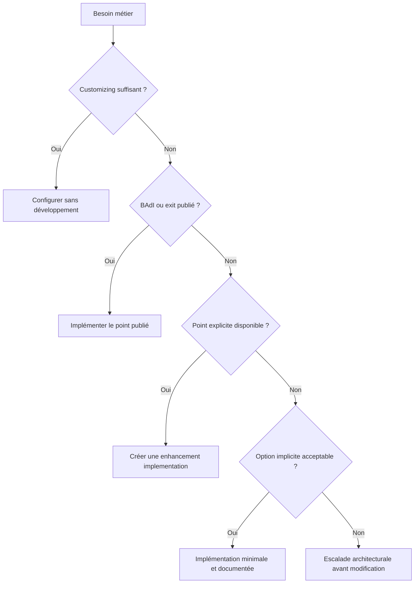

# 2. CHOISIR UNE TECHNOLOGIE D’EXTENSION

## 2.A RÉSULTAT ATTENDU

- Choisir la technologie la plus stable disponible
- Éviter l’utilisation d’un enhancement implicite lorsqu’une extension publiée existe
- Situer les technologies historiques

## 2.B ORDRE DE RECHERCHE



## 2.C MATRICE DE CHOIX

| Technologie                   | Utilisation principale                               | Outil SAP GUI          |
| ----------------------------- | ---------------------------------------------------- | ---------------------- |
| Customer exit                 | Extensions classiques fournies par SAP               | `SMOD`, `CMOD`         |
| BAdI classique                | Extension orientée objet historique                  | `SE18`, `SE19`         |
| BAdI du Enhancement Framework | Extension orientée objet intégrée au framework       | `SE18`, `SE19`, `SE80` |
| Enhancement point ou section  | Insertion ou remplacement à un point explicite       | Éditeur ABAP, `SE80`   |
| Option implicite              | Insertion à un emplacement systématique              | Éditeur ABAP           |
| BTE                           | Extension événementielle, fréquente en FI            | `FIBF`                 |
| User exit codé                | Routine historique nommée dans un programme standard | `SE38`, `SE80`         |

## 2.D CRITÈRES

Évaluer systématiquement :

- stabilité du contrat ;
- possibilité de plusieurs implémentations ;
- filtrage disponible ;
- contexte transactionnel ;
- fréquence d’appel ;
- volume de données ;
- dépendance à une ligne précise du standard ;
- comportement après upgrade ;
- possibilité de désactivation rapide.

## 2.E PROCESS

### 2.E.1 ÉTAPE 1 — IDENTIFIER LE TYPE DE PROCESSUS

Déterminer si le besoin concerne une transaction classique, un traitement FI, un écran Dynpro, une classe, une API ou un framework applicatif. Relever le composant logiciel et le scénario exact. La technologie pertinente dépend du point d’exécution réel.

### 2.E.2 ÉTAPE 2 — RECHERCHER LES EXTENSIONS DOCUMENTÉES

Consulter la documentation du composant et les objets Repository associés. Pour chaque BAdI, customer exit, BTE ou enhancement explicite trouvé, relever les paramètres, les filtres, l’usage multiple, le moment d’appel et les restrictions.

### 2.E.3 ÉTAPE 3 — CONFIRMER L’APPEL AU RUNTIME

Placer un breakpoint dans le point candidat ou utiliser un breakpoint sur les mécanismes d’appel adaptés. Reproduire une seule fois le processus. Vérifier que le point est atteint avec les données requises et dans le bon contexte transactionnel.

### 2.E.4 ÉTAPE 4 — COMPARER LES CANDIDATS

Classer chaque option selon sa stabilité, son périmètre, ses données disponibles, son ordre d’exécution et sa transportabilité. Privilégier le contrat d’extension prévu par SAP. N’utiliser une option implicite qu’en l’absence de point public approprié et avec une justification documentée.

### 2.E.5 ÉTAPE 5 — VÉRIFIER LES IMPLÉMENTATIONS EXISTANTES

Rechercher les projets CMOD, implémentations BAdI et enhancements actifs. Contrôler leurs filtres et leur ordre éventuel. Déterminer si le besoin doit compléter une implémentation existante ou s’il peut être isolé sans comportement concurrent.

### 2.E.6 ÉTAPE 6 — CONSIGNER LA DÉCISION

Documenter le point retenu, les alternatives écartées, le scénario de preuve, les objets à transporter et les tests de non-régression. Cette fiche devient le contrôle de référence lors des upgrades et changements de support package.

## 2.F VÉRIFICATION

- L’implémentation ou le projet est actif et transporté dans le bon ordre.
- Un breakpoint confirme que le point d’extension est appelé dans le scénario visé.
- Le comportement standard reste inchangé hors du périmètre fonctionnel prévu.
- Aucune modification directe d’un objet SAP standard n’a été créée.

## 2.G ERREURS FRÉQUENTES

- Choisir le premier exit trouvé sans vérifier le moment exact de l’appel.
- Créer plusieurs implémentations concurrentes sans règles de filtre.

## 2.H FICHE DE CONTRÔLE À COPIER

```text
Système / SID       :
Mandant             :
Utilisateur         :
Transaction / outil :
Objet technique     :
Jeu de données      :
Résultat attendu    :
Résultat observé    :
Horodatage          :
Ordre de transport  :
```

## 2.I TERMES DU LEXIQUE

- [BAdI](<../🧩 00 ├── LEXIQUE SAP ET ABAP/10 └── ACRONYMES SAP.md#acro-badi>)
- [BTE](<../🧩 00 ├── LEXIQUE SAP ET ABAP/10 └── ACRONYMES SAP.md#acro-bte>)
- [Objet Repository](<../🧩 00 ├── LEXIQUE SAP ET ABAP/03 ├── REPOSITORY PACKAGES ET TRANSPORTS.md#objet-repository>)

## 2.J RÉFÉRENCES OFFICIELLES SAP

- [Enhancement Technologies — SAP Help Portal](https://help.sap.com/docs/ABAP_PLATFORM_NEW/46a2cfc13d25463b8b9a3d2a3c3ba0d9/7063da4023a28631e10000000a1550b0.html)
- [Enhancement Framework — SAP Help Portal](https://help.sap.com/docs/SAP_S4HANA_ON-PREMISE/e322becd165844e5868e590bc8efafaf/949cdc40132a8531e10000000a1550b0.html)
- [Customer Exits — SAP Help Portal](https://help.sap.com/docs/ABAP_PLATFORM_NEW/2b28ffa716c24348903f8ffbfeb81df8/c81975cc43b111d1896f0000e8322d00.html)

---

[Chapitre suivant — RECHERCHER UN POINT D’EXTENSION](<./03 ├── RECHERCHER UN POINT D EXTENSION.md>)
