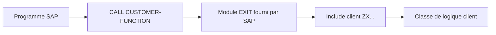

# FUNCTION MODULE EXITS

## RÉSULTAT ATTENDU

- Comprendre l’appel `CALL CUSTOMER-FUNCTION`
- Implémenter le code dans l’include client prévu
- Respecter l’interface et le contexte transactionnel

## PRINCIPE

Le standard appelle un module fonction d’exit, souvent nommé selon le modèle `EXIT_<programme>_<numéro>`. Ce module expose une interface et contient un include client destiné à l’implémentation.



## IMPLÉMENTATION

Ne pas modifier le module `EXIT_*`. Depuis le composant du projet `CMOD`, ouvrir l’include client et déléguer le traitement :

```abap
zcl_dev_customer_exit=>process(
  EXPORTING
    is_header = i_header
  CHANGING
    cs_item   = c_item ).
```

Les noms de paramètres sont définis par SAP. Ne pas supposer qu’un paramètre `CHANGING` peut être modifié sans vérifier son usage après le retour.

## GESTION DES ERREURS

- utiliser les messages autorisés par le contrat de l’exit ;
- éviter un dump pour une erreur fonctionnelle attendue ;
- ne pas déclencher de commit ;
- ne pas lancer une mise à jour indépendante qui survivrait à un rollback du standard ;
- conserver un temps d’exécution faible si l’exit est appelé dans une boucle.

## PROCESS

### ÉTAPE 1 — ANALYSER LE MODULE `EXIT_*`

Depuis `SMOD`, ouvrir le function exit dans `SE37`. Lire la documentation et relever précisément les paramètres importés, exportés, modifiés et les tables. Identifier l’include client proposé dans le code source du module.

### ÉTAPE 2 — RETROUVER LE POINT D’APPEL STANDARD

Utiliser la liste d’utilisation ou la recherche source pour localiser `CALL CUSTOMER-FUNCTION`. Examiner les valeurs préparées avant l’appel et les contrôles exécutés après. Le sens fonctionnel des paramètres dépend de ce contexte.

### ÉTAPE 3 — CONFIRMER LES VALEURS AU RUNTIME

Placer un breakpoint dans le module ou l’include client et reproduire le scénario. Relever la pile, les valeurs d’entrée, les paramètres réellement modifiables et le nombre d’appels. Vérifier si l’exit intervient avant ou après une borne transactionnelle.

### ÉTAPE 4 — IMPLÉMENTER DANS L’INCLUDE CLIENT

Ouvrir le composant depuis le projet `CMOD` afin de créer ou modifier uniquement l’include prévu. Valider les paramètres, appliquer la condition fonctionnelle minimale puis déléguer le traitement à une classe Z. Ne pas lire ou modifier des globales standard non contractuelles.

### ÉTAPE 5 — ACTIVER CODE ET PROJET

Contrôler et activer l’include et les classes appelées, puis activer le projet `CMOD`. Vérifier que l’enhancement n’est pas affecté à un autre projet concurrent et que tous les objets figurent dans les transports attendus.

### ÉTAPE 6 — TESTER RETOURS ET ERREURS

Tester les valeurs nominales, initiales et invalides autorisées par l’interface. Vérifier les paramètres au retour de l’exit, les messages et la suite du traitement standard. Exécuter un cas hors périmètre pour prouver l’absence d’effet parasite.

## VÉRIFICATION

- L’implémentation ou le projet est actif et transporté dans le bon ordre.
- Un breakpoint confirme que le point d’extension est appelé dans le scénario visé.
- Le comportement standard reste inchangé hors du périmètre fonctionnel prévu.
- Aucune modification directe d’un objet SAP standard n’a été créée.

## ERREURS FRÉQUENTES

- Copier un exemple sans adapter les types, noms d’objets et données disponibles dans le système.
- Tester uniquement le cas nominal et ignorer les valeurs initiales, absentes ou invalides.
- Choisir le premier exit trouvé sans vérifier le moment exact de l’appel.
- Créer plusieurs implémentations concurrentes sans règles de filtre.

## SNIPPET À RÉUTILISER

> [!NOTE]
> Adapter les noms `Z*`, les types DDIC, les données et les autorisations au système cible. Effectuer un contrôle syntaxique avant activation.

```abap
zcl_dev_customer_exit=>process(
  EXPORTING
    is_header = i_header
  CHANGING
    cs_item   = c_item ).
```

## TERMES DU LEXIQUE

- [BAdI](<../🧩 00 ├── LEXIQUE SAP ET ABAP/10 └── ACRONYMES SAP.md#acro-badi>)
- [BTE](<../🧩 00 ├── LEXIQUE SAP ET ABAP/10 └── ACRONYMES SAP.md#acro-bte>)
- [Objet Repository](<../🧩 00 ├── LEXIQUE SAP ET ABAP/03 ├── REPOSITORY PACKAGES ET TRANSPORTS.md#objet-repository>)

## RÉFÉRENCES OFFICIELLES SAP

- [Types of Exits — SAP Help Portal](https://help.sap.com/docs/ABAP_PLATFORM_NEW/2b28ffa716c24348903f8ffbfeb81df8/c81975e643b111d1896f0000e8322d00.html)
- [Customer Exits — SAP Help Portal](https://help.sap.com/docs/ABAP_PLATFORM_NEW/2b28ffa716c24348903f8ffbfeb81df8/c81975cc43b111d1896f0000e8322d00.html)
- [Customer Exits (CMOD) — SAP Help Portal](https://help.sap.com/docs/SUPPORT_CONTENT/abap/3353525722.html)

---

[Chapitre suivant — SCREEN EXITS](<./09 ├── SCREEN EXITS.md>)
