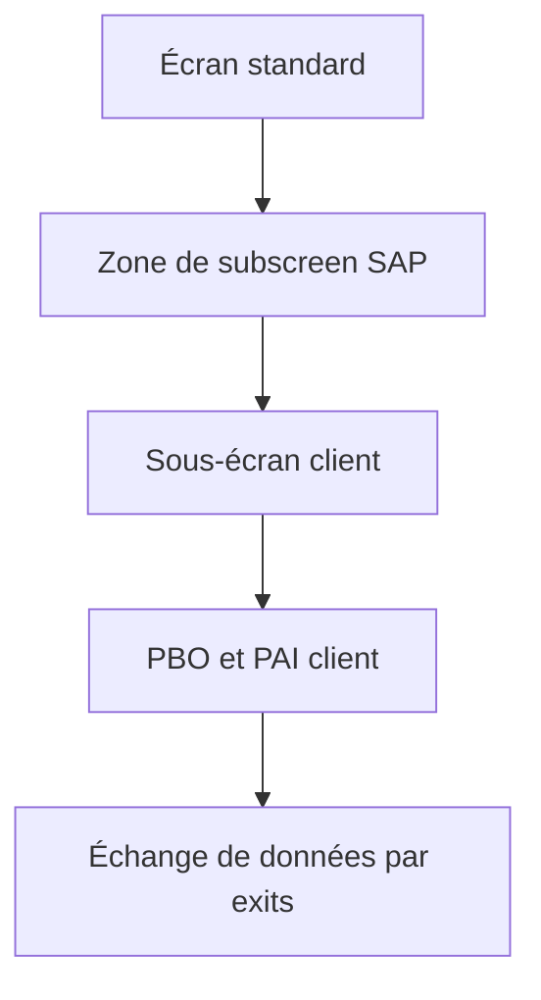

# 9. SCREEN EXITS

## 9.A RÉSULTAT ATTENDU

- Ajouter un sous-écran client à un écran standard prévu par SAP
- Comprendre le flux de données entre programme standard et sous-écran
- Coordonner Dynpro, DDIC et function exits

## 9.B ARCHITECTURE



SAP place une zone de sous-écran dans le Dynpro standard. Le client crée le sous-écran dans le programme ou groupe de fonctions prévu par le composant.

## 9.C COMPOSANTS À COORDONNER

Un screen exit opérationnel associe le sous-écran déclaré dans `SMOD`, le projet `CMOD`, les champs DDIC, les modules PBO/PAI et les function exits qui échangent les données avec le programme standard. L’écran seul n’assure ni l’initialisation ni la sauvegarde.

## 9.D POINTS DE VIGILANCE

- le sous-écran ne possède pas de GUI status autonome ;
- la navigation doit respecter le flux du Dynpro principal ;
- les champs doivent être initialisés à chaque affichage pertinent ;
- le PAI ne doit pas persister les données indépendamment du standard ;
- les champs ajoutés peuvent nécessiter une append structure et une logique de sauvegarde.

## 9.E PROCESS

### 9.E.1 ÉTAPE 1 — ANALYSER LE SCREEN EXIT DANS `SMOD`

Afficher l’enhancement et ouvrir le composant écran. Relever le programme ou groupe de fonctions client prévu, le numéro de sous-écran et la zone de subscreen standard. Identifier les function exits associés au transfert aller et retour des données.

### 9.E.2 ÉTAPE 2 — OUVRIR LE PROJET `CMOD`

Vérifier que l’enhancement est affecté au projet attendu et que le projet est transportable. Ouvrir le composant écran depuis le projet afin de créer le sous-écran dans l’objet client prévu, pas dans le programme SAP standard.

### 9.E.3 ÉTAPE 3 — CRÉER LE SOUS-ÉCRAN

Dans Screen Painter, créer le numéro indiqué avec le type **Sous-écran**. Ajouter uniquement les champs requis, fondés sur des types DDIC stables. Ne créer ni GUI status autonome ni navigation incompatible avec le Dynpro principal.

### 9.E.4 ÉTAPE 4 — IMPLÉMENTER PBO ET PAI

Dans le flow logic, appeler des modules PBO pour initialiser l’affichage et PAI pour transférer ou valider les saisies. Conserver ces modules légers. Ne pas exécuter de commit ni persister indépendamment du cycle de sauvegarde standard.

### 9.E.5 ÉTAPE 5 — RELIER LES DONNÉES AU STANDARD

Implémenter les function exits associés pour alimenter les globales du sous-écran et récupérer les valeurs modifiées. Ajouter les append structures prévues avant le code qui accède aux champs. Vérifier le comportement en création, modification et affichage.

### 9.E.6 ÉTAPE 6 — ACTIVER ET TESTER LE CYCLE COMPLET

Activer les objets DDIC, le sous-écran, les includes et le projet CMOD. Tester affichage, saisie, sauvegarde, retour, annulation et réouverture du document. Vérifier qu’aucune valeur d’un document précédent ne reste dans les données globales.

## 9.F VÉRIFICATION

- L’implémentation ou le projet est actif et transporté dans le bon ordre.
- Un breakpoint confirme que le point d’extension est appelé dans le scénario visé.
- Le comportement standard reste inchangé hors du périmètre fonctionnel prévu.
- Aucune modification directe d’un objet SAP standard n’a été créée.

## 9.G ERREURS FRÉQUENTES

- Choisir le premier exit trouvé sans vérifier le moment exact de l’appel.
- Créer plusieurs implémentations concurrentes sans règles de filtre.

## 9.H FICHE DE CONTRÔLE À COPIER

```text
Système / SID       :
Mandant             :
Utilisateur         :
Transaction / outil :
Objet technique     :
Jeu de données      :
Résultat attendu    :
Résultat observé    :
Horodatage          :
Ordre de transport  :
```

## 9.I TERMES DU LEXIQUE

- [BAdI](<../🧩 00 ├── LEXIQUE SAP ET ABAP/10 └── ACRONYMES SAP.md#acro-badi>)
- [BTE](<../🧩 00 ├── LEXIQUE SAP ET ABAP/10 └── ACRONYMES SAP.md#acro-bte>)
- [Objet Repository](<../🧩 00 ├── LEXIQUE SAP ET ABAP/03 ├── REPOSITORY PACKAGES ET TRANSPORTS.md#objet-repository>)

## 9.J RÉFÉRENCES OFFICIELLES SAP

- [Types of Exits — SAP Help Portal](https://help.sap.com/docs/ABAP_PLATFORM_NEW/2b28ffa716c24348903f8ffbfeb81df8/c81975e643b111d1896f0000e8322d00.html)
- [Customer Exits — SAP Help Portal](https://help.sap.com/docs/ABAP_PLATFORM_NEW/2b28ffa716c24348903f8ffbfeb81df8/c81975cc43b111d1896f0000e8322d00.html)
- [Enhancement Technologies — SAP Help Portal](https://help.sap.com/docs/ABAP_PLATFORM_NEW/46a2cfc13d25463b8b9a3d2a3c3ba0d9/7063da4023a28631e10000000a1550b0.html)

---

[Chapitre suivant — MENU EXITS](<./10 ├── MENU EXITS.md>)
