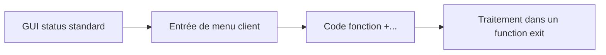

# 10. MENU EXITS

## 10.A RÉSULTAT ATTENDU

- Ajouter une entrée de menu ou une fonction à une transaction standard
- Implémenter le traitement associé
- Contrôler disponibilité et autorisations

## 10.B PRINCIPE

Un menu exit permet d’ajouter une fonction à un GUI status prévu par SAP. Les codes fonction des menu exits sont généralement définis par SAP et commencent par `+`.



## 10.C IMPLÉMENTATION

- identifier le menu exit dans `SMOD` ;
- affecter l’enhancement au projet `CMOD` ;
- maintenir le texte de l’entrée ;
- implémenter le traitement dans le composant prévu ;
- vérifier les autorisations avant l’action ;
- gérer les contextes où l’action n’est pas disponible.

## 10.D BONNES PRATIQUES

- masquer ou désactiver l’action lorsqu’elle n’est pas pertinente ;
- ne pas détourner un code fonction standard ;
- afficher un texte court et non ambigu ;
- réutiliser une transaction ou une classe de service existante ;
- tester les langues de connexion utilisées ;
- contrôler le retour vers l’écran standard.

## 10.E PROCESS

### 10.E.1 ÉTAPE 1 — ANALYSER LE MENU EXIT

Dans `SMOD`, afficher l’enhancement puis le composant menu. Relever le code fonction fourni par SAP, les GUI status concernés et la documentation. Identifier le function exit ou user exit prévu pour traiter la commande.

### 10.E.2 ÉTAPE 2 — VÉRIFIER LE PROJET `CMOD`

Ouvrir le projet contenant l’enhancement et contrôler son statut. Accéder au composant menu depuis le projet. Ne pas modifier directement le GUI status standard dans `SE41`.

### 10.E.3 ÉTAPE 3 — MAINTENIR LE TEXTE DE FONCTION

Renseigner le libellé client associé au code fonction et, si le composant le prévoit, les textes complémentaires. Utiliser un texte traduisible et cohérent avec l’action. Conserver exactement le code fonction déclaré par l’exit.

### 10.E.4 ÉTAPE 4 — IMPLÉMENTER LE TRAITEMENT DE COMMANDE

Dans l’exit prévu, traiter la valeur de commande par une branche explicite, puis déléguer l’action à une classe Z. Vérifier les autorisations et le contexte métier avant l’exécution. Ne pas intercepter les commandes standard non concernées.

### 10.E.5 ÉTAPE 5 — GÉRER LA DISPONIBILITÉ

Lorsque le contrat le permet, désactiver ou masquer l’action si le statut du document ou l’autorisation l’interdit. Répéter le contrôle dans le traitement de commande ; l’état visuel seul ne constitue pas une protection.

### 10.E.6 ÉTAPE 6 — ACTIVER ET TESTER

Activer les includes et le projet. Tester l’affichage du menu dans chaque GUI status concerné, l’exécution de la commande, l’autorisation refusée et un écran où l’action ne doit pas apparaître. Vérifier les traductions et le transport des textes.

## 10.F VÉRIFICATION

- L’implémentation ou le projet est actif et transporté dans le bon ordre.
- Un breakpoint confirme que le point d’extension est appelé dans le scénario visé.
- Le comportement standard reste inchangé hors du périmètre fonctionnel prévu.
- Aucune modification directe d’un objet SAP standard n’a été créée.

## 10.G ERREURS FRÉQUENTES

- Choisir le premier exit trouvé sans vérifier le moment exact de l’appel.
- Créer plusieurs implémentations concurrentes sans règles de filtre.

## 10.H FICHE DE CONTRÔLE À COPIER

```text
Système / SID       :
Mandant             :
Utilisateur         :
Transaction / outil :
Objet technique     :
Jeu de données      :
Résultat attendu    :
Résultat observé    :
Horodatage          :
Ordre de transport  :
```

## 10.I TERMES DU LEXIQUE

- [BAdI](<../🧩 00 ├── LEXIQUE SAP ET ABAP/10 └── ACRONYMES SAP.md#acro-badi>)
- [BTE](<../🧩 00 ├── LEXIQUE SAP ET ABAP/10 └── ACRONYMES SAP.md#acro-bte>)
- [Objet Repository](<../🧩 00 ├── LEXIQUE SAP ET ABAP/03 ├── REPOSITORY PACKAGES ET TRANSPORTS.md#objet-repository>)

## 10.J RÉFÉRENCES OFFICIELLES SAP

- [Types of Exits — SAP Help Portal](https://help.sap.com/docs/ABAP_PLATFORM_NEW/2b28ffa716c24348903f8ffbfeb81df8/c81975e643b111d1896f0000e8322d00.html)
- [Enhancements, User Exits and Customer Exits — SAP Help Portal](https://help.sap.com/docs/btp/ABAP/3353526313.html)

---

[Chapitre suivant — EXTENSIONS DDIC ASSOCIÉES AUX EXITS](<./11 ├── EXTENSIONS DDIC ASSOCIEES AUX EXITS.md>)
