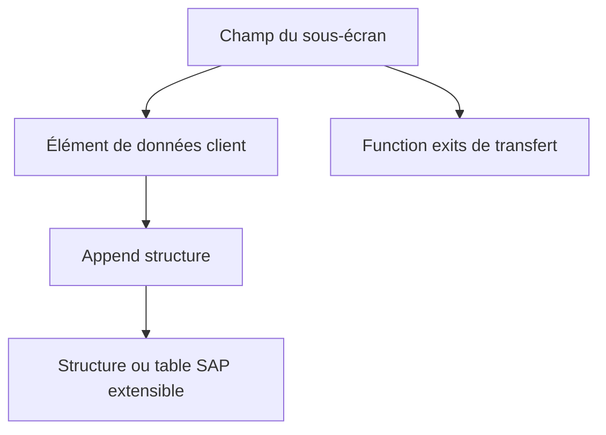

# EXTENSIONS DDIC ASSOCIÉES AUX EXITS

## RÉSULTAT ATTENDU

- Relier un champ client à une extension applicative
- Utiliser append structures et éléments de données sans modifier la table SAP
- Organiser le transport des dépendances

## CAS CLASSIQUE

Un screen exit affiche un champ client. La persistance peut nécessiter :

- un élément de données client ;
- un domaine client ;
- une append structure sur une structure ou table extensible ;
- un sous-écran ;
- des function exits pour l’alimentation et la sauvegarde.



## RÈGLES

- utiliser les mécanismes d’append prévus par le Dictionary ;
- ne pas ajouter un champ directement dans une table SAP ;
- vérifier les catégories d’extension autorisées ;
- respecter le namespace client ;
- ne pas supposer que l’ajout DDIC entraîne automatiquement l’affichage ou la sauvegarde ;
- analyser les impacts sur les structures, interfaces, IDoc et extractions.

## TRANSPORT

Transporter dans un ordre cohérent :

1. domaine et élément de données ;
2. append structure ;
3. sous-écran et code ;
4. projet ou implémentation d’extension ;
5. paramétrage éventuel.

## PROCESS

### ÉTAPE 1 — IDENTIFIER LE POINT DDIC PRÉVU

Depuis la documentation `SMOD` et les paramètres des exits, relever la structure client, l’include `CI_*` ou l’append attendu. Vérifier sa présence dans les tables et structures réellement utilisées par le processus. Ne pas ajouter un champ à une structure voisine sans preuve de propagation.

### ÉTAPE 2 — DÉFINIR LES CHAMPS Z

Créer ou réutiliser des éléments de données Z avec domaine, libellés, aide de recherche et documentation cohérents. Choisir des types compatibles avec le stockage, l’écran et l’interface de l’exit. Définir les règles de valeur initiale et de conversion.

### ÉTAPE 3 — CRÉER L’APPEND OU COMPLÉTER L’INCLUDE

Dans `SE11`, ouvrir l’objet autorisé et ajouter les composants dans une append structure Z ou l’include client prévu. Affecter le package et la demande de transport. Ne pas modifier directement les composants livrés par SAP.

### ÉTAPE 4 — CONTRÔLER ET ACTIVER LE DDIC

Exécuter le contrôle de cohérence puis activer les domaines, éléments de données et append dans l’ordre des dépendances. Examiner les messages d’activation et, pour une table, vérifier l’état de la structure physique selon la procédure Basis du système.

### ÉTAPE 5 — ADAPTER L’EXIT ET L’ÉCRAN

Utiliser les nouveaux champs dans le screen exit ou le function exit prévu pour l’initialisation et la sauvegarde. Éviter les affectations dynamiques si le champ est désormais typé dans le contrat client. Conserver la validation métier dans une classe dédiée.

### ÉTAPE 6 — TESTER LE CYCLE ET LE TRANSPORT

Créer, modifier, afficher et annuler un document avec les nouveaux champs. Vérifier la persistance, les valeurs initiales, les aides et les autorisations. Contrôler que les objets DDIC sont transportés avant le code et les écrans qui les référencent.

## VÉRIFICATION

- L’implémentation ou le projet est actif et transporté dans le bon ordre.
- Un breakpoint confirme que le point d’extension est appelé dans le scénario visé.
- Le comportement standard reste inchangé hors du périmètre fonctionnel prévu.
- Aucune modification directe d’un objet SAP standard n’a été créée.

## ERREURS FRÉQUENTES

- Choisir le premier exit trouvé sans vérifier le moment exact de l’appel.
- Créer plusieurs implémentations concurrentes sans règles de filtre.

## FICHE DE CONTRÔLE À COPIER

```text
Système / SID       :
Mandant             :
Utilisateur         :
Transaction / outil :
Objet technique     :
Jeu de données      :
Résultat attendu    :
Résultat observé    :
Horodatage          :
Ordre de transport  :
```

## TERMES DU LEXIQUE

- [DDIC](<../🧩 00 ├── LEXIQUE SAP ET ABAP/10 └── ACRONYMES SAP.md#acro-ddic>)
- [BAdI](<../🧩 00 ├── LEXIQUE SAP ET ABAP/10 └── ACRONYMES SAP.md#acro-badi>)
- [BTE](<../🧩 00 ├── LEXIQUE SAP ET ABAP/10 └── ACRONYMES SAP.md#acro-bte>)
- [Objet Repository](<../🧩 00 ├── LEXIQUE SAP ET ABAP/03 ├── REPOSITORY PACKAGES ET TRANSPORTS.md#objet-repository>)

## RÉFÉRENCES OFFICIELLES SAP

- [Enhancement Technologies — SAP Help Portal](https://help.sap.com/docs/ABAP_PLATFORM_NEW/46a2cfc13d25463b8b9a3d2a3c3ba0d9/7063da4023a28631e10000000a1550b0.html)
- [Enhancement Framework — SAP Help Portal](https://help.sap.com/docs/SAP_S4HANA_ON-PREMISE/e322becd165844e5868e590bc8efafaf/949cdc40132a8531e10000000a1550b0.html)
- [Types of Exits — SAP Help Portal](https://help.sap.com/docs/ABAP_PLATFORM_NEW/2b28ffa716c24348903f8ffbfeb81df8/c81975e643b111d1896f0000e8322d00.html)

---

[Chapitre suivant — FIELD EXITS ET TECHNOLOGIES HISTORIQUES](<./12 ├── FIELD EXITS ET TECHNOLOGIES HISTORIQUES.md>)
