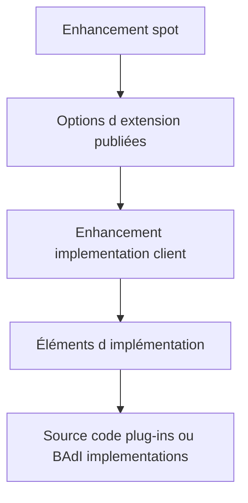

# ENHANCEMENT SPOTS ET IMPLÉMENTATIONS

## RÉSULTAT ATTENDU

- Distinguer conteneur de définition et conteneur d’implémentation
- Comprendre simple et composite enhancement spots
- Organiser les objets d’extension

## MODÈLE



L’enhancement spot regroupe des options d’extension du côté définition. L’enhancement implementation regroupe les implémentations client. Les objets restent séparés du code enrichi.

## TYPES DE CONTENEURS

- **simple enhancement spot** : regroupe des options d’un même contexte ;
- **composite enhancement spot** : structure plusieurs enhancement spots ;
- **simple enhancement implementation** : contient les éléments d’implémentation ;
- **composite enhancement implementation** : structure plusieurs implémentations.

## CRÉATION CÔTÉ CLIENT

Pour implémenter une option existante :

1. ouvrir l’objet standard dans `SE80`, l’éditeur ABAP ou `SE18` ;
2. passer en mode enhancement ;
3. sélectionner l’option ;
4. créer ou choisir une enhancement implementation client ;
5. affecter package et transport ;
6. coder l’élément ;
7. activer l’élément et l’implémentation.

Le client ne doit pas créer un enhancement spot dans un objet SAP uniquement pour contourner l’absence d’un point prévu ; cela modifierait la définition standard.

## PROCESS

### ÉTAPE 1 — IDENTIFIER LE SPOT DEPUIS LE PROCESSUS

Retrouver dans le code standard l’enhancement point, l’enhancement section ou l’appel de BAdI concerné. Relever le nom du spot et le package. Confirmer au débogueur que ce code appartient au scénario et à la version actifs.

### ÉTAPE 2 — ANALYSER LE SPOT

Ouvrir l’enhancement spot dans `SE18` ou `SE80`. Lire sa documentation et inventorier ses éléments : définitions BAdI, points explicites et sections. Examiner les interfaces et restrictions de chaque élément avant de choisir une implémentation.

### ÉTAPE 3 — INVENTORIER LES IMPLÉMENTATIONS EXISTANTES

Afficher les enhancement implementations liées au spot. Relever leur statut, package, contenu, filtres et système d’origine. Vérifier si une implémentation Z couvre déjà le besoin ou si plusieurs blocs pourraient agir au même endroit.

### ÉTAPE 4 — CRÉER L’IMPLÉMENTATION CLIENT

Créer une enhancement implementation Z avec une description fonctionnelle, un package et une demande de transport. Ajouter seulement les éléments nécessaires. Conserver une seule responsabilité métier identifiable par implémentation.

### ÉTAPE 5 — IMPLÉMENTER ET ACTIVER

Pour une BAdI, implémenter les méthodes dans une classe Z et maintenir les filtres. Pour un point source, placer un code minimal déléguant à une classe de service. Activer les classes, éléments d’enhancement puis l’implémentation complète.

### ÉTAPE 6 — TESTER ET PRÉPARER L’UPGRADE

Poser un breakpoint dans chaque élément implémenté et reproduire le scénario cible puis un cas hors périmètre. Conserver le spot, l’élément, la position source et les tests. Cette fiche sert à contrôler l’implémentation après une mise à niveau.

## VÉRIFICATION

- L’implémentation ou le projet est actif et transporté dans le bon ordre.
- Un breakpoint confirme que le point d’extension est appelé dans le scénario visé.
- Le comportement standard reste inchangé hors du périmètre fonctionnel prévu.
- Aucune modification directe d’un objet SAP standard n’a été créée.

## ERREURS FRÉQUENTES

- Choisir le premier exit trouvé sans vérifier le moment exact de l’appel.
- Créer plusieurs implémentations concurrentes sans règles de filtre.

## FICHE DE CONTRÔLE À COPIER

```text
Système / SID       :
Mandant             :
Utilisateur         :
Transaction / outil :
Objet technique     :
Jeu de données      :
Résultat attendu    :
Résultat observé    :
Horodatage          :
Ordre de transport  :
```

## TERMES DU LEXIQUE

- [BAdI](<../🧩 00 ├── LEXIQUE SAP ET ABAP/10 └── ACRONYMES SAP.md#acro-badi>)
- [BTE](<../🧩 00 ├── LEXIQUE SAP ET ABAP/10 └── ACRONYMES SAP.md#acro-bte>)
- [Objet Repository](<../🧩 00 ├── LEXIQUE SAP ET ABAP/03 ├── REPOSITORY PACKAGES ET TRANSPORTS.md#objet-repository>)

## RÉFÉRENCES OFFICIELLES SAP

- [Creating Enhancement Spots — SAP Help Portal](https://help.sap.com/docs/ABAP_PLATFORM_NEW/46a2cfc13d25463b8b9a3d2a3c3ba0d9/3b0a39426f79f83ae10000000a1550b0.html)
- [Enhancement Implementations — SAP Help Portal](https://help.sap.com/docs/ABAP_PLATFORM_NEW/46a2cfc13d25463b8b9a3d2a3c3ba0d9/8343e040e136742ae10000000a155106.html)
- [ABAP: Enhancement Concepts — SAP Help Portal](https://help.sap.com/docs/ABAP_PLATFORM_NEW/7bfe8cdcfbb040dcb6702dada8c3e2f0/f17cdbf76d1f4cb8805ed69891eafdd9.html)

---

[Chapitre suivant — POINTS D’ENHANCEMENT EXPLICITES](<./18 ├── POINTS D ENHANCEMENT EXPLICITES.md>)
