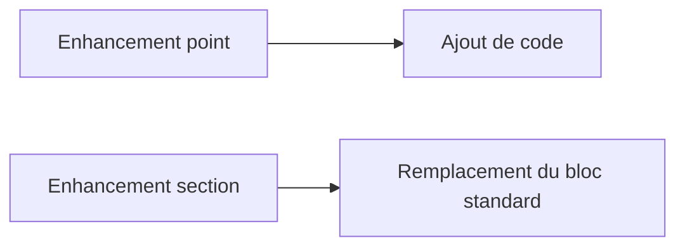

# POINTS D’ENHANCEMENT EXPLICITES

## RÉSULTAT ATTENDU

- Distinguer `ENHANCEMENT-POINT` et `ENHANCEMENT-SECTION`
- Créer un source code plug-in sur une option publiée
- Évaluer le risque d’un remplacement de section

## ENHANCEMENT POINT

Un point explicite désigne une position où le code d’une implémentation est ajouté.

Définition côté fournisseur :

```abap
ENHANCEMENT-POINT ep_validate SPOTS es_demo.
```

Implémentation client affichée dans l’éditeur :

```abap
ENHANCEMENT 1 zdev_validate.
  zcl_dev_extension=>validate( ).
ENDENHANCEMENT.
```

## ENHANCEMENT SECTION

Une section explicite encadre un bloc standard qui peut être remplacé par l’implémentation. Le code client ne complète pas le bloc : il le substitue.



Le remplacement augmente le risque de perdre des corrections ou évolutions apportées ultérieurement au bloc standard. Il doit être justifié et revu lors des upgrades.

## STATIC ET DYNAMIC

Certaines options sont statiques et interviennent dans les parties déclaratives ; d’autres sont dynamiques et interviennent dans le flux d’exécution. Respecter le contexte syntaxique de l’option.

## PROCESS

### ÉTAPE 1 — RETROUVER LE POINT EXPLICITE

Ouvrir le programme ou l’include standard en affichage et rechercher `ENHANCEMENT-POINT` ou `ENHANCEMENT-SECTION`. Relever le nom du point, le spot associé et le code environnant. Confirmer que le point est exécuté dans le scénario par un breakpoint proche.

### ÉTAPE 2 — ANALYSER LA POSITION ET LE CONTRAT

Examiner les données visibles, leur portée et les traitements exécutés avant et après le point. Pour une section, analyser précisément le code standard remplacé par l’implémentation. Écarter le point si le besoin exige des données absentes ou une borne transactionnelle différente.

### ÉTAPE 3 — AFFICHER LES IMPLÉMENTATIONS EXISTANTES

Depuis les opérations d’enhancement de l’éditeur, lister les implémentations attachées au point. Vérifier leur statut et leur comportement. Déterminer si plusieurs implémentations peuvent coexister sans dépendre d’un ordre implicite.

### ÉTAPE 4 — CRÉER L’ENHANCEMENT IMPLEMENTATION

Passer en mode enhancement, sélectionner le point et créer une implémentation Z dans le package et la demande prévus. Donner une description liée au besoin métier. Ne modifier aucune ligne standard autour du bloc généré.

### ÉTAPE 5 — AJOUTER UN CODE MINIMAL

Appeler une classe Z avec les données disponibles et traiter explicitement les valeurs initiales ou erreurs. Pour une enhancement section, reproduire ou remplacer uniquement le comportement décidé et tester toutes les branches standard supprimées par le remplacement.

### ÉTAPE 6 — ACTIVER ET TESTER

Activer la classe, le bloc et l’enhancement implementation. Exécuter le scénario avec breakpoint puis les cas hors périmètre. Contrôler les messages, la LUW, les performances et la liste des objets transportés.

## VÉRIFICATION

- L’implémentation ou le projet est actif et transporté dans le bon ordre.
- Un breakpoint confirme que le point d’extension est appelé dans le scénario visé.
- Le comportement standard reste inchangé hors du périmètre fonctionnel prévu.
- Aucune modification directe d’un objet SAP standard n’a été créée.

## ERREURS FRÉQUENTES

- Copier un exemple sans adapter les types, noms d’objets et données disponibles dans le système.
- Tester uniquement le cas nominal et ignorer les valeurs initiales, absentes ou invalides.
- Choisir le premier exit trouvé sans vérifier le moment exact de l’appel.
- Créer plusieurs implémentations concurrentes sans règles de filtre.

## SNIPPET À RÉUTILISER

> [!NOTE]
> Adapter les noms `Z*`, les types DDIC, les données et les autorisations au système cible. Effectuer un contrôle syntaxique avant activation.

```abap
ENHANCEMENT 1 zdev_validate.
  zcl_dev_extension=>validate( ).
ENDENHANCEMENT.
```

## TERMES DU LEXIQUE

- [BAdI](<../🧩 00 ├── LEXIQUE SAP ET ABAP/10 └── ACRONYMES SAP.md#acro-badi>)
- [BTE](<../🧩 00 ├── LEXIQUE SAP ET ABAP/10 └── ACRONYMES SAP.md#acro-bte>)
- [Objet Repository](<../🧩 00 ├── LEXIQUE SAP ET ABAP/03 ├── REPOSITORY PACKAGES ET TRANSPORTS.md#objet-repository>)

## RÉFÉRENCES OFFICIELLES SAP

- [Explicit Enhancement Options — SAP Help Portal](https://help.sap.com/docs/ABAP_PLATFORM_NEW/46a2cfc13d25463b8b9a3d2a3c3ba0d9/56ee9441026aae5fe10000000a1550b0.html)
- [ABAP Source Code Enhancements — SAP Help Portal](https://help.sap.com/docs/SAP_NETWEAVER_AS_ABAP_752/46a2cfc13d25463b8b9a3d2a3c3ba0d9/a047e94086087e7fe10000000a1550b0.html)
- [Source Code Plug-Ins — SAP Help Portal](https://help.sap.com/docs/ABAP_PLATFORM_BW4HANA/7bfe8cdcfbb040dcb6702dada8c3e2f0/e5dca35db39546569b2a35a359f816b4.html)

---

[Chapitre suivant — OPTIONS D’ENHANCEMENT IMPLICITES](<./19 ├── OPTIONS D ENHANCEMENT IMPLICITES.md>)
