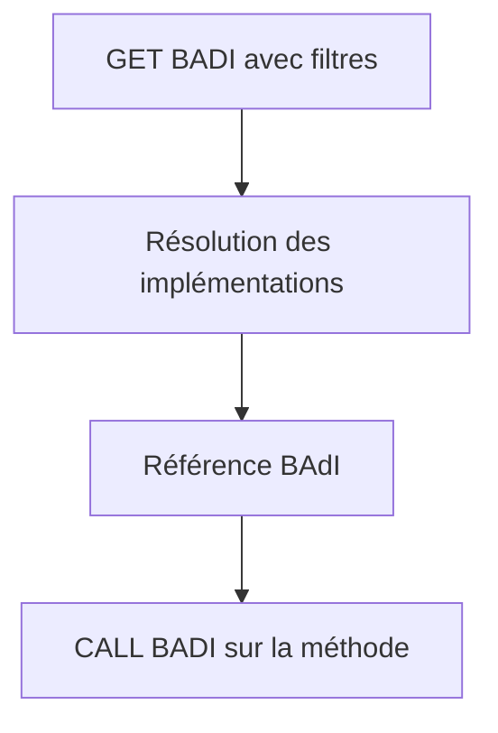

# 21. BAdI DU ENHANCEMENT FRAMEWORK ET APPELS ABAP

## 21.A RÉSULTAT ATTENDU

- Comprendre `GET BADI` et `CALL BADI`
- Distinguer code fournisseur et code d’implémentation client
- Interpréter filtres et absence d’implémentation

## 21.B CÔTÉ FOURNISSEUR

Une application qui définit et appelle son propre BAdI du Enhancement Framework peut utiliser :

```abap
DATA lo_badi TYPE REF TO zbadi_demo.

GET BADI lo_badi
  FILTERS
    country = lv_country.

CALL BADI lo_badi->change_data
  CHANGING
    cs_data = ls_data.
```

Ce code appartient au fournisseur du point d’extension. Lorsqu’un BAdI standard existe, le client crée une implémentation ; il ne modifie pas l’appel standard.

## 21.C SÉLECTION



Le comportement en l’absence d’implémentation dépend des propriétés de la définition, notamment single-use, multiple-use et fallback. Le fournisseur doit concevoir ce cas explicitement.

## 21.D PERFORMANCE

- résoudre la référence au niveau approprié ;
- ne pas exécuter une recherche coûteuse dans une boucle si le contexte est stable ;
- limiter le volume transmis ;
- documenter l’ordre attendu pour les BAdI multiple-use ;
- éviter les dépendances entre implémentations.

## 21.E PROCESS

### 21.E.1 ÉTAPE 1 — ANALYSER LA DÉFINITION ET SON SPOT

Dans `SE18`, ouvrir l’enhancement spot puis la définition BAdI. Relever l’interface, les filtres, le mode d’usage et les implémentations. Vérifier les types exacts nécessaires aux valeurs de filtre et aux paramètres des méthodes.

### 21.E.2 ÉTAPE 2 — RETROUVER L’ACQUISITION DE L’INSTANCE

Rechercher `GET BADI` dans le code appelant. Examiner les valeurs de filtre transmises et le traitement des exceptions ou de l’absence d’implémentation selon le contrat. Poser un breakpoint après l’acquisition pour confirmer la sélection runtime.

### 21.E.3 ÉTAPE 3 — RETROUVER L’APPEL DE MÉTHODE

Rechercher `CALL BADI` sur la référence obtenue. Comparer les paramètres passés à la signature de l’interface. Identifier comment le résultat, les paramètres changing et les exceptions influencent la suite du traitement.

### 21.E.4 ÉTAPE 4 — TESTER LA SÉLECTION DES IMPLÉMENTATIONS

Placer des breakpoints dans chaque classe candidate. Exécuter le scénario avec une valeur de filtre incluse, exclue et initiale. Pour une BAdI à usage multiple, relever toutes les implémentations appelées sans supposer un ordre non documenté.

### 21.E.5 ÉTAPE 5 — IMPLÉMENTER LE CONTRAT CLIENT

Créer l’implémentation dans `SE19`, maintenir des filtres non ambigus et coder les méthodes de l’interface. Déléguer la logique à une classe Z et respecter les paramètres modifiables. Activer classe, implémentation et objets dépendants.

### 21.E.6 ÉTAPE 6 — VALIDER AU POINT D’APPEL

Rejouer le processus depuis l’application standard. Contrôler les valeurs avant `CALL BADI`, à l’entrée et à la sortie de l’implémentation, puis après le retour au standard. Tester aussi le système cible après transport pour vérifier l’activation et les filtres.

## 21.F VÉRIFICATION

- L’implémentation ou le projet est actif et transporté dans le bon ordre.
- Un breakpoint confirme que le point d’extension est appelé dans le scénario visé.
- Le comportement standard reste inchangé hors du périmètre fonctionnel prévu.
- Aucune modification directe d’un objet SAP standard n’a été créée.

## 21.G ERREURS FRÉQUENTES

- Copier un exemple sans adapter les types, noms d’objets et données disponibles dans le système.
- Tester uniquement le cas nominal et ignorer les valeurs initiales, absentes ou invalides.
- Choisir le premier exit trouvé sans vérifier le moment exact de l’appel.
- Créer plusieurs implémentations concurrentes sans règles de filtre.

## 21.H SNIPPET À RÉUTILISER

> [!NOTE]
> Adapter les noms `Z*`, les types DDIC, les données et les autorisations au système cible. Effectuer un contrôle syntaxique avant activation.

```abap
DATA lo_badi TYPE REF TO zbadi_demo.

GET BADI lo_badi
  FILTERS
    country = lv_country.

CALL BADI lo_badi->change_data
  CHANGING
    cs_data = ls_data.
```

## 21.I TERMES DU LEXIQUE

- [ABAP](<../🧩 00 ├── LEXIQUE SAP ET ABAP/10 └── ACRONYMES SAP.md#acro-abap>)
- [BAdI](<../🧩 00 ├── LEXIQUE SAP ET ABAP/10 └── ACRONYMES SAP.md#acro-badi>)
- [BTE](<../🧩 00 ├── LEXIQUE SAP ET ABAP/10 └── ACRONYMES SAP.md#acro-bte>)
- [Objet Repository](<../🧩 00 ├── LEXIQUE SAP ET ABAP/03 ├── REPOSITORY PACKAGES ET TRANSPORTS.md#objet-repository>)

## 21.J RÉFÉRENCES OFFICIELLES SAP

- [Business Add-Ins — SAP Help Portal](https://help.sap.com/docs/PRODUCT_ID/46a2cfc13d25463b8b9a3d2a3c3ba0d9/8ff2e540f8648431e10000000a1550b0.html)
- [Single-Use BAdI — SAP Help Portal](https://help.sap.com/docs/ABAP_PLATFORM_NEW/46a2cfc13d25463b8b9a3d2a3c3ba0d9/44f55e8acb460485e10000000a155369.html)
- [How to Use Filters — SAP Help Portal](https://help.sap.com/docs/ABAP_PLATFORM_NEW/46a2cfc13d25463b8b9a3d2a3c3ba0d9/44f6cd83912541aae10000000a114a6b.html)

---

[Chapitre suivant — BUSINESS TRANSACTION EVENTS AVEC `FIBF`](<./22 ├── BUSINESS TRANSACTION EVENTS AVEC FIBF.md>)
