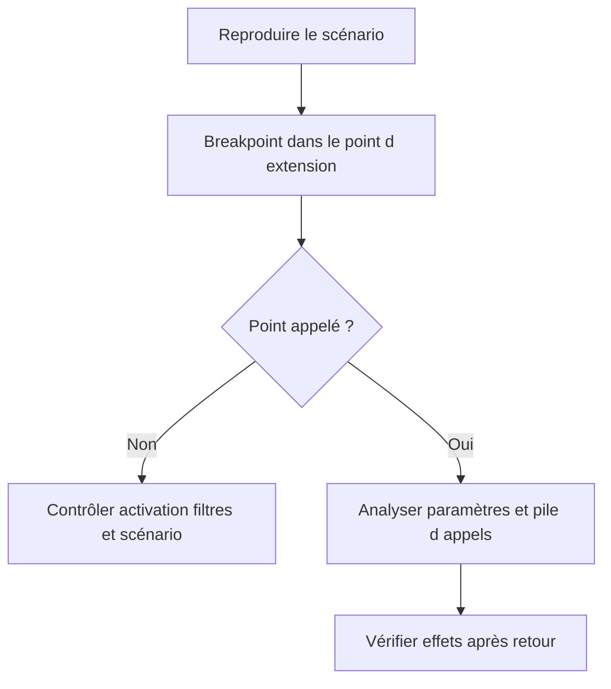

# TRANSPORT, DEBUG, UPGRADE ET BONNES PRATIQUES

## RÉSULTAT ATTENDU

- Livrer une extension complète et activable
- Diagnostiquer son exécution
- Contrôler les impacts d’un upgrade

## TRANSPORT

Vérifier la présence de tous les objets :

- projet `CMOD` et includes client ;
- implémentation BAdI et classe associée ;
- enhancement implementation et éléments ;
- objets DDIC ;
- sous-écrans et textes ;
- Customizing BTE ou valeurs de filtre ;
- classe de service et classe de messages.

Les objets Workbench et Customizing peuvent appartenir à des ordres distincts. Définir leur ordre d’import.

## DEBUG



Pour un point appelé en update task, RFC ou job, utiliser le type de breakpoint adapté et les outils de surveillance correspondants.

## UPGRADE

`SPAU_ENH` et l’Enhancement Information System permettent d’identifier les enhancements nécessitant une analyse ou un ajustement. Une implémentation active peut rester syntaxiquement valide tout en devenant fonctionnellement incorrecte après modification du standard.

Contrôler particulièrement :

- enhancement sections ;
- options implicites ;
- overwrite-methods ;
- dépendances à des variables locales ;
- interfaces BAdI modifiées ;
- customer exits remplacés ou migrés.

## CHECKLIST

- [ ] Extension publiée privilégiée avant une option implicite
- [ ] Point d’appel prouvé par debug
- [ ] Contrat et contexte transactionnel documentés
- [ ] Aucun commit caché
- [ ] Logique déléguée à une classe client
- [ ] Activation et désactivation testées
- [ ] Filtres et multiplicités vérifiés
- [ ] Effets de bord et performance mesurés
- [ ] Tous les objets et Customizing transportés
- [ ] Cas d’erreur et rollback testés
- [ ] Contrôle `SPAU_ENH` prévu après upgrade
- [ ] Documentation technique reliée au besoin métier

## PROCÉDURE PAS À PAS

1. Saisir `/nCMOD`.
2. Créer ou afficher un projet client Z.
3. Affecter l’enhancement `SMOD` validé.
4. Implémenter les composants nécessaires dans les includes client.
5. Activer les composants puis le projet.
6. Tester le scénario avec un breakpoint et vérifier qu’aucun autre projet actif ne provoque de conflit.

## VÉRIFICATION

- L’implémentation ou le projet est actif et transporté dans le bon ordre.
- Un breakpoint confirme que le point d’extension est appelé dans le scénario visé.
- Le comportement standard reste inchangé hors du périmètre fonctionnel prévu.
- Aucune modification directe d’un objet SAP standard n’a été créée.

## ERREURS FRÉQUENTES

- Choisir le premier exit trouvé sans vérifier le moment exact de l’appel.
- Créer plusieurs implémentations concurrentes sans règles de filtre.

## FICHE DE CONTRÔLE À COPIER

```text
Système / SID       :
Mandant             :
Utilisateur         :
Transaction / outil :
Objet technique     :
Jeu de données      :
Résultat attendu    :
Résultat observé    :
Horodatage          :
Ordre de transport  :
```

## TERMES DU LEXIQUE

- [BAdI](<../🧩 00 ├── LEXIQUE SAP ET ABAP/10 └── ACRONYMES SAP.md#acro-badi>)
- [BTE](<../🧩 00 ├── LEXIQUE SAP ET ABAP/10 └── ACRONYMES SAP.md#acro-bte>)
- [Objet Repository](<../🧩 00 ├── LEXIQUE SAP ET ABAP/03 ├── REPOSITORY PACKAGES ET TRANSPORTS.md#objet-repository>)

## RÉFÉRENCES OFFICIELLES SAP

- [Performing Adjustments — SAP Help Portal](https://help.sap.com/docs/ABAP_PLATFORM_NEW/46a2cfc13d25463b8b9a3d2a3c3ba0d9/f8ec104259a2e62ce10000000a1550b0.html)
- [Enhancement Information System — SAP Help Portal](https://help.sap.com/docs/SAP_NETWEAVER_750/46a2cfc13d25463b8b9a3d2a3c3ba0d9/29503e423a95b36be10000000a155106.html)
- [Enhancement Framework — SAP Help Portal](https://help.sap.com/docs/SAP_S4HANA_ON-PREMISE/e322becd165844e5868e590bc8efafaf/949cdc40132a8531e10000000a1550b0.html)
- [Adjusting Classes, Interfaces and Function Groups — SAP Help Portal](https://help.sap.com/docs/ABAP_PLATFORM_NEW/46a2cfc13d25463b8b9a3d2a3c3ba0d9/4640793345962f8fe10000000a1553f6.html)
