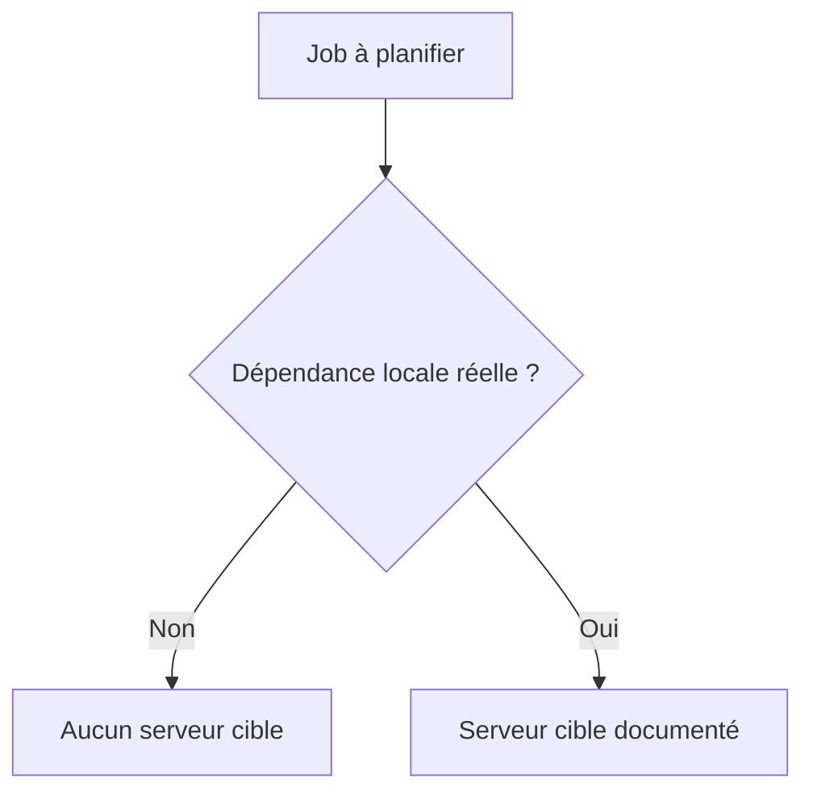

# CLASSES DE JOB, PRIORITÉS ET SERVEUR CIBLE

## RÉSULTAT ATTENDU

- Comprendre les classes `A`, `B` et `C`
- Éviter l’usage abusif des priorités élevées
- Savoir quand fixer un serveur cible

## CLASSES

| Classe | Positionnement                                                |
| ------ | ------------------------------------------------------------- |
| `A`    | Priorité élevée, réservée aux traitements critiques autorisés |
| `B`    | Priorité intermédiaire                                        |
| `C`    | Priorité normale pour la majorité des jobs                    |

La classe influence l’ordre de prise en charge, mais elle ne corrige pas un programme lent ni une infrastructure insuffisante.

## RÈGLE DE GOUVERNANCE

La classe `A` doit être attribuée selon une règle d’exploitation formalisée. Une multiplication de jobs `A` annule l’intérêt de la priorisation et peut pénaliser les traitements normaux.

## SERVEUR CIBLE

Laisser le système répartir la charge est généralement préférable. Fixer un serveur seulement si une contrainte vérifiée l’exige.



## DIAGNOSTIC

Si un job reste prêt :

- contrôler la classe ;
- vérifier les processus batch disponibles ;
- vérifier le serveur cible ;
- rechercher une saturation ou un arrêt d’instance ;
- analyser les modes d’exploitation.

## PROCESS

### ÉTAPE 1 — CLASSER LE BESOIN D’EXPLOITATION

Documenter la criticité, l’heure limite, la durée habituelle, le volume et l’impact d’un retard. Faire valider la classe de job par l’exploitation. Une classe élevée ne corrige ni un programme lent ni une planification surchargée.

### ÉTAPE 2 — VÉRIFIER LA CAPACITÉ DISPONIBLE

Identifier les serveurs ou groupes disposant de processus batch pendant la fenêtre prévue. Examiner avec Basis les autres charges concurrentes. Déterminer si le programme nécessite une proximité particulière avec une ressource ou un fichier local au serveur.

### ÉTAPE 3 — CONFIGURER CLASSE ET CIBLAGE

Dans `SM36`, affecter la classe autorisée. Laisser le système choisir la ressource lorsque aucune contrainte n’existe. Si un serveur ou groupe est requis, renseigner le ciblage validé et documenter la raison technique.

### ÉTAPE 4 — CONTRÔLER LE JOB LIBÉRÉ

Dans `SM37`, ouvrir les détails et vérifier classe, serveur cible, condition de démarrage et étapes. Comparer au contrat d’exploitation. Corriger avant la fenêtre si le job dépend d’un serveur indisponible.

### ÉTAPE 5 — MESURER LE DÉMARRAGE RÉEL

Après exécution, relever heure prévue, heure de début, serveur d’exécution et durée. Distinguer un retard d’ordonnancement d’une durée programme excessive. Conserver plusieurs exécutions comparables avant de conclure à un problème de capacité.

### ÉTAPE 6 — RÉÉVALUER SANS CONTOURNER LA GOUVERNANCE

Si l’objectif n’est pas tenu, ajuster avec Basis la fenêtre, la classe, le groupe ou la capacité, puis mesurer à nouveau. Ne pas forcer durablement une classe prioritaire ou un serveur cible depuis un programme Z sans décision d’exploitation.

## VÉRIFICATION

- Le job apparaît dans `SM37` avec le statut attendu.
- Le journal ne contient pas de message d’erreur non traité.
- Le spool, le fichier ou le journal applicatif contient le résultat attendu.
- Une relance contrôlée ne crée pas de doublon métier.

## ERREURS FRÉQUENTES

- Planifier un job avec l’utilisateur personnel d’un développeur.
- Relancer un job non idempotent après un échec partiel.

## FICHE DE CONTRÔLE À COPIER

```text
Système / SID       :
Mandant             :
Utilisateur         :
Transaction / outil :
Objet technique     :
Jeu de données      :
Résultat attendu    :
Résultat observé    :
Horodatage          :
Ordre de transport  :
```

## TERMES DU LEXIQUE

- [Classe](<../🧩 00 ├── LEXIQUE SAP ET ABAP/04 ├── LANGAGE ET DEVELOPPEMENT ABAP.md#classe>)
- [Job](<../🧩 00 ├── LEXIQUE SAP ET ABAP/06 ├── PROGRAMMES CLASSES ET OBJETS TECHNIQUES.md#job>)
- [Spool](<../🧩 00 ├── LEXIQUE SAP ET ABAP/06 ├── PROGRAMMES CLASSES ET OBJETS TECHNIQUES.md#spool>)
- [Processus background](<../🧩 00 ├── LEXIQUE SAP ET ABAP/08 ├── EXECUTION EXPLOITATION ET ADMINISTRATION.md#processus-background>)
- [Variante](<../🧩 00 ├── LEXIQUE SAP ET ABAP/06 ├── PROGRAMMES CLASSES ET OBJETS TECHNIQUES.md#variante>)

## RÉFÉRENCES OFFICIELLES SAP

- [Scheduling Background Jobs — SAP Help Portal](https://help.sap.com/docs/ABAP_PLATFORM_NEW/b07e7195f03f438b8e7ed273099d74f3/4b2b2954365474fee10000000a421937.html)
- [Background Work Processes — SAP Help Portal](https://help.sap.com/docs/ABAP_PLATFORM_NEW/b07e7195f03f438b8e7ed273099d74f3/4b2b3c3e8eb51780e10000000a42189c.html)

---

[Chapitre suivant — JOBS PÉRIODIQUES ET FENÊTRES D’EXÉCUTION](<./09 ├── JOBS PERIODIQUES ET FENETRES D EXECUTION.md>)
