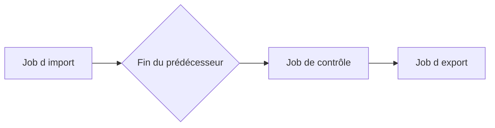

# 10. DÉPENDANCES ENTRE JOBS

## 10.A RÉSULTAT ATTENDU

- Enchaîner des traitements sans dépendre d’horaires approximatifs
- Définir le comportement après succès ou échec
- Éviter les chaînes impossibles à reprendre

## 10.B CONDITION « APRÈS JOB »

Un job peut attendre la fin d’un prédécesseur. Cette relation est préférable à un décalage horaire arbitraire lorsque le second traitement dépend réellement du premier.



## 10.C SUCCÈS OU FIN QUELCONQUE

La configuration doit préciser si le successeur peut démarrer :

- uniquement après une fin normale ;
- même si le prédécesseur est annulé.

Le second choix est dangereux si le successeur suppose des données complètes.

## 10.D CONCEPTION DE LA CHAÎNE

Documenter pour chaque étape :

- prérequis ;
- données produites ;
- critère de succès ;
- comportement en cas de doublon ;
- procédure de reprise ;
- personne ou équipe responsable.

## 10.E LIMITE

Les dépendances classiques de `SM36` ne constituent pas un moteur complet de workflow. Une chaîne avec nombreuses branches, compensations et dépendances externes doit être gérée par un ordonnanceur ou une orchestration adaptée.

## 10.F PROCESS

### 10.F.1 ÉTAPE 1 — DÉFINIR LE CONTRAT ENTRE PRODUCTEUR ET CONSOMMATEUR

Identifier le job producteur, son résultat persistant et le job consommateur. Définir les statuts de fin autorisant la suite et les preuves de complétude : fichier publié, lot validé ou statut métier. Le nom du prédécesseur seul ne prouve pas que la donnée attendue existe.

### 10.F.2 ÉTAPE 2 — CHOISIR LE MÉCANISME DE DÉPENDANCE

Utiliser une condition « après job » pour une séquence batch simple et stable. Utiliser un événement ou un statut applicatif lorsque l’identité du lot ou la complétude métier doit être transmise. Éviter une simple heure décalée, qui ne garantit aucune fin réelle.

### 10.F.3 ÉTAPE 3 — CONFIGURER LE CONSOMMATEUR

Dans `SM36`, définir l’étape et sa condition après le job ou l’événement exact. Renseigner les paramètres nécessaires et vérifier le comportement prévu si le producteur se termine en erreur. Enregistrer puis contrôler le statut libéré dans `SM37`.

### 10.F.4 ÉTAPE 4 — AJOUTER UNE VALIDATION À L’ENTRÉE

Au démarrage, le consommateur vérifie l’identifiant de lot, le statut final et les contrôles de volume. Si la preuve manque, il s’arrête sans traiter des données partielles. Journaliser le prérequis absent avec la clé attendue.

### 10.F.5 ÉTAPE 5 — TESTER SUCCÈS, ÉCHEC ET RETARD

Exécuter un producteur réussi, un producteur en erreur et un producteur retardé. Vérifier quand le consommateur devient éligible et ce qu’il fait dans chaque cas. Tester aussi un événement dupliqué ou un nom de job homonyme.

### 10.F.6 ÉTAPE 6 — DÉFINIR LA REPRISE DE LA CHAÎNE

Documenter si la reprise relance le producteur, le consommateur ou une unité précise. Vérifier l’idempotence des deux côtés et conserver les identifiants du lot. Ne pas recopier toute la chaîne si une étape validée produirait des doublons.

## 10.G VÉRIFICATION

- Le job apparaît dans `SM37` avec le statut attendu.
- Le journal ne contient pas de message d’erreur non traité.
- Le spool, le fichier ou le journal applicatif contient le résultat attendu.
- Une relance contrôlée ne crée pas de doublon métier.

## 10.H ERREURS FRÉQUENTES

- Planifier un job avec l’utilisateur personnel d’un développeur.
- Relancer un job non idempotent après un échec partiel.

## 10.I FICHE DE CONTRÔLE À COPIER

```text
Système / SID       :
Mandant             :
Utilisateur         :
Transaction / outil :
Objet technique     :
Jeu de données      :
Résultat attendu    :
Résultat observé    :
Horodatage          :
Ordre de transport  :
```

## 10.J TERMES DU LEXIQUE

- [Job](<../🧩 00 ├── LEXIQUE SAP ET ABAP/06 ├── PROGRAMMES CLASSES ET OBJETS TECHNIQUES.md#job>)
- [Spool](<../🧩 00 ├── LEXIQUE SAP ET ABAP/06 ├── PROGRAMMES CLASSES ET OBJETS TECHNIQUES.md#spool>)
- [Processus background](<../🧩 00 ├── LEXIQUE SAP ET ABAP/08 ├── EXECUTION EXPLOITATION ET ADMINISTRATION.md#processus-background>)
- [Variante](<../🧩 00 ├── LEXIQUE SAP ET ABAP/06 ├── PROGRAMMES CLASSES ET OBJETS TECHNIQUES.md#variante>)

## 10.K RÉFÉRENCES OFFICIELLES SAP

- [Specifying Job Start Conditions — SAP Help Portal](https://help.sap.com/docs/ABAP_PLATFORM_NEW/b07e7195f03f438b8e7ed273099d74f3/4b2b2b4a365474fee10000000a421937.html)
- [Managing Jobs from the Job Overview — SAP Help Portal](https://help.sap.com/docs/ABAP_PLATFORM_NEW/b07e7195f03f438b8e7ed273099d74f3/4b2bc2224c594ba2e10000000a42189c.html)

---

[Chapitre suivant — ÉVÉNEMENTS DE FOND, `SM62` ET `SM64`](<./11 ├── EVENEMENTS DE FOND SM62 ET SM64.md>)
