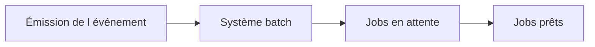

# ÉVÉNEMENTS DE FOND, `SM62` ET `SM64`

## RÉSULTAT ATTENDU

- Comprendre le déclenchement événementiel
- Distinguer définition et émission d’un événement
- Utiliser les arguments sans ambiguïté

## PRINCIPE

Un événement informe le système de traitement de fond qu’une condition est satisfaite. Tous les jobs libérés qui attendent cet événement et son argument deviennent éligibles au démarrage.



## TRANSACTIONS

- `SM62` : définition et historique des événements selon la version et l’écran utilisé ;
- `SM64` : déclenchement manuel et maintenance des événements de fond selon les autorisations disponibles.

Toujours vérifier le comportement exact dans le système cible, car les menus et libellés peuvent varier selon la version.

## IDENTIFIANT ET ARGUMENT

L’identifiant représente le type d’événement. L’argument permet de distinguer une occurrence ou un contexte.

Exemple :

```text
Événement : Z_FILE_RECEIVED
Argument  : SALES_20260731.csv
```

## BONNES PRATIQUES

- utiliser un préfixe client ;
- documenter l’émetteur ;
- définir si l’argument est obligatoire ;
- ne pas transmettre de données sensibles ;
- garantir que le consommateur peut être exécuté plusieurs fois sans corruption.

## PROCESS

### ÉTAPE 1 — DÉFINIR L’ÉVÉNEMENT DANS `SM62`

Créer ou afficher l’identifiant avec un préfixe Z et une description explicite. Documenter l’émetteur, les consommateurs et le sens de l’argument. Vérifier les autorisations et la gouvernance avant de créer un événement de portée globale.

### ÉTAPE 2 — NORMALISER L’ARGUMENT

Définir le format exact : identifiant de lot, fichier ou domaine fonctionnel. Limiter sa longueur et exclure les données sensibles. Le producteur et le job en attente doivent utiliser la même casse et la même convention.

### ÉTAPE 3 — PLANIFIER LE JOB CONSOMMATEUR

Dans `SM36`, créer l’étape puis choisir une condition de démarrage par événement. Renseigner l’identifiant et l’argument attendus, enregistrer et libérer. Dans `SM37`, vérifier que le job attend le bon événement.

### ÉTAPE 4 — DÉCLENCHER MANUELLEMENT EN TEST

Dans `SM64`, sélectionner l’événement défini et saisir l’argument exact. Déclencher une seule occurrence en environnement de test. Relever l’heure et contrôler dans `SM37` quel job devient éligible.

### ÉTAPE 5 — VÉRIFIER LA CORRESPONDANCE

Tester l’argument correct, une casse différente, un argument absent et un argument inconnu. Vérifier qu’aucun job non destiné au lot ne démarre. Le consommateur contrôle aussi la présence du résultat métier associé.

### ÉTAPE 6 — TESTER LES ÉVÉNEMENTS DUPLIQUÉS

Déclencher deux fois la même combinaison. Vérifier la règle de périodicité ou de replanification et l’idempotence du traitement. Journaliser l’occurrence et l’identifiant de lot afin de diagnostiquer toute exécution multiple.

## VÉRIFICATION

- Le job apparaît dans `SM37` avec le statut attendu.
- Le journal ne contient pas de message d’erreur non traité.
- Le spool, le fichier ou le journal applicatif contient le résultat attendu.
- Une relance contrôlée ne crée pas de doublon métier.

## ERREURS FRÉQUENTES

- Planifier un job avec l’utilisateur personnel d’un développeur.
- Relancer un job non idempotent après un échec partiel.

## FICHE DE CONTRÔLE À COPIER

```text
Système / SID       :
Mandant             :
Utilisateur         :
Transaction / outil :
Objet technique     :
Jeu de données      :
Résultat attendu    :
Résultat observé    :
Horodatage          :
Ordre de transport  :
```

## TERMES DU LEXIQUE

- [Job](<../🧩 00 ├── LEXIQUE SAP ET ABAP/06 ├── PROGRAMMES CLASSES ET OBJETS TECHNIQUES.md#job>)
- [Spool](<../🧩 00 ├── LEXIQUE SAP ET ABAP/06 ├── PROGRAMMES CLASSES ET OBJETS TECHNIQUES.md#spool>)
- [Processus background](<../🧩 00 ├── LEXIQUE SAP ET ABAP/08 ├── EXECUTION EXPLOITATION ET ADMINISTRATION.md#processus-background>)
- [Variante](<../🧩 00 ├── LEXIQUE SAP ET ABAP/06 ├── PROGRAMMES CLASSES ET OBJETS TECHNIQUES.md#variante>)

## RÉFÉRENCES OFFICIELLES SAP

- [Events in Background Processing Explained — SAP Help Portal](https://help.sap.com/docs/ABAP_PLATFORM_NEW/b07e7195f03f438b8e7ed273099d74f3/4b2bbdd14c594ba2e10000000a42189c.html)
- [Defining Events — SAP Help Portal](https://help.sap.com/docs/ABAP_PLATFORM_NEW/b07e7195f03f438b8e7ed273099d74f3/4d9521f0d1b83c46e10000000a42189e.html)
- [Triggering Events from SAP GUI — SAP Help Portal](https://help.sap.com/docs/ABAP_PLATFORM_NEW/b07e7195f03f438b8e7ed273099d74f3/4d99bd4f786d1822e10000000a42189e.html)

---

[Chapitre suivant — DÉCLENCHER UN ÉVÉNEMENT EN ABAP](<./12 ├── DECLENCHER UN EVENEMENT EN ABAP.md>)
