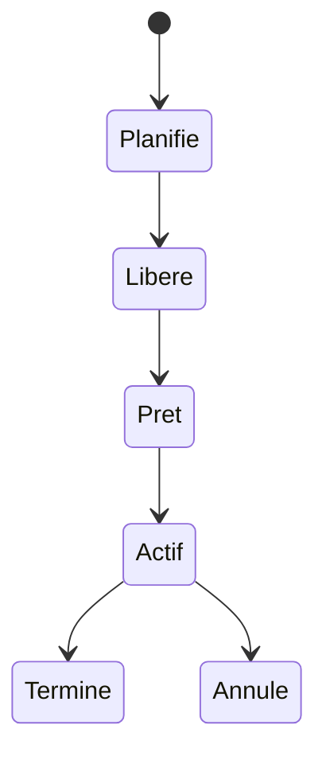

# 16. STATUTS D’UN JOB

## 16.A RÉSULTAT ATTENDU

- Interpréter le cycle de vie d’un job
- Distinguer attente normale et anomalie
- Choisir l’action compatible avec le statut

## 16.B CYCLE PRINCIPAL



Les libellés peuvent varier légèrement selon la langue et la version du système.

## 16.C SIGNIFICATION

| Statut   | Interprétation                                                  |
| -------- | --------------------------------------------------------------- |
| Planifié | Définition enregistrée, pas encore libérée pour exécution       |
| Libéré   | Autorisé à démarrer lorsque la condition sera satisfaite        |
| Prêt     | Condition atteinte, attente d’un processus batch                |
| Actif    | Une étape est en cours d’exécution                              |
| Terminé  | Toutes les étapes se sont terminées normalement                 |
| Annulé   | Le job a été interrompu ou une étape a provoqué une terminaison |

## 16.D « TERMINÉ » NE SIGNIFIE PAS TOUJOURS « MÉTIER RÉUSSI »

Un programme peut finir techniquement sans erreur tout en ayant rejeté toutes les données. Le statut du job doit être complété par :

- journal applicatif ;
- compteurs traités, réussis et rejetés ;
- fichier de rejet ;
- contrôle des données produites ;
- alerte métier.

## 16.E JOB PRÊT TROP LONGTEMPS

Contrôler les processus batch, la classe, le serveur cible, les modes d’exploitation et la charge système.

## 16.F PROCESS

### 16.F.1 ÉTAPE 1 — IDENTIFIER LE STATUT ET L’HORODATAGE

Dans `SM37`, sélectionner l’occurrence exacte et relever statut, heure prévue, début et fin. Comparer ces valeurs avant d’interpréter l’état. Un job libéré en attente et un job actif depuis longtemps nécessitent des diagnostics différents.

### 16.F.2 ÉTAPE 2 — INTERPRÉTER « PLANIFIÉ » OU « LIBÉRÉ »

Pour un job planifié, vérifier qu’une condition de démarrage complète existe. Pour un job libéré, contrôler la date, l’événement, le prédécesseur et la disponibilité des processus batch. Ne pas relancer une copie tant que la cause de l’attente n’est pas connue.

### 16.F.3 ÉTAPE 3 — INTERPRÉTER « PRÊT » OU « ACTIF »

Pour un job prêt, vérifier la capacité et le ciblage serveur. Pour un job actif, ouvrir les étapes et identifier le programme courant, le serveur et la durée. Corréler avec le journal avant de conclure à un blocage.

### 16.F.4 ÉTAPE 4 — INTERPRÉTER « TERMINÉ »

Lire le journal, le spool et les compteurs métier. Vérifier le résultat persistant. Un programme peut se terminer sans erreur système tout en journalisant des rejets ou en ne sélectionnant aucune donnée.

### 16.F.5 ÉTAPE 5 — INTERPRÉTER « ANNULÉ »

Relever le premier message d’erreur, l’étape, le programme et l’heure. Rechercher un dump `ST22`, une erreur d’autorisation, une annulation opérateur ou un défaut externe correspondant. Distinguer la cause initiale des messages secondaires de fin.

### 16.F.6 ÉTAPE 6 — AGIR SELON L’ÉTAT MÉTIER

Contrôler les unités déjà validées et la stratégie de reprise avant modification du job. Documenter l’action : attendre, corriger la condition, résoudre la capacité, réparer le code ou relancer une unité idempotente. Le statut seul n’autorise jamais une répétition aveugle.

## 16.G VÉRIFICATION

- Le job apparaît dans `SM37` avec le statut attendu.
- Le journal ne contient pas de message d’erreur non traité.
- Le spool, le fichier ou le journal applicatif contient le résultat attendu.
- Une relance contrôlée ne crée pas de doublon métier.

## 16.H ERREURS FRÉQUENTES

- Planifier un job avec l’utilisateur personnel d’un développeur.
- Relancer un job non idempotent après un échec partiel.

## 16.I FICHE DE CONTRÔLE À COPIER

```text
Système / SID       :
Mandant             :
Utilisateur         :
Transaction / outil :
Objet technique     :
Jeu de données      :
Résultat attendu    :
Résultat observé    :
Horodatage          :
Ordre de transport  :
```

## 16.J TERMES DU LEXIQUE

- [Job](<../🧩 00 ├── LEXIQUE SAP ET ABAP/06 ├── PROGRAMMES CLASSES ET OBJETS TECHNIQUES.md#job>)
- [Spool](<../🧩 00 ├── LEXIQUE SAP ET ABAP/06 ├── PROGRAMMES CLASSES ET OBJETS TECHNIQUES.md#spool>)
- [Processus background](<../🧩 00 ├── LEXIQUE SAP ET ABAP/08 ├── EXECUTION EXPLOITATION ET ADMINISTRATION.md#processus-background>)
- [Variante](<../🧩 00 ├── LEXIQUE SAP ET ABAP/06 ├── PROGRAMMES CLASSES ET OBJETS TECHNIQUES.md#variante>)

## 16.K RÉFÉRENCES OFFICIELLES SAP

- [Possible Status of Background Jobs — SAP Help Portal](https://help.sap.com/docs/ABAP_PLATFORM_NEW/b07e7195f03f438b8e7ed273099d74f3/4b308aa91dd90a93e10000000a421937.html)
- [Job Was Not Started — SAP Help Portal](https://help.sap.com/docs/ABAP_PLATFORM_NEW/b07e7195f03f438b8e7ed273099d74f3/4b272c13d1341780e10000000a42189c.html)

---

[Chapitre suivant — JOURNAL DE JOB ET MESSAGES](<./17 ├── JOURNAL DE JOB ET MESSAGES.md>)
