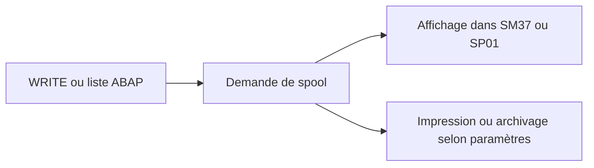

# SPOOL, SORTIES ET DESTINATAIRES

## RÉSULTAT ATTENDU

- Comprendre où va la sortie d’une liste ABAP
- Configurer les paramètres d’impression
- Éviter les spools massifs ou inutiles

## PRINCIPE

Lorsqu’un programme ABAP exécuté en arrière-plan produit une liste, la sortie est enregistrée dans le système de spool.



## PARAMÈTRES

Une étape peut définir notamment :

- périphérique de sortie ;
- impression immédiate ;
- suppression après impression ;
- nombre de copies ;
- titre ;
- destinataire de la liste ;
- options d’archivage selon la configuration.

## RISQUES

- millions de lignes écrites dans un spool ;
- saturation des tables et fichiers de spool ;
- données sensibles accessibles à des utilisateurs non autorisés ;
- sortie illisible parce que la largeur de page n’est pas adaptée ;
- conservation trop longue.

## RECOMMANDATION

Un rapport batch ne doit pas utiliser le spool comme base de données. Produire une synthèse et stocker les détails dans un journal applicatif ou un fichier contrôlé.

## OUTILS

- `SM37` : spool lié au job ;
- `SP01` : demandes de spool ;
- `SPAD` : administration des périphériques, réservée aux équipes compétentes.

## PROCESS

### ÉTAPE 1 — IDENTIFIER L’ÉTAPE PRODUCTRICE

Dans `SM37`, ouvrir le job exact et sa liste d’étapes. Relever le programme, la variante, l’utilisateur et les paramètres de spool de l’étape concernée. Plusieurs étapes peuvent produire des demandes distinctes.

### ÉTAPE 2 — OUVRIR LA DEMANDE DE SPOOL

Depuis le job, afficher les spools associés et relever leur numéro, statut, nombre de pages et date. Si nécessaire, ouvrir le même numéro dans `SP01` pour examiner les attributs détaillés.

### ÉTAPE 3 — CONTRÔLER LE CONTENU

Afficher la liste et vérifier titre, en-têtes, pagination, caractères, troncature et compteurs métier. Distinguer un spool vide parce qu’aucune donnée n’était sélectionnée d’un spool absent à cause d’une erreur avant la sortie.

### ÉTAPE 4 — CONTRÔLER LA DESTINATION

Vérifier l’imprimante logique, le format, le destinataire et les options de conservation. Confirmer que la destination existe dans le système cible et que l’utilisateur d’exécution peut l’utiliser. Ne pas résoudre une erreur de destination en changeant arbitrairement le code du report.

### ÉTAPE 5 — ANALYSER UN STATUT EN ERREUR

Relever le message et l’heure de traitement de la demande. Corréler avec l’administration du spool et la disponibilité de la destination selon la procédure Basis. Conserver le numéro de spool avant toute réimpression ou suppression.

### ÉTAPE 6 — VALIDER SORTIE ET RÉTENTION

Après correction, générer un nouveau spool avec la même variante et comparer contenu et attributs. Vérifier la durée de conservation, la confidentialité et la purge. Le succès du job ne remplace pas le contrôle de la sortie effectivement remise au destinataire.

## VÉRIFICATION

- Le job apparaît dans `SM37` avec le statut attendu.
- Le journal ne contient pas de message d’erreur non traité.
- Le spool, le fichier ou le journal applicatif contient le résultat attendu.
- Une relance contrôlée ne crée pas de doublon métier.

## ERREURS FRÉQUENTES

- Planifier un job avec l’utilisateur personnel d’un développeur.
- Relancer un job non idempotent après un échec partiel.

## FICHE DE CONTRÔLE À COPIER

```text
Système / SID       :
Mandant             :
Utilisateur         :
Transaction / outil :
Objet technique     :
Jeu de données      :
Résultat attendu    :
Résultat observé    :
Horodatage          :
Ordre de transport  :
```

## TERMES DU LEXIQUE

- [Spool](<../🧩 00 ├── LEXIQUE SAP ET ABAP/06 ├── PROGRAMMES CLASSES ET OBJETS TECHNIQUES.md#spool>)
- [Job](<../🧩 00 ├── LEXIQUE SAP ET ABAP/06 ├── PROGRAMMES CLASSES ET OBJETS TECHNIQUES.md#job>)
- [Processus background](<../🧩 00 ├── LEXIQUE SAP ET ABAP/08 ├── EXECUTION EXPLOITATION ET ADMINISTRATION.md#processus-background>)
- [Variante](<../🧩 00 ├── LEXIQUE SAP ET ABAP/06 ├── PROGRAMMES CLASSES ET OBJETS TECHNIQUES.md#variante>)

## RÉFÉRENCES OFFICIELLES SAP

- [Obtaining Printing and Archiving Specifications — SAP Help Portal](https://help.sap.com/docs/ABAP_PLATFORM_NEW/b07e7195f03f438b8e7ed273099d74f3/4d9110b58e4f34b7e10000000a42189c.html)
- [Background Work Processes — SAP Help Portal](https://help.sap.com/docs/ABAP_PLATFORM_NEW/b07e7195f03f438b8e7ed273099d74f3/4b2b3c3e8eb51780e10000000a42189c.html)

---

[Chapitre suivant — MODIFIER, COPIER, REPLANIFIER, ANNULER ET SUPPRIMER](<./19 ├── MODIFIER COPIER REPLANIFIER ANNULER ET SUPPRIMER.md>)
