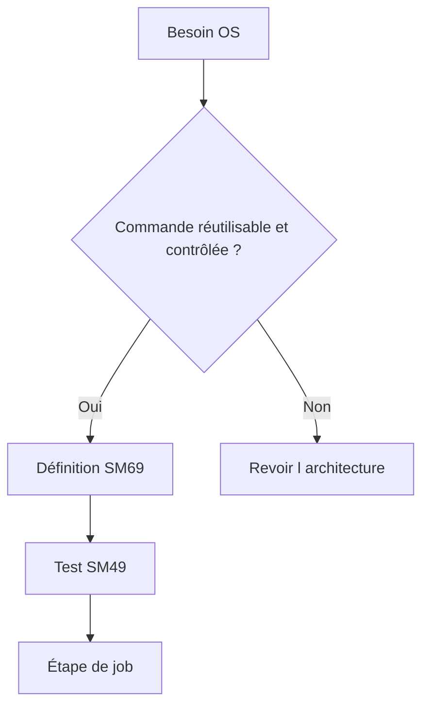

# COMMANDES ET PROGRAMMES EXTERNES

## RÉSULTAT ATTENDU

- Distinguer commande externe et programme externe
- Utiliser `SM69` et `SM49` de manière sécurisée
- Diagnostiquer les erreurs SAPXPG

## DISTINCTION

Une **commande externe** est prédéfinie et administrée dans SAP, généralement avec `SM69`. Un **programme externe** peut être spécifié plus directement et nécessite des autorisations d’administration plus fortes.



## SÉCURITÉ

Une commande externe peut donner accès au système d’exploitation. Elle doit imposer :

- chemin absolu ou environnement maîtrisé ;
- paramètres autorisés limités ;
- utilisateur OS adapté ;
- interdiction d’injection de commandes ;
- journalisation ;
- restrictions d’autorisation ;
- validation par l’administration Basis et sécurité.

## OUTILS

- `SM69` : définition des commandes externes ;
- `SM49` : test d’une commande définie ;
- `SM37` : journal de l’étape ;
- trace SAPXPG : diagnostic des exécutions externes selon la configuration.

## ERREURS COURANTES

- exécutable absent sur le serveur cible ;
- droits OS insuffisants ;
- paramètres mal échappés ;
- différence de répertoire ou d’environnement ;
- code retour non nul ;
- sortie d’erreur dans le journal ;
- serveur cible incompatible.

## PROCÉDURE PAS À PAS

1. Saisir `/nSM37`.
2. Renseigner le nom du job, l’utilisateur et une période suffisamment précise.
3. Exécuter la recherche et sélectionner le job correspondant au bon horodatage.
4. Lire le statut, le journal de job, les étapes et le spool.
5. En cas d’échec, relever le message, le programme, la variante, l’utilisateur et l’heure avant toute relance.

## VÉRIFICATION

- Le job apparaît dans `SM37` avec le statut attendu.
- Le journal ne contient pas de message d’erreur non traité.
- Le spool, le fichier ou le journal applicatif contient le résultat attendu.
- Une relance contrôlée ne crée pas de doublon métier.

## ERREURS FRÉQUENTES

- Planifier un job avec l’utilisateur personnel d’un développeur.
- Relancer un job non idempotent après un échec partiel.

## FICHE DE CONTRÔLE À COPIER

```text
Système / SID       :
Mandant             :
Utilisateur         :
Transaction / outil :
Objet technique     :
Jeu de données      :
Résultat attendu    :
Résultat observé    :
Horodatage          :
Ordre de transport  :
```

## TERMES DU LEXIQUE

- [Job](<../🧩 00 ├── LEXIQUE SAP ET ABAP/06 ├── PROGRAMMES CLASSES ET OBJETS TECHNIQUES.md#job>)
- [Spool](<../🧩 00 ├── LEXIQUE SAP ET ABAP/06 ├── PROGRAMMES CLASSES ET OBJETS TECHNIQUES.md#spool>)
- [Processus background](<../🧩 00 ├── LEXIQUE SAP ET ABAP/08 ├── EXECUTION EXPLOITATION ET ADMINISTRATION.md#processus-background>)
- [Variante](<../🧩 00 ├── LEXIQUE SAP ET ABAP/06 ├── PROGRAMMES CLASSES ET OBJETS TECHNIQUES.md#variante>)

## RÉFÉRENCES OFFICIELLES SAP

- [External Commands and External Programs — SAP Help Portal](https://help.sap.com/docs/ABAP_PLATFORM_NEW/b07e7195f03f438b8e7ed273099d74f3/4b2bbe5e4c594ba2e10000000a42189c.html)
- [Defining External Commands — SAP Help Portal](https://help.sap.com/docs/ABAP_PLATFORM_NEW/b07e7195f03f438b8e7ed273099d74f3/4b2b3e958eb51780e10000000a42189c.html)
- [Analyzing Problems with External Commands — SAP Help Portal](https://help.sap.com/docs/ABAP_PLATFORM_NEW/b07e7195f03f438b8e7ed273099d74f3/4b272d0ed1341780e10000000a42189c.html)


---

[Chapitre suivant — ANALYSER LES ÉCHECS ET LES RETARDS](<./22 ├── ANALYSER LES ECHECS ET LES RETARDS.md>)
