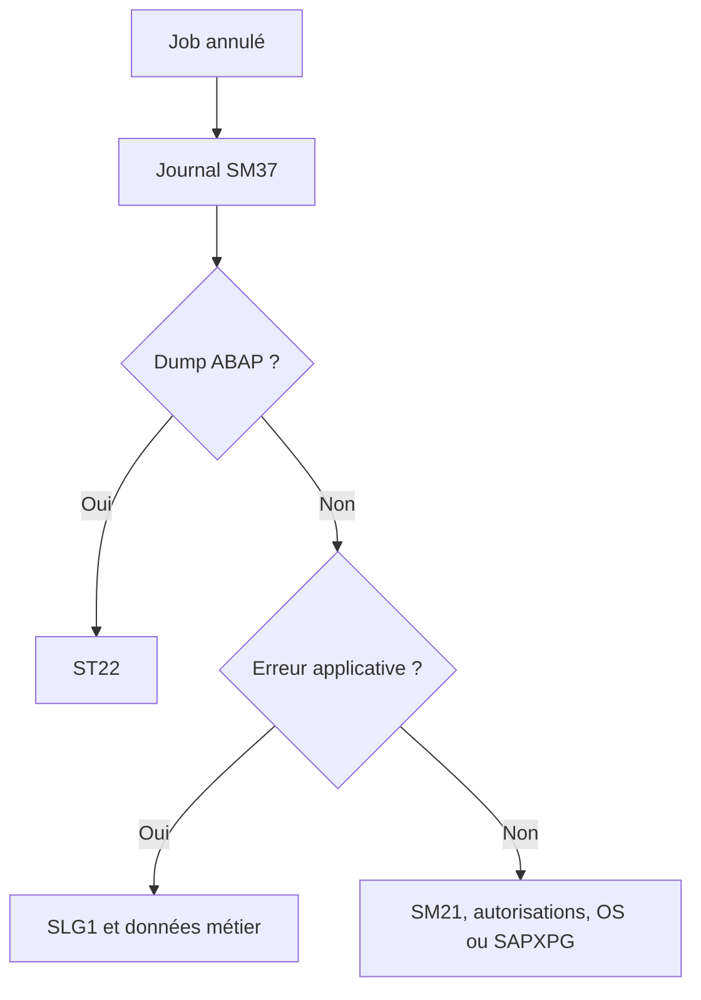

# ANALYSER LES ÉCHECS ET LES RETARDS

## RÉSULTAT ATTENDU

- Appliquer une méthode de diagnostic reproductible
- Distinguer un job non démarré, lent ou annulé
- Corréler les outils SAP

## JOB NON DÉMARRÉ

Contrôler dans cet ordre :

1. statut libéré ;
2. condition de démarrage atteinte ;
3. date limite non dépassée ;
4. serveur cible disponible ;
5. processus batch disponibles ;
6. classe et concurrence ;
7. autorisations de libération ;
8. cohérence du système de jobs.

## JOB ANNULÉ



## JOB LENT

- mesurer la durée par phase ;
- analyser SQL avec `ST05` ;
- analyser le runtime avec `SAT` ou `ST12` ;
- contrôler les volumes de sélection ;
- vérifier les verrous et attentes ;
- rechercher les exécutions simultanées ;
- contrôler le serveur et les processus ;
- comparer avec une exécution précédente de volume similaire.

## DONNÉES À CONSERVER

- nom et numéro du job ;
- date, heure et client ;
- utilisateur d’exécution ;
- programme et variante ;
- serveur ;
- statut ;
- journal ;
- spool ;
- dump éventuel ;
- volumes ;
- traces et identifiants applicatifs.

## PROCÉDURE PAS À PAS

1. Saisir `/nSM37`.
2. Renseigner le nom du job, l’utilisateur et une période suffisamment précise.
3. Exécuter la recherche et sélectionner le job correspondant au bon horodatage.
4. Lire le statut, le journal de job, les étapes et le spool.
5. En cas d’échec, relever le message, le programme, la variante, l’utilisateur et l’heure avant toute relance.

## VÉRIFICATION

- Le job apparaît dans `SM37` avec le statut attendu.
- Le journal ne contient pas de message d’erreur non traité.
- Le spool, le fichier ou le journal applicatif contient le résultat attendu.
- Une relance contrôlée ne crée pas de doublon métier.

## ERREURS FRÉQUENTES

- Planifier un job avec l’utilisateur personnel d’un développeur.
- Relancer un job non idempotent après un échec partiel.

## FICHE DE CONTRÔLE À COPIER

```text
Système / SID       :
Mandant             :
Utilisateur         :
Transaction / outil :
Objet technique     :
Jeu de données      :
Résultat attendu    :
Résultat observé    :
Horodatage          :
Ordre de transport  :
```

## TERMES DU LEXIQUE

- [Job](<../🧩 00 ├── LEXIQUE SAP ET ABAP/06 ├── PROGRAMMES CLASSES ET OBJETS TECHNIQUES.md#job>)
- [Spool](<../🧩 00 ├── LEXIQUE SAP ET ABAP/06 ├── PROGRAMMES CLASSES ET OBJETS TECHNIQUES.md#spool>)
- [Processus background](<../🧩 00 ├── LEXIQUE SAP ET ABAP/08 ├── EXECUTION EXPLOITATION ET ADMINISTRATION.md#processus-background>)
- [Variante](<../🧩 00 ├── LEXIQUE SAP ET ABAP/06 ├── PROGRAMMES CLASSES ET OBJETS TECHNIQUES.md#variante>)

## RÉFÉRENCES OFFICIELLES SAP

- [Job Was Not Started — SAP Help Portal](https://help.sap.com/docs/ABAP_PLATFORM_NEW/b07e7195f03f438b8e7ed273099d74f3/4b272c13d1341780e10000000a42189c.html)
- [Managing Jobs from the Job Overview — SAP Help Portal](https://help.sap.com/docs/ABAP_PLATFORM_NEW/b07e7195f03f438b8e7ed273099d74f3/4b2bc2224c594ba2e10000000a42189c.html)
- [Job Storage Management — SAP Help Portal](https://help.sap.com/docs/ABAP_PLATFORM_NEW/b07e7195f03f438b8e7ed273099d74f3/4b2bc0974c594ba2e10000000a42189c.html)


---

[Chapitre suivant — CONCEPTION, REPRISE, IDEMPOTENCE ET BONNES PRATIQUES](<./23 └── CONCEPTION REPRISE IDEMPOTENCE ET BONNES PRATIQUES.md>)
