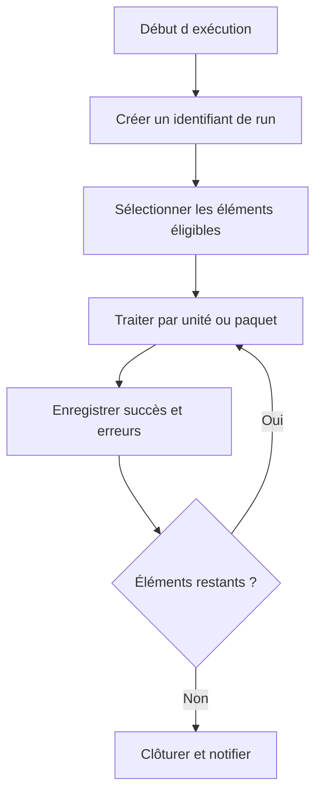

# CONCEPTION, REPRISE, IDEMPOTENCE ET BONNES PRATIQUES

## RÉSULTAT ATTENDU

- Concevoir un job exploitable en production
- Permettre une reprise sans doublon
- Fournir une checklist de livraison

## PROPRIÉTÉS D’UN JOB ROBUSTE

Un job professionnel doit être :

- **idempotent** : une relance ne corrompt pas les données ;
- **reprenable** : les éléments restant à traiter sont identifiables ;
- **observable** : compteurs, erreurs et identifiant d’exécution sont disponibles ;
- **borné** : le volume et la durée sont maîtrisés ;
- **sécurisé** : utilisateur et autorisations minimales ;
- **documenté** : fréquence, dépendances, variante, responsable et procédure d’incident.

## STRATÉGIE DE REPRISE



## PRINCIPES

- ne pas considérer le statut `Terminé` comme preuve suffisante du succès métier ;
- empêcher les exécutions concurrentes incompatibles ;
- utiliser des clés métier ou identifiants techniques pour éviter les doublons ;
- prévoir les commits selon des unités cohérentes ;
- ne pas masquer une erreur par une simple poursuite ;
- distinguer erreurs temporaires et définitives ;
- conserver les données de rejet ;
- ne pas dépendre d’une ressource frontend ;
- tester l’annulation en cours de traitement ;
- tester la reprise après échec partiel.

## CHECKLIST

- [ ] Programme compatible `sy-batch`
- [ ] Variante versionnée ou gouvernée
- [ ] Nom de job explicite
- [ ] Classe justifiée
- [ ] Aucun serveur cible sans nécessité
- [ ] Utilisateur technique minimal
- [ ] Pas d’interaction SAP GUI
- [ ] Journal métier avec compteurs
- [ ] Spool limité et sans données sensibles inutiles
- [ ] Concurrence contrôlée
- [ ] Idempotence démontrée
- [ ] Reprise documentée
- [ ] Alertes et responsabilité définies
- [ ] Test avec volume représentatif
- [ ] Diagnostic `SM37`, `ST22`, `SLG1`, `ST12` documenté
- [ ] Nettoyage des anciens jobs et spools pris en charge par l’exploitation

## JOBS TECHNIQUES STANDARD

SAP fournit des jobs techniques de nettoyage et de collecte à planifier selon les recommandations du produit et de la version. Leur fréquence et leur activation relèvent de l’administration du système, pas d’une convention générique de développement.

## PROCESS

### ÉTAPE 1 — DÉFINIR LE LOT ET SA CLÉ

Attribuer à chaque exécution un identifiant stable lié au périmètre métier. Définir les données incluses, l’ordre de traitement et la règle empêchant deux jobs de traiter le même lot. Persister cet identifiant avant la première unité modifiée.

### ÉTAPE 2 — DÉFINIR L’UNITÉ DE REPRISE

Choisir document, fichier, paquet ou autre unité atomique. Pour chaque unité, enregistrer statut, tentatives, début, fin et message. Aligner les commits sur cette unité afin qu’un statut « réussi » corresponde à des données réellement validées.

### ÉTAPE 3 — RENDRE LE TRAITEMENT IDEMPOTENT

Avant création, rechercher la clé fonctionnelle ou technique déjà traitée. Transformer les répétitions en absence d’effet, mise à jour déterministe ou rejet explicite selon le contrat. Ne pas utiliser uniquement le statut du job pour détecter les doublons.

### ÉTAPE 4 — JOURNALISER LES POINTS DE CONTRÔLE

Écrire les compteurs, la dernière unité validée et la première erreur dans une table de pilotage ou le journal applicatif. Le journal de job conserve le résumé et l’identifiant de lot. Une reprise doit être calculée depuis l’état persistant, pas depuis une ligne de spool.

### ÉTAPE 5 — TESTER LES INTERRUPTIONS

Arrêter le traitement avant le premier commit, après plusieurs unités et après un effet externe. Relancer le même lot et comparer au résultat d’une exécution complète. Vérifier doublons, unités manquantes, verrous et statuts restés actifs.

### ÉTAPE 6 — FORMALISER LA PROCÉDURE D’EXPLOITATION

Documenter comment identifier le lot, corriger la cause, choisir le point de reprise, autoriser la relance et valider le résultat. Inclure les transactions, objets de log et contrôles métier. Une copie manuelle du job ne constitue pas une stratégie de reprise.

## VÉRIFICATION

- Le job apparaît dans `SM37` avec le statut attendu.
- Le journal ne contient pas de message d’erreur non traité.
- Le spool, le fichier ou le journal applicatif contient le résultat attendu.
- Une relance contrôlée ne crée pas de doublon métier.

## ERREURS FRÉQUENTES

- Planifier un job avec l’utilisateur personnel d’un développeur.
- Relancer un job non idempotent après un échec partiel.

## FICHE DE CONTRÔLE À COPIER

```text
Système / SID       :
Mandant             :
Utilisateur         :
Transaction / outil :
Objet technique     :
Jeu de données      :
Résultat attendu    :
Résultat observé    :
Horodatage          :
Ordre de transport  :
```

## TERMES DU LEXIQUE

- [Job](<../🧩 00 ├── LEXIQUE SAP ET ABAP/06 ├── PROGRAMMES CLASSES ET OBJETS TECHNIQUES.md#job>)
- [Spool](<../🧩 00 ├── LEXIQUE SAP ET ABAP/06 ├── PROGRAMMES CLASSES ET OBJETS TECHNIQUES.md#spool>)
- [Processus background](<../🧩 00 ├── LEXIQUE SAP ET ABAP/08 ├── EXECUTION EXPLOITATION ET ADMINISTRATION.md#processus-background>)
- [Variante](<../🧩 00 ├── LEXIQUE SAP ET ABAP/06 ├── PROGRAMMES CLASSES ET OBJETS TECHNIQUES.md#variante>)

## RÉFÉRENCES OFFICIELLES SAP

- [Background Processing: Concepts and Features — SAP Help Portal](https://help.sap.com/docs/ABAP_PLATFORM_NEW/3ad3ba0715c5422eae08578d4c40328d/4b2b51c34c594ba2e10000000a42189c.html)
- [Standard Jobs — SAP Help Portal](https://help.sap.com/docs/ABAP_PLATFORM_NEW/b07e7195f03f438b8e7ed273099d74f3/4b26c6e6d7441ff8e10000000a42189c.html)
- [Managing Jobs from the Job Overview — SAP Help Portal](https://help.sap.com/docs/ABAP_PLATFORM_NEW/b07e7195f03f438b8e7ed273099d74f3/4b2bc2224c594ba2e10000000a42189c.html)
