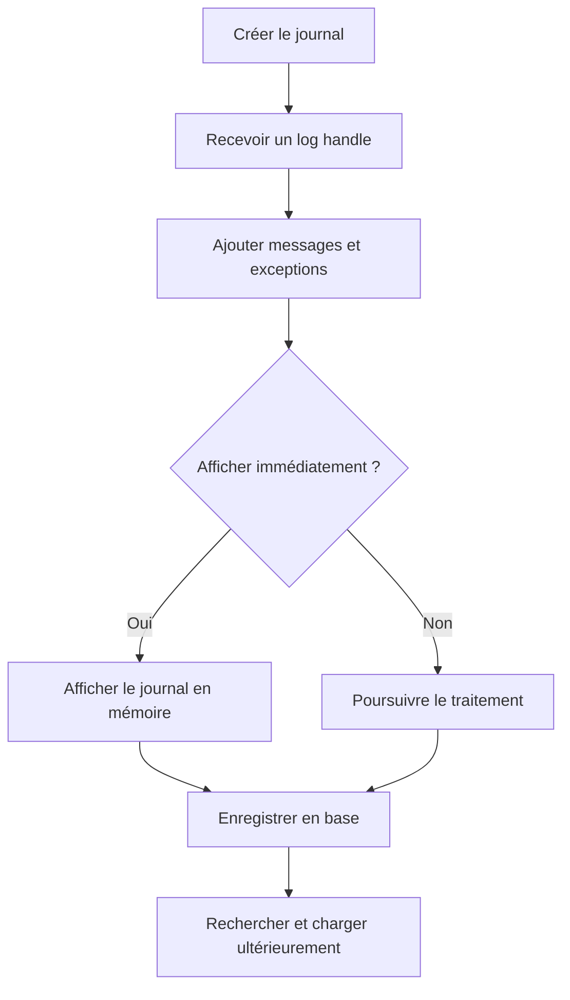

# 2. ARCHITECTURE ET CYCLE DE VIE DU BAL

## 2.A RÉSULTAT ATTENDU

- Comprendre le cycle de vie d’un journal
- Distinguer le handle du numéro de journal en base
- Identifier les opérations réalisées en mémoire et en base

## 2.B CYCLE DE VIE



Les fonctions `BAL_LOG_*` travaillent principalement sur les journaux présents dans la mémoire globale du groupe de fonctions BAL. La fonction `BAL_DB_SAVE` assure ensuite la persistance.

## 2.C IDENTIFIANTS

| Identifiant     | Rôle                                                    |
| --------------- | ------------------------------------------------------- |
| Object          | Domaine applicatif stable                               |
| Subobject       | Sous-processus ou scénario                              |
| External number | Identifiant métier ou technique exploitable dans `SLG1` |
| Log handle      | Identifiant technique permanent du journal              |
| Log number      | Numéro interne attribué lors de la sauvegarde en base   |
| Message handle  | Identifie un message précis dans un journal             |

Le **log handle** est disponible dès la création. Le numéro interne de base n’est définitivement attribué qu’au moment de la sauvegarde.

## 2.D DONNÉES PHYSIQUES

Les données persistées sont gérées par le framework BAL. Le code applicatif ne doit pas écrire directement dans les tables techniques du journal, notamment `BALHDR`, `BALDAT` ou `BAL_INDX`.

## 2.E RÈGLE DE CONCEPTION

Encapsuler le BAL dans une classe ou un composant applicatif évite de disperser les appels de modules fonction dans tout le programme. L’appelant doit manipuler des opérations métier comme `ADD_SUCCESS`, `ADD_WARNING`, `ADD_EXCEPTION` et `SAVE`.

## 2.F PROCESS

### 2.F.1 ÉTAPE 1 — CONFIGURER LE DOMAINE

Créer ou vérifier l’objet et ses sous-objets dans `SLG0`. Transporter cette configuration avant le code qui l’utilise. Conserver une nomenclature stable entre dialogue, batch et interfaces du même domaine.

### 2.F.2 ÉTAPE 2 — CRÉER UN EN-TÊTE D’EXÉCUTION

Renseigner objet, sous-objet, identifiant externe, programme et expiration si le contrat l’utilise. Appeler `BAL_LOG_CREATE` et conserver le handle dans le composant responsable du journal.

### 2.F.3 ÉTAPE 3 — COLLECTER LES MESSAGES

Ajouter les messages au handle exact pendant le traitement. Structurer les messages par unité métier et limiter les succès répétitifs. Contrôler `sy-subrc` de chaque appel BAL susceptible d’échouer.

### 2.F.4 ÉTAPE 4 — AFFICHER OU EXPOSER LE JOURNAL COURANT

En dialogue, afficher le journal en mémoire seulement si le scénario le requiert. En batch, écrire un résumé dans le journal de job et conserver l’identifiant externe permettant l’ouverture dans `SLG1`.

### 2.F.5 ÉTAPE 5 — PERSISTER LES HANDLES CIBLÉS

Appeler `BAL_DB_SAVE` avec la table des handles appartenant au traitement. Aligner la sauvegarde avec la stratégie de commit et contrôler son retour. Récupérer les numéros persistants si un lien technique doit être conservé.

### 2.F.6 ÉTAPE 6 — RECHERCHER, CHARGER ET NETTOYER

Vérifier le journal dans `SLG1`, puis tester `BAL_DB_SEARCH` et `BAL_DB_LOAD` avec des critères sélectifs si le programme doit le relire. Retirer ensuite de la mémoire uniquement les handles devenus inutiles. Appliquer la rétention définie au niveau de l’objet.

## 2.G VÉRIFICATION

- Le journal est retrouvable dans `SLG1` avec objet, sous-objet et période.
- Chaque erreur contient un contexte permettant d’identifier l’enregistrement concerné.
- Le log est sauvegardé même lorsque le traitement se termine avec des erreurs gérées.
- Aucune donnée sensible inutile n’est enregistrée.

## 2.H ERREURS FRÉQUENTES

- Enregistrer uniquement un texte générique sans clé métier.
- Journaliser des mots de passe, tokens ou données personnelles inutiles.

## 2.I FICHE DE CONTRÔLE À COPIER

```text
Système / SID       :
Mandant             :
Utilisateur         :
Transaction / outil :
Objet technique     :
Jeu de données      :
Résultat attendu    :
Résultat observé    :
Horodatage          :
Ordre de transport  :
```

## 2.J TERMES DU LEXIQUE

- [Application Log](<../🧩 00 ├── LEXIQUE SAP ET ABAP/08 ├── EXECUTION EXPLOITATION ET ADMINISTRATION.md#application-log>)
- [BAL](<../🧩 00 ├── LEXIQUE SAP ET ABAP/10 └── ACRONYMES SAP.md#acro-bal>)
- [Job](<../🧩 00 ├── LEXIQUE SAP ET ABAP/06 ├── PROGRAMMES CLASSES ET OBJETS TECHNIQUES.md#job>)

## 2.K RÉFÉRENCES OFFICIELLES SAP

- [Basics — SAP Help Portal](https://help.sap.com/docs/ABAP_PLATFORM_NEW/addb96cd90c945dfb3182865363bbc47/4e21029235d44180e10000000a15822b.html)
- [Database Interface — SAP Help Portal](https://help.sap.com/docs/ABAP_PLATFORM_NEW/addb96cd90c945dfb3182865363bbc47/4e21021635d44180e10000000a15822b.html)
- [Function Module Overview — SAP Help Portal](https://help.sap.com/docs/ABAP_PLATFORM_NEW/addb96cd90c945dfb3182865363bbc47/4e23b1720771417fe10000000a15822b.html)

---

[Chapitre suivant — OBJETS, SOUS-OBJETS ET IDENTIFIANTS](<./03 ├── OBJETS SOUS OBJETS ET IDENTIFIANTS.md>)
