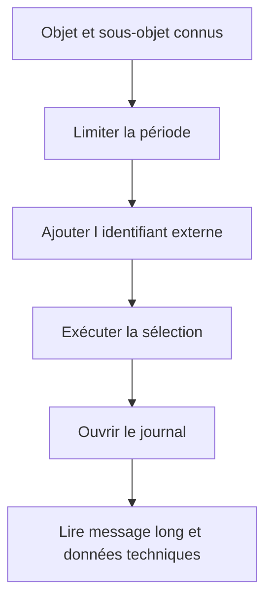

# ANALYSER LES JOURNAUX AVEC SLG1

## RÉSULTAT ATTENDU

- Rechercher efficacement un journal
- Lire les niveaux d’information disponibles
- Constituer une méthode de diagnostic reproductible

## CRITÈRES PRINCIPAUX

La transaction `SLG1` permet de filtrer notamment par :

- objet et sous-objet ;
- identifiant externe ;
- période et heure de création ;
- utilisateur ;
- transaction ou programme ;
- classe du journal ;
- mode de création, par exemple dialogue ou batch.

## MÉTHODE DE RECHERCHE



Toujours commencer par une période courte. Une sélection sans objet ni restriction temporelle peut charger un volume important.

## LECTURE DU RÉSULTAT

L’affichage standard présente :

- l’en-tête du journal ;
- une arborescence ou une liste de messages ;
- le texte court ;
- le texte long T100 lorsqu’il existe ;
- les informations techniques du message ;
- le contexte ou les paramètres complémentaires si l’application les fournit.

## DIAGNOSTIC

Pour chaque anomalie, relever :

1. objet et sous-objet ;
2. identifiant externe ;
3. date, heure et utilisateur ;
4. programme ou transaction ;
5. premier message d’erreur ;
6. messages précédents expliquant le contexte ;
7. données techniques du message.

## PROCESS

### ÉTAPE 1 — RECUEILLIR LES CRITÈRES DE CORRÉLATION

Relever objet, sous-objet, identifiant externe, programme, utilisateur, mandant et intervalle. Pour un job, récupérer l’heure exacte dans `SM37`; pour une interface, utiliser le fichier, lot ou message de corrélation.

### ÉTAPE 2 — FILTRER DANS `SLG1`

Saisir `/nSLG1`, renseigner les critères les plus sélectifs disponibles et exécuter. Élargir progressivement la période ou l’identifiant seulement si aucun résultat n’apparaît. Une recherche globale ne constitue pas un diagnostic reproductible.

### ÉTAPE 3 — IDENTIFIER LE BON EN-TÊTE

Comparer identifiant externe, programme, utilisateur, date de création et expiration. Ouvrir uniquement le journal correspondant au traitement visé. Conserver son numéro technique si une analyse approfondie est nécessaire.

### ÉTAPE 4 — LIRE LA PREMIÈRE CAUSE

Parcourir les messages dans l’ordre, en tenant compte du niveau de détail et de la gravité. Identifier le dernier point réussi et la première erreur. Déplier le contexte et le texte long avant de conclure.

### ÉTAPE 5 — CORRÉLER AVEC LE RÉSULTAT MÉTIER

Vérifier la clé indiquée dans les tables, documents ou fichiers concernés. Comparer les compteurs du journal au résultat persistant. Un message d’erreur isolé peut représenter un rejet prévu plutôt qu’un échec global.

### ÉTAPE 6 — PARTAGER UNE PREUVE MINIMALE

Exporter ou transmettre uniquement l’en-tête, les messages et le contexte nécessaires. Masquer les données sensibles. Conserver objet, identifiant externe, horodatage et cause prouvée dans le ticket ou le diagnostic.

## VÉRIFICATION

- Le journal est retrouvable dans `SLG1` avec objet, sous-objet et période.
- Chaque erreur contient un contexte permettant d’identifier l’enregistrement concerné.
- Le log est sauvegardé même lorsque le traitement se termine avec des erreurs gérées.
- Aucune donnée sensible inutile n’est enregistrée.

## ERREURS FRÉQUENTES

- Enregistrer uniquement un texte générique sans clé métier.
- Journaliser des mots de passe, tokens ou données personnelles inutiles.

## FICHE DE CONTRÔLE À COPIER

```text
Système / SID       :
Mandant             :
Utilisateur         :
Transaction / outil :
Objet technique     :
Jeu de données      :
Résultat attendu    :
Résultat observé    :
Horodatage          :
Ordre de transport  :
```

## TERMES DU LEXIQUE

- [Application Log](<../🧩 00 ├── LEXIQUE SAP ET ABAP/08 ├── EXECUTION EXPLOITATION ET ADMINISTRATION.md#application-log>)
- [BAL](<../🧩 00 ├── LEXIQUE SAP ET ABAP/10 └── ACRONYMES SAP.md#acro-bal>)
- [Job](<../🧩 00 ├── LEXIQUE SAP ET ABAP/06 ├── PROGRAMMES CLASSES ET OBJETS TECHNIQUES.md#job>)

## RÉFÉRENCES OFFICIELLES SAP

- [Analyze Logs — SAP Help Portal](https://help.sap.com/docs/ABAP_PLATFORM_NEW/addb96cd90c945dfb3182865363bbc47/4e21048535d44180e10000000a15822b.html)
- [Displaying Logs — SAP Help Portal](https://help.sap.com/docs/ABAP_PLATFORM/addb96cd90c945dfb3182865363bbc47/4e21041a35d44180e10000000a15822b.html)
- [Application Log – User Guidelines — SAP Help Portal](https://help.sap.com/docs/SAP_S4HANA_ON-PREMISE/f63dd39a28bb4b90adbf9e608aff58ea/4e23ac220771417fe10000000a15822b.html)

---

[Chapitre suivant — EN-TÊTE DU JOURNAL AVEC BAL_S_LOG](<./06 ├── EN TETE DU JOURNAL AVEC BAL_S_LOG.md>)
