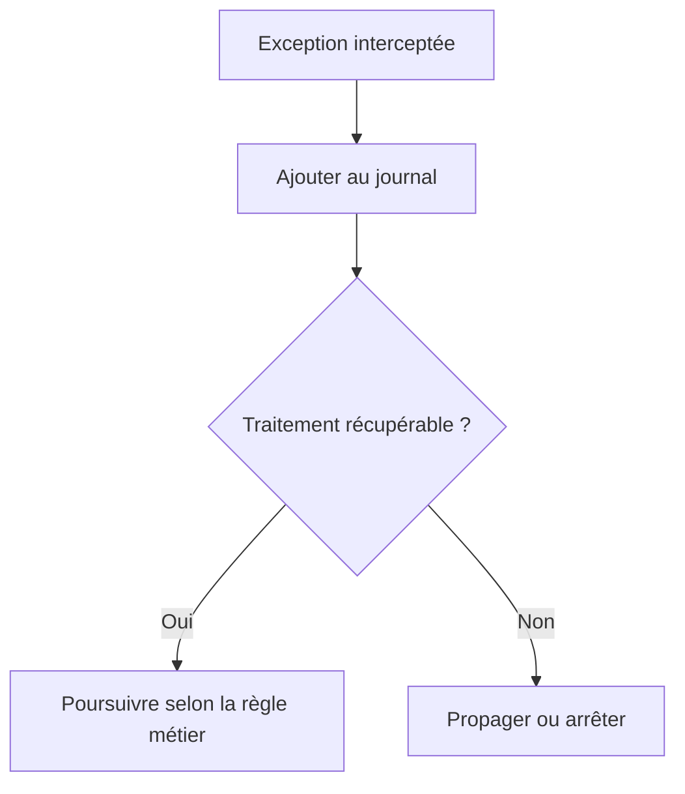

# AJOUTER DES EXCEPTIONS

## RÉSULTAT ATTENDU

- Ajouter une exception de classe au journal
- Préserver son texte et son niveau de gravité
- Distinguer journalisation et traitement de l’exception

## EXEMPLE

```abap
TRY.
    lo_service->execute( ).
  CATCH cx_root INTO DATA(lx_error).
    DATA(ls_exception) = VALUE bal_s_exc(
      exception = lx_error
      msgty     = 'E'
      probclass = '2'
      detlevel  = '1' ).

    CALL FUNCTION 'BAL_LOG_EXCEPTION_ADD'
      EXPORTING
        i_log_handle = lv_log_handle
        i_s_exc      = ls_exception
      EXCEPTIONS
        OTHERS       = 1.

    RAISE EXCEPTION lx_error.
ENDTRY.
```

## POINT CRITIQUE

Ajouter une exception au journal ne la traite pas. Le programme doit encore décider s’il faut :

- poursuivre ;
- ignorer l’élément courant ;
- annuler la transaction ;
- lever une nouvelle exception ;
- arrêter le traitement.



Les exceptions T100 produisent un contenu plus structuré. Une exception sans message T100 reste néanmoins journalisable par le framework.

## PROCESS

### ÉTAPE 1 — INTERCEPTER AU NIVEAU QUI PEUT DÉCIDER

Entourer l’appel susceptible d’échouer par `TRY ... CATCH` et intercepter la classe la plus précise utile. Utiliser `CX_ROOT` seulement à une frontière de traitement qui doit journaliser toute erreur avant de l’arrêter ou de la convertir.

### ÉTAPE 2 — CONSERVER LA RÉFÉRENCE D’EXCEPTION

Récupérer l’exception avec `INTO DATA(lx_error)`. Ne pas remplacer immédiatement son texte par un message générique. Conserver la cause précédente et le contexte métier nécessaires à l’analyse.

### ÉTAPE 3 — CONSTRUIRE `BAL_S_EXC`

Renseigner la référence d’exception, le type de message, la classe de problème et le niveau de détail. Appliquer la convention du projet afin qu’une erreur d’un élément rejeté ne soit pas confondue avec l’échec complet du traitement.

### ÉTAPE 4 — AJOUTER L’EXCEPTION AU LOG

Appeler `BAL_LOG_EXCEPTION_ADD` avec le handle exact et la structure. Contrôler `sy-subrc` immédiatement. Si le journal lui-même est indisponible, utiliser le mécanisme de secours défini sans masquer l’exception initiale.

### ÉTAPE 5 — APPLIQUER LA STRATÉGIE D’ERREUR

Après journalisation, décider explicitement de poursuivre l’élément suivant, annuler l’unité, lever une exception applicative ou arrêter le traitement. Ajouter au besoin un message de synthèse. La journalisation ne constitue jamais un traitement de l’erreur.

### ÉTAPE 6 — TESTER PROPAGATION ET SAUVEGARDE

Provoquer une exception T100 puis une exception sans interface T100. Vérifier le texte dans `SLG1`, le statut métier, la propagation et la persistance du journal en cas de rollback. Aucun `CATCH` ne doit transformer silencieusement l’échec en succès.

## VÉRIFICATION

- Le journal est retrouvable dans `SLG1` avec objet, sous-objet et période.
- Chaque erreur contient un contexte permettant d’identifier l’enregistrement concerné.
- Le log est sauvegardé même lorsque le traitement se termine avec des erreurs gérées.
- Aucune donnée sensible inutile n’est enregistrée.

## ERREURS FRÉQUENTES

- Copier un exemple sans adapter les types, noms d’objets et données disponibles dans le système.
- Tester uniquement le cas nominal et ignorer les valeurs initiales, absentes ou invalides.
- Enregistrer uniquement un texte générique sans clé métier.
- Journaliser des mots de passe, tokens ou données personnelles inutiles.

## SNIPPET À RÉUTILISER

> [!NOTE]
> Adapter les noms `Z*`, les types DDIC, les données et les autorisations au système cible. Effectuer un contrôle syntaxique avant activation.

```abap
TRY.
    lo_service->execute( ).
  CATCH cx_root INTO DATA(lx_error).
    DATA(ls_exception) = VALUE bal_s_exc(
      exception = lx_error
      msgty     = 'E'
      probclass = '2'
      detlevel  = '1' ).

    CALL FUNCTION 'BAL_LOG_EXCEPTION_ADD'
      EXPORTING
        i_log_handle = lv_log_handle
        i_s_exc      = ls_exception
      EXCEPTIONS
        OTHERS       = 1.

    RAISE EXCEPTION lx_error.
ENDTRY.
```

## TERMES DU LEXIQUE

- [Exception](<../🧩 00 ├── LEXIQUE SAP ET ABAP/04 ├── LANGAGE ET DEVELOPPEMENT ABAP.md#exception>)
- [Application Log](<../🧩 00 ├── LEXIQUE SAP ET ABAP/08 ├── EXECUTION EXPLOITATION ET ADMINISTRATION.md#application-log>)
- [BAL](<../🧩 00 ├── LEXIQUE SAP ET ABAP/10 └── ACRONYMES SAP.md#acro-bal>)
- [Job](<../🧩 00 ├── LEXIQUE SAP ET ABAP/06 ├── PROGRAMMES CLASSES ET OBJETS TECHNIQUES.md#job>)

## RÉFÉRENCES OFFICIELLES SAP

- [Basics — SAP Help Portal](https://help.sap.com/docs/ABAP_PLATFORM_NEW/addb96cd90c945dfb3182865363bbc47/4e21029235d44180e10000000a15822b.html)
- [Which Data Can Be Collected? — SAP Help Portal](https://help.sap.com/docs/SAP_NETWEAVER_AS_ABAP_752/addb96cd90c945dfb3182865363bbc47/4e2106b735d44180e10000000a15822b.html)
- [Function Module Overview — SAP Help Portal](https://help.sap.com/docs/ABAP_PLATFORM_NEW/addb96cd90c945dfb3182865363bbc47/4e23b1720771417fe10000000a15822b.html)

---

[Chapitre suivant — CLASSE DE PROBLÈME, NIVEAU DE DÉTAIL, TRI ET CONTEXTE](<./11 ├── CLASSE DE PROBLEME NIVEAU DE DETAIL TRI ET CONTEXTE.md>)
