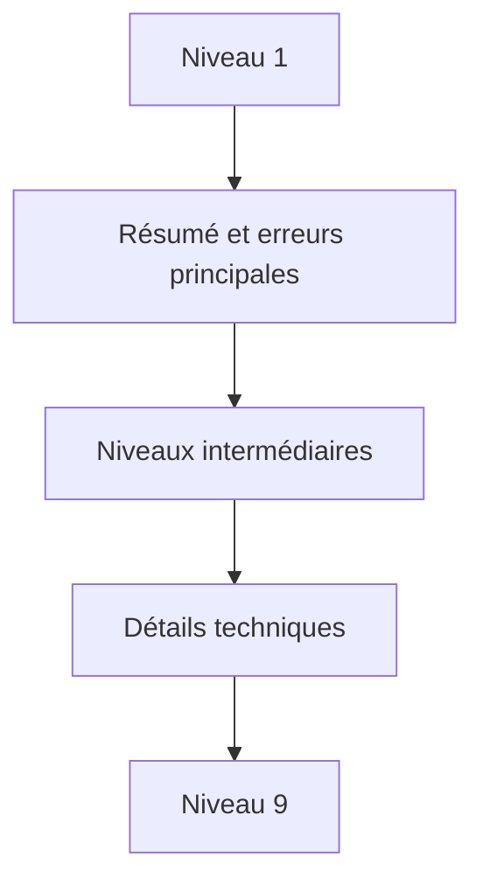

# CLASSE DE PROBLÈME, NIVEAU DE DÉTAIL, TRI ET CONTEXTE

## RÉSULTAT ATTENDU

- Qualifier les messages au-delà du type `E`, `W` ou `I`
- Organiser un journal volumineux
- Fournir le contexte métier nécessaire au diagnostic

## ATTRIBUTS

La structure `BAL_S_MSG` contient notamment :

| Champ       | Usage                                   |
| ----------- | --------------------------------------- |
| `PROBCLASS` | Importance du problème pour le filtrage |
| `DETLEVEL`  | Niveau de détail, de 1 à 9              |
| `ALSORT`    | Critère de tri applicatif               |
| `TIME_STMP` | Horodatage du message                   |
| `CONTEXT`   | Données de contexte structurées         |
| `PARAMS`    | Texte étendu ou callback de détail      |

Le type du message et la classe de problème ne représentent pas la même notion. Un message `I` peut être important pour l’exploitation ; un message `E` peut ne concerner qu’un élément rejeté parmi plusieurs milliers.

## NIVEAUX DE DÉTAIL



Définir une convention projet, par exemple :

- 1 : résultat global ;
- 2 : étape fonctionnelle ;
- 3 : document traité ;
- 5 : détail d’une règle ;
- 9 : trace technique temporaire.

## CONTEXTE

Le contexte permet d’associer à un message une structure DDIC contenant, par exemple, un document, un poste ou un identifiant de fichier. SAP limite la taille du contexte. Utiliser des champs de type caractère simplifie la compatibilité Unicode.

## PROCESS

### ÉTAPE 1 — DÉFINIR UNE CONVENTION DE NIVEAUX

Documenter le sens de chaque `DETLEVEL` utilisé : résumé, étape, unité métier ou trace technique. Définir aussi les classes de problème et leur usage. La convention doit être commune aux programmes partageant le même objet BAL.

### ÉTAPE 2 — QUALIFIER CHAQUE MESSAGE

Lors de la construction de `BAL_S_MSG`, renseigner `MSGTY`, `PROBCLASS` et `DETLEVEL` selon l’impact réel. Distinguer une erreur rejetant une ligne d’une erreur arrêtant le lot. Ne pas classer tous les messages en niveau maximal.

### ÉTAPE 3 — DÉFINIR LE TRI APPLICATIF

Construire `ALSORT` à partir d’une clé déterministe si l’ordre d’affichage doit regrouper document, poste ou étape. Vérifier sa longueur et sa stabilité. Ne pas utiliser un texte traduit comme clé de tri.

### ÉTAPE 4 — CRÉER UN CONTEXTE DDIC MINIMAL

Définir une structure DDIC contenant les identifiants nécessaires au diagnostic : lot, document, poste ou fichier. Utiliser des types compatibles avec les limites BAL et exclure les données sensibles. Affecter ce contexte aux messages concernés.

### ÉTAPE 5 — SAUVEGARDER ET AFFICHER PAR NIVEAU

Persister le journal, puis l’ouvrir dans `SLG1` ou avec un profil BAL tenant compte du niveau de détail. Vérifier que le résumé reste lisible sans les traces fines et que le diagnostic complet apparaît lorsque le niveau est élargi.

### ÉTAPE 6 — TESTER VOLUME ET FILTRAGE

Générer des messages de plusieurs types, classes et niveaux avec des clés différentes. Contrôler tri, filtres, contexte et performances d’affichage. Retirer les traces de niveau élevé non nécessaires à l’exploitation permanente.

## VÉRIFICATION

- Le journal est retrouvable dans `SLG1` avec objet, sous-objet et période.
- Chaque erreur contient un contexte permettant d’identifier l’enregistrement concerné.
- Le log est sauvegardé même lorsque le traitement se termine avec des erreurs gérées.
- Aucune donnée sensible inutile n’est enregistrée.

## ERREURS FRÉQUENTES

- Enregistrer uniquement un texte générique sans clé métier.
- Journaliser des mots de passe, tokens ou données personnelles inutiles.

## FICHE DE CONTRÔLE À COPIER

```text
Système / SID       :
Mandant             :
Utilisateur         :
Transaction / outil :
Objet technique     :
Jeu de données      :
Résultat attendu    :
Résultat observé    :
Horodatage          :
Ordre de transport  :
```

## TERMES DU LEXIQUE

- [Classe](<../🧩 00 ├── LEXIQUE SAP ET ABAP/04 ├── LANGAGE ET DEVELOPPEMENT ABAP.md#classe>)
- [Application Log](<../🧩 00 ├── LEXIQUE SAP ET ABAP/08 ├── EXECUTION EXPLOITATION ET ADMINISTRATION.md#application-log>)
- [BAL](<../🧩 00 ├── LEXIQUE SAP ET ABAP/10 └── ACRONYMES SAP.md#acro-bal>)
- [Job](<../🧩 00 ├── LEXIQUE SAP ET ABAP/06 ├── PROGRAMMES CLASSES ET OBJETS TECHNIQUES.md#job>)

## RÉFÉRENCES OFFICIELLES SAP

- [Which Data Can Be Collected? — SAP Help Portal](https://help.sap.com/docs/SAP_NETWEAVER_AS_ABAP_752/addb96cd90c945dfb3182865363bbc47/4e2106b735d44180e10000000a15822b.html)
- [Log Display — SAP Help Portal](https://help.sap.com/docs/SAP_NETWEAVER_731_BW_ABAP/addb96cd90c945dfb3182865363bbc47/4e2102fa35d44180e10000000a15822b.html)

---

[Chapitre suivant — CUMULER, MODIFIER ET SUPPRIMER DES MESSAGES](<./12 ├── CUMULER MODIFIER ET SUPPRIMER DES MESSAGES.md>)
