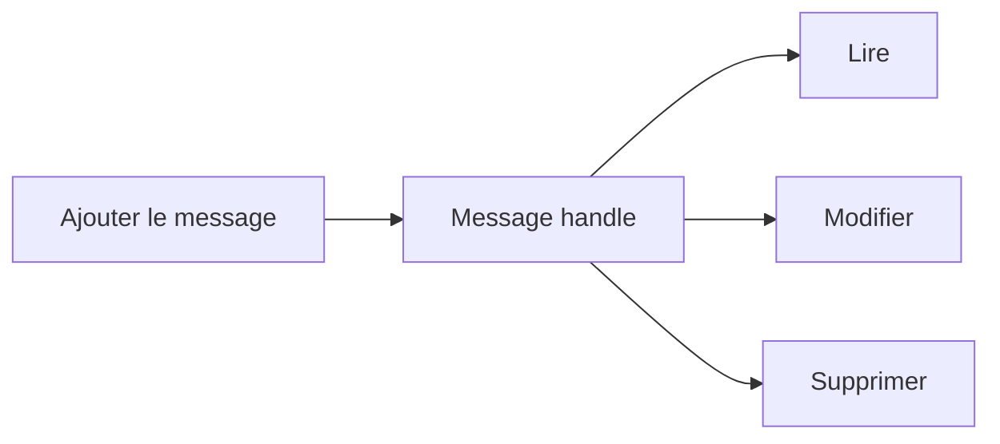

# 12. CUMULER, MODIFIER ET SUPPRIMER DES MESSAGES

## 12.A RÉSULTAT ATTENDU

- Éviter les milliers de messages identiques
- Manipuler un message à partir de son handle
- Connaître les fonctions avancées du BAL

## 12.B CUMULER

`BAL_LOG_MSG_CUMULATE` ajoute un message ou incrémente son compteur lorsqu’un message équivalent existe. Cette technique réduit le volume pour les erreurs répétitives.

Exemple de résultat :

> Article sans unité de mesure — 1 542 occurrences

Le journal doit néanmoins conserver assez de contexte pour identifier les enregistrements concernés. Une cumulation totale sans fichier de rejet ni identifiants rend le diagnostic impossible.

## 12.C HANDLES DE MESSAGE

Les fonctions d’ajout renvoient un `BALMSGHNDL`. Ce handle permet notamment :

- `BAL_LOG_MSG_READ` ;
- `BAL_LOG_MSG_CHANGE` ;
- `BAL_LOG_MSG_REPLACE` ;
- `BAL_LOG_MSG_DELETE`.



## 12.D USAGE

La modification d’un message est utile lorsqu’un traitement ajoute d’abord un état provisoire, puis complète le résultat. Dans la majorité des traitements, il reste plus simple et plus traçable d’ajouter un nouveau message.

Ne pas supprimer une erreur uniquement pour produire un journal « vert ». Le journal doit refléter le résultat réel du traitement.

## 12.E PROCESS

### 12.E.1 ÉTAPE 1 — IDENTIFIER LES MESSAGES RÉPÉTITIFS

Mesurer quelles erreurs produisent des milliers d’occurrences identiques. Définir les champs déterminant l’équivalence et le niveau de détail conservé. Prévoir un fichier ou une table de rejets si les clés individuelles restent nécessaires.

### 12.E.2 ÉTAPE 2 — CUMULER AVEC LE HANDLE DU LOG

Construire le message structuré puis appeler `BAL_LOG_MSG_CUMULATE` selon la signature active. Contrôler le retour et le compteur obtenu. Tester deux messages identiques puis un message différant par une variable significative.

### 12.E.3 ÉTAPE 3 — CONSERVER LE HANDLE DU MESSAGE

Lors d’un ajout destiné à évoluer, récupérer `BALMSGHNDL` et l’associer à l’unité concernée. Ne pas confondre ce handle avec `BALLOGHNDL`. Vérifier son existence avant lecture ou modification.

### 12.E.4 ÉTAPE 4 — LIRE AVANT DE MODIFIER

Utiliser `BAL_LOG_MSG_READ` pour récupérer l’état courant. Comparer le contenu à la transition attendue, puis appeler `BAL_LOG_MSG_CHANGE` ou `BAL_LOG_MSG_REPLACE` selon le besoin documenté. Contrôler chaque code retour.

### 12.E.5 ÉTAPE 5 — SUPPRIMER UNIQUEMENT UN MESSAGE PROVISOIRE

Utiliser `BAL_LOG_MSG_DELETE` seulement si le message a été ajouté comme état temporaire et si sa suppression ne falsifie pas l’historique. Préférer un nouveau message corrigeant ou clôturant l’état lorsqu’une trace chronologique est utile.

### 12.E.6 ÉTAPE 6 — VÉRIFIER LE JOURNAL FINAL

Afficher en mémoire puis sauvegarder. Dans `SLG1`, contrôler compteur, messages modifiés, ordre et contexte de rejets. Comparer le volume du journal avant/après cumulation et confirmer que les enregistrements défaillants restent identifiables.

## 12.F VÉRIFICATION

- Le journal est retrouvable dans `SLG1` avec objet, sous-objet et période.
- Chaque erreur contient un contexte permettant d’identifier l’enregistrement concerné.
- Le log est sauvegardé même lorsque le traitement se termine avec des erreurs gérées.
- Aucune donnée sensible inutile n’est enregistrée.

## 12.G ERREURS FRÉQUENTES

- Enregistrer uniquement un texte générique sans clé métier.
- Journaliser des mots de passe, tokens ou données personnelles inutiles.

## 12.H FICHE DE CONTRÔLE À COPIER

```text
Système / SID       :
Mandant             :
Utilisateur         :
Transaction / outil :
Objet technique     :
Jeu de données      :
Résultat attendu    :
Résultat observé    :
Horodatage          :
Ordre de transport  :
```

## 12.I TERMES DU LEXIQUE

- [Application Log](<../🧩 00 ├── LEXIQUE SAP ET ABAP/08 ├── EXECUTION EXPLOITATION ET ADMINISTRATION.md#application-log>)
- [BAL](<../🧩 00 ├── LEXIQUE SAP ET ABAP/10 └── ACRONYMES SAP.md#acro-bal>)
- [Job](<../🧩 00 ├── LEXIQUE SAP ET ABAP/06 ├── PROGRAMMES CLASSES ET OBJETS TECHNIQUES.md#job>)

## 12.J RÉFÉRENCES OFFICIELLES SAP

- [Function Module Overview — SAP Help Portal](https://help.sap.com/docs/ABAP_PLATFORM_NEW/addb96cd90c945dfb3182865363bbc47/4e23b1720771417fe10000000a15822b.html)
- [Basics — SAP Help Portal](https://help.sap.com/docs/ABAP_PLATFORM_NEW/addb96cd90c945dfb3182865363bbc47/4e21029235d44180e10000000a15822b.html)

---

[Chapitre suivant — AFFICHER UN JOURNAL EN MÉMOIRE](<./13 ├── AFFICHER UN JOURNAL EN MEMOIRE.md>)
