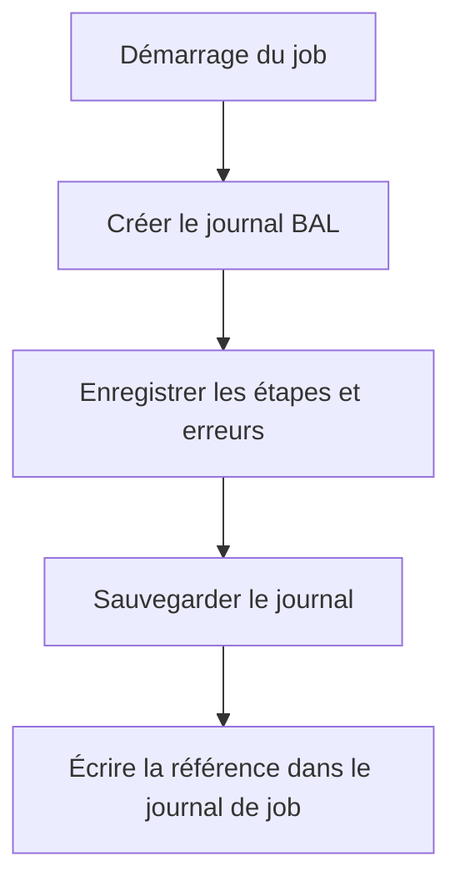

# 18. INTÉGRER LE JOURNAL AUX JOBS ET PROGRAMMES BATCH

## 18.A RÉSULTAT ATTENDU

- Rendre un traitement batch exploitable
- Relier le journal applicatif au journal de job
- Éviter les dépendances à l’affichage SAP GUI

## 18.B STRATÉGIE



Le programme batch doit écrire dans le journal de job une référence exploitable :

- objet ;
- sous-objet ;
- identifiant externe ;
- résultat global ;
- nombre de succès, avertissements et erreurs.

```abap
WRITE: / |Journal SLG1 : ZDEV_LOG / IMPORT / { lv_extnumber }|.
```

## 18.C RÈGLES

- ne pas appeler `BAL_DSP_LOG_DISPLAY` en arrière-plan ;
- sauvegarder le journal même lorsqu’aucune erreur n’est rencontrée si la traçabilité l’exige ;
- intercepter les exceptions au niveau supérieur pour enregistrer le résultat final ;
- distinguer erreur technique du job et rejet fonctionnel d’une ligne ;
- rendre la reprise idempotente.

## 18.D RÉSULTAT DU JOB

Un job peut techniquement se terminer correctement alors que des éléments métier ont été rejetés. Le programme doit définir explicitement les seuils qui provoquent une terminaison anormale, un simple avertissement ou un succès partiel.

## 18.E PROCESS

### 18.E.1 ÉTAPE 1 — CRÉER UN IDENTIFIANT D’EXÉCUTION

Construire dès le démarrage un identifiant externe à partir du lot, fichier ou numéro de job. Renseigner objet, sous-objet, programme et expiration dans `BAL_S_LOG`, puis créer le journal. Écrire cet identifiant dans le journal de job.

### 18.E.2 ÉTAPE 2 — JOURNALISER LES PARAMÈTRES EFFECTIFS

Ajouter un message de démarrage contenant uniquement les paramètres nécessaires : périmètre, mode test et taille de paquet. Ne jamais recopier une variante complète si elle contient des valeurs sensibles.

### 18.E.3 ÉTAPE 3 — JOURNALISER PAR ÉTAPE ET PAR ANOMALIE

Ajouter un message au début et à la fin des phases majeures. Pour le volume, utiliser compteurs et cumulation ; conserver les clés seulement pour les rejets. Distinguer erreur technique, rejet fonctionnel et avertissement.

### 18.E.4 ÉTAPE 4 — INTERCEPTER LA FRONTIÈRE DU JOB

Au niveau supérieur du report, intercepter les exceptions non récupérables, les ajouter au journal puis définir le statut final. Conserver la cause initiale. Ne pas afficher le log avec `BAL_DSP_LOG_DISPLAY` en arrière-plan.

### 18.E.5 ÉTAPE 5 — SAUVEGARDER ET ÉCRIRE LE RÉSUMÉ

Sauvegarder le handle selon la LUW, puis écrire dans le journal de job objet, sous-objet, identifiant, compteurs et résultat global. Contrôler l’échec de sauvegarde séparément afin que l’exploitation sache que le log détaillé manque.

### 18.E.6 ÉTAPE 6 — CONTRÔLER DANS `SM37` ET `SLG1`

Exécuter le report comme job avec l’utilisateur technique. Depuis `SM37`, récupérer l’identifiant puis ouvrir le log dans `SLG1`. Tester succès, succès partiel, exception et relance ; vérifier l’absence de doublons métier.

## 18.F VÉRIFICATION

- Le journal est retrouvable dans `SLG1` avec objet, sous-objet et période.
- Chaque erreur contient un contexte permettant d’identifier l’enregistrement concerné.
- Le log est sauvegardé même lorsque le traitement se termine avec des erreurs gérées.
- Aucune donnée sensible inutile n’est enregistrée.

## 18.G ERREURS FRÉQUENTES

- Copier un exemple sans adapter les types, noms d’objets et données disponibles dans le système.
- Tester uniquement le cas nominal et ignorer les valeurs initiales, absentes ou invalides.
- Enregistrer uniquement un texte générique sans clé métier.
- Journaliser des mots de passe, tokens ou données personnelles inutiles.

## 18.H SNIPPET À RÉUTILISER

> [!NOTE]
> Adapter les noms `Z*`, les types DDIC, les données et les autorisations au système cible. Effectuer un contrôle syntaxique avant activation.

```abap
WRITE: / |Journal SLG1 : ZDEV_LOG / IMPORT / { lv_extnumber }|.
```

## 18.I TERMES DU LEXIQUE

- [Application Log](<../🧩 00 ├── LEXIQUE SAP ET ABAP/08 ├── EXECUTION EXPLOITATION ET ADMINISTRATION.md#application-log>)
- [BAL](<../🧩 00 ├── LEXIQUE SAP ET ABAP/10 └── ACRONYMES SAP.md#acro-bal>)
- [Job](<../🧩 00 ├── LEXIQUE SAP ET ABAP/06 ├── PROGRAMMES CLASSES ET OBJETS TECHNIQUES.md#job>)

## 18.J RÉFÉRENCES OFFICIELLES SAP

- [Logging Application Jobs — SAP Help Portal](https://help.sap.com/docs/SAP_NETWEAVER_AS_ABAP_752/b4367b1cec3243c4989f0ff3d727c4ab/3882707a014c4b5e85d31c459bfb8652.html)
- [Application Log – Guidelines for Developers — SAP Help Portal](https://help.sap.com/docs/SAP_NETWEAVER_AS_ABAP_FOR_SOH_740/addb96cd90c945dfb3182865363bbc47/4e21000f35d44180e10000000a15822b.html)

---

[Chapitre suivant — JOURNALISER IMPORTS, EXPORTS ET TRAITEMENTS DE MASSE](<./19 ├── JOURNALISER IMPORTS EXPORTS ET TRAITEMENTS DE MASSE.md>)
