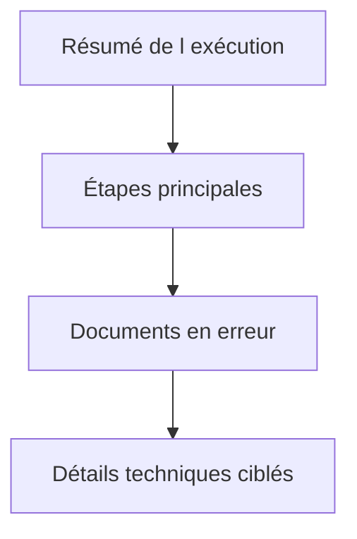

# JOURNALISER IMPORTS, EXPORTS ET TRAITEMENTS DE MASSE

## RÉSULTAT ATTENDU

- Concevoir un journal lisible pour un grand volume
- Séparer résumé, erreurs et détails
- Permettre la reprise d’une exécution

## STRUCTURE RECOMMANDÉE

1. message de démarrage ;
2. paramètres significatifs ;
3. nombre d’enregistrements lus ;
4. avertissements globaux ;
5. erreurs par document ou groupe ;
6. nombre de succès, rejets et erreurs techniques ;
7. statut final et référence de reprise.



## VOLUME

Ne pas créer un message de succès pour chaque ligne lorsque plusieurs millions de lignes sont traitées. Préférer :

- compteurs ;
- cumulation ;
- messages uniquement pour les anomalies ;
- fichier de rejet séparé ;
- détails activables par niveau de journalisation.

## IDENTIFIANT EXTERNE

Exemples :

```text
PRODUCTS_20260731_044000
orders_20260731_001.csv
IDOC_0000000123456789
RUN_4F8A2C
```

L’identifiant doit être reproductible dans les autres outils de suivi : nom du fichier, identifiant CPI, numéro de job, document SAP ou identifiant de corrélation.

## SUCCÈS PARTIEL

Le journal doit distinguer :

- succès complet ;
- succès avec avertissements ;
- succès partiel ;
- échec fonctionnel ;
- échec technique ;
- exécution annulée.

## PROCESS

### ÉTAPE 1 — CORRÉLER LE LOG AU LOT

Utiliser comme identifiant externe le fichier, le message, le lot ou une clé de reprise stable. Ajouter le même identifiant aux tables de pilotage et aux sorties. L’exploitant doit passer d’un outil à l’autre sans recherche approximative.

### ÉTAPE 2 — ÉCRIRE UN EN-TÊTE DE DÉMARRAGE

Journaliser le type de traitement, la version de format, le périmètre, l’heure et le mode test. Pour un fichier, ajouter taille et preuve de complétude utiles. Ne pas enregistrer le contenu brut ni les secrets.

### ÉTAPE 3 — COMPTER PLUTÔT QUE JOURNALISER CHAQUE SUCCÈS

Maintenir des compteurs lus, valides, réussis, avertis, rejetés et en erreur. Ajouter des messages seulement aux changements d’étape et aux anomalies. Utiliser la cumulation pour les erreurs identiques lorsque les clés détaillées existent ailleurs.

### ÉTAPE 4 — CONSERVER LE CONTEXTE DES REJETS

Pour chaque rejet, enregistrer numéro de ligne, document ou unité, règle et cause. Utiliser un contexte DDIC ou un fichier de rejets pour les grands volumes. Définir un seuil empêchant le journal BAL de devenir le stockage de toutes les données sources.

### ÉTAPE 5 — ÉCRIRE LE STATUT FINAL ET LA REPRISE

Ajouter un message synthétisant succès complet, partiel, fonctionnel, technique ou annulé. Indiquer la première unité non validée ou l’identifiant de reprise. Sauvegarder même après une erreur gérée selon la stratégie transactionnelle définie.

### ÉTAPE 6 — TESTER VOLUME ET REJEU

Exécuter un lot nominal, vide, partiellement invalide, interrompu et dupliqué. Vérifier lisibilité dans `SLG1`, taille, temps de sauvegarde, compteurs et absence de données sensibles. La relance doit produire un nouveau log corrélé sans doubler le résultat métier.

## VÉRIFICATION

- Le journal est retrouvable dans `SLG1` avec objet, sous-objet et période.
- Chaque erreur contient un contexte permettant d’identifier l’enregistrement concerné.
- Le log est sauvegardé même lorsque le traitement se termine avec des erreurs gérées.
- Aucune donnée sensible inutile n’est enregistrée.

## ERREURS FRÉQUENTES

- Enregistrer uniquement un texte générique sans clé métier.
- Journaliser des mots de passe, tokens ou données personnelles inutiles.

## FICHE DE CONTRÔLE À COPIER

```text
Système / SID       :
Mandant             :
Utilisateur         :
Transaction / outil :
Objet technique     :
Jeu de données      :
Résultat attendu    :
Résultat observé    :
Horodatage          :
Ordre de transport  :
```

## TERMES DU LEXIQUE

- [Import](<../🧩 00 ├── LEXIQUE SAP ET ABAP/03 ├── REPOSITORY PACKAGES ET TRANSPORTS.md#import-transport>)
- [Application Log](<../🧩 00 ├── LEXIQUE SAP ET ABAP/08 ├── EXECUTION EXPLOITATION ET ADMINISTRATION.md#application-log>)
- [BAL](<../🧩 00 ├── LEXIQUE SAP ET ABAP/10 └── ACRONYMES SAP.md#acro-bal>)
- [Job](<../🧩 00 ├── LEXIQUE SAP ET ABAP/06 ├── PROGRAMMES CLASSES ET OBJETS TECHNIQUES.md#job>)

## RÉFÉRENCES OFFICIELLES SAP

- [Application Log – Guidelines for Developers — SAP Help Portal](https://help.sap.com/docs/SAP_NETWEAVER_AS_ABAP_FOR_SOH_740/addb96cd90c945dfb3182865363bbc47/4e21000f35d44180e10000000a15822b.html)
- [Which Data Can Be Collected? — SAP Help Portal](https://help.sap.com/docs/SAP_NETWEAVER_AS_ABAP_752/addb96cd90c945dfb3182865363bbc47/4e2106b735d44180e10000000a15822b.html)

---

[Chapitre suivant — RÉTENTION, SUPPRESSION ET ARCHIVAGE](<./20 ├── RETENTION SUPPRESSION ET ARCHIVAGE.md>)
