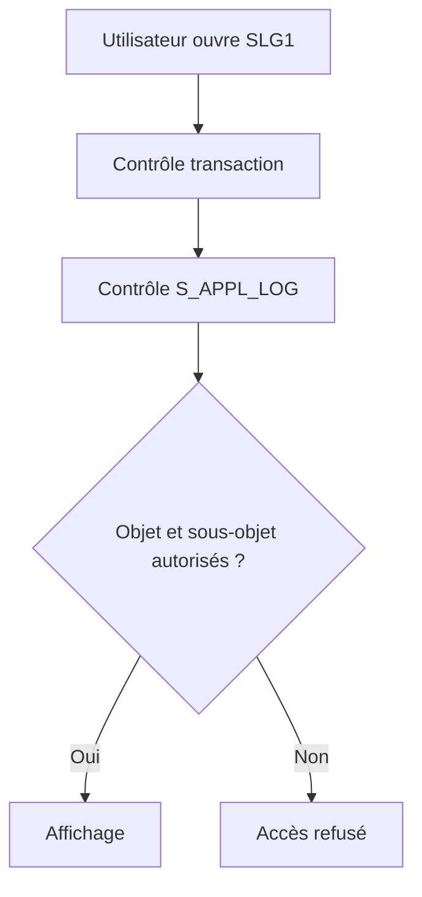

# 21. AUTORISATIONS ET DONNÉES SENSIBLES

## 21.A RÉSULTAT ATTENDU

- Protéger la consultation des journaux
- Concevoir les objets selon les périmètres d’autorisation
- Éviter la fuite de données sensibles

## 21.B OBJET D’AUTORISATION

L’accès aux journaux peut être protégé avec `S_APPL_LOG` selon :

- `ALG_OBJECT` : objet du journal ;
- `ALG_SUBOBJ` : sous-objet ;
- `ACTVT` : activité autorisée.

L’autorisation de démarrer `SLG1` ne suffit pas nécessairement pour consulter tous les objets.

## 21.C CONCEPTION DES OBJETS

Si deux équipes ne doivent pas accéder aux mêmes données, les placer sous des objets ou sous-objets permettant une séparation d’autorisation claire.



## 21.D DONNÉES À EXCLURE

- mots de passe et secrets ;
- jetons OAuth ou certificats ;
- numéros de carte complets ;
- données personnelles non nécessaires ;
- payloads complets contenant des informations sensibles ;
- données techniques permettant une attaque.

Masquer ou tronquer les valeurs. Préférer un identifiant de corrélation permettant de retrouver la donnée dans un système autorisé.

## 21.E CONTRÔLE

Tester les rôles avec `SU53` après un refus et faire analyser la trace d’autorisation avec les outils Basis appropriés. Ne pas contourner un refus en élargissant `S_APPL_LOG` à tous les objets sans justification.

## 21.F PROCESS

### 21.F.1 ÉTAPE 1 — CLASSER LES DONNÉES JOURNALISÉES

Lister les identifiants, messages, contextes et payloads envisagés. Marquer secrets, données personnelles, financières ou techniques sensibles. Supprimer tout champ qui n’est pas nécessaire au diagnostic et définir les règles de masquage restantes.

### 21.F.2 ÉTAPE 2 — DÉCOUPER OBJETS ET SOUS-OBJETS

Séparer les domaines dont les populations autorisées diffèrent. Vérifier que la nomenclature `SLG0` permet d’appliquer `S_APPL_LOG` sans donner accès à des journaux étrangers au rôle. Ne pas utiliser un objet unique pour toutes les applications Z.

### 21.F.3 ÉTAPE 3 — CONSTRUIRE LES RÔLES MINIMAUX

Avec l’équipe sécurité, définir `ACTVT`, `ALG_OBJECT` et `ALG_SUBOBJ` strictement nécessaires. Distinguer consultation, administration et suppression. L’autorisation de transaction ne remplace pas le contrôle sur les objets de journal.

### 21.F.4 ÉTAPE 4 — TESTER UTILISATEUR AUTORISÉ ET REFUSÉ

Créer des logs de deux périmètres, puis ouvrir `SLG1` avec des utilisateurs représentatifs. Vérifier l’accès au périmètre autorisé et le refus de l’autre. Après un refus, utiliser `SU53` ou une trace ciblée selon la procédure sécurité.

### 21.F.5 ÉTAPE 5 — VÉRIFIER LE CONTENU RÉEL

Examiner en-têtes, variables T100, textes libres, exceptions et contextes dans `SLG1`. Tester les erreurs techniques, car elles contiennent souvent plus d’informations que le cas nominal. Confirmer qu’aucun secret complet n’apparaît dans un export ou un spool.

### 21.F.6 ÉTAPE 6 — VALIDER RÉTENTION ET TRAÇABILITÉ

Aligner la durée de conservation sur la sensibilité et les obligations. Tester suppression ou archivage avec les mêmes rôles. Documenter propriétaire, justification des champs conservés et procédure de traitement d’un incident de confidentialité.

## 21.G VÉRIFICATION

- Le scénario reproduit correspond au même utilisateur, mandant, transaction et jeu de données.
- L’horodatage et l’identifiant de l’analyse sont conservés.
- La cause retenue est soutenue par une ligne source, une trace ou une valeur observée.
- Après correction, le même scénario ne reproduit plus le défaut et le résultat métier reste identique.

## 21.H ERREURS FRÉQUENTES

- Enregistrer uniquement un texte générique sans clé métier.
- Journaliser des mots de passe, tokens ou données personnelles inutiles.

## 21.I FICHE DE CONTRÔLE À COPIER

```text
Système / SID       :
Mandant             :
Utilisateur         :
Transaction / outil :
Objet technique     :
Jeu de données      :
Résultat attendu    :
Résultat observé    :
Horodatage          :
Ordre de transport  :
```

## 21.J TERMES DU LEXIQUE

- [Application Log](<../🧩 00 ├── LEXIQUE SAP ET ABAP/08 ├── EXECUTION EXPLOITATION ET ADMINISTRATION.md#application-log>)
- [BAL](<../🧩 00 ├── LEXIQUE SAP ET ABAP/10 └── ACRONYMES SAP.md#acro-bal>)
- [Job](<../🧩 00 ├── LEXIQUE SAP ET ABAP/06 ├── PROGRAMMES CLASSES ET OBJETS TECHNIQUES.md#job>)

## 21.K RÉFÉRENCES OFFICIELLES SAP

- [Authorization Objects — SAP Help Portal](https://help.sap.com/docs/SAP_ERP/da5ab0fa48b34143a25d0e08448f5219/9301c5536a51204be10000000a174cb4.html)
- [Application Logging — SAP Help Portal](https://help.sap.com/docs/ABAP_PLATFORM_NEW/864321b9b3dd487d94c70f6a007b0397/c769bcc9f36611d3a6510000e835363f.html)

---

[Chapitre suivant — API BAL CLASSIQUE, API OBJET ET CODE HISTORIQUE](<./22 ├── API BAL CLASSIQUE API OBJET ET CODE HISTORIQUE.md>)
