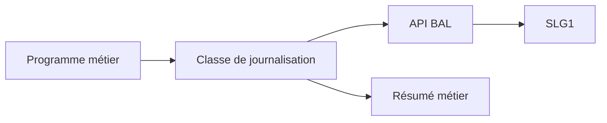

# BONNES PRATIQUES ET CHECKLIST

## RÉSULTAT ATTENDU

- Standardiser l’implémentation
- Produire des journaux exploitables
- Limiter la volumétrie et les risques de sécurité

## CHECKLIST DE CONCEPTION

- [ ] L’objet et le sous-objet existent dans `SLG0`.
- [ ] Leur découpage correspond aux autorisations attendues.
- [ ] L’identifiant externe permet de retrouver l’exécution.
- [ ] Une classe de messages `SE91` contient les messages stables.
- [ ] Les messages indiquent l’action, l’objet concerné et la cause.
- [ ] Le traitement produit un résumé final.
- [ ] Le volume maximal de messages est maîtrisé.
- [ ] La date d’expiration est définie selon la politique de rétention.
- [ ] Aucune donnée sensible inutile n’est journalisée.
- [ ] Tous les `sy-subrc` critiques sont contrôlés.
- [ ] La stratégie de sauvegarde respecte la SAP LUW.
- [ ] Le programme batch écrit la référence `SLG1` dans son journal de job.
- [ ] Les rôles `S_APPL_LOG` ont été testés.
- [ ] Une procédure `SLG2` ou d’archivage est prévue.

## PRINCIPES DE QUALITÉ

| Principe       | Application                                                             |
| -------------- | ----------------------------------------------------------------------- |
| Corrélation    | Identifiant externe partagé avec le document, fichier ou message source |
| Synthèse       | Résultat global lisible sans parcourir tous les détails                 |
| Actionnabilité | Le message indique quoi vérifier ou corriger                            |
| Stabilité      | Objets et numéros de messages pérennes                                  |
| Sobriété       | Pas de succès unitaire inutile en masse                                 |
| Sécurité       | Masquage des données sensibles                                          |
| Exploitabilité | Recherche rapide dans `SLG1`                                            |
| Maintenance    | Encapsulation dans une classe dédiée                                    |

## ARCHITECTURE RECOMMANDÉE



La classe de journalisation doit rester un adaptateur. Elle ne doit pas décider seule du rollback, de la poursuite ou du statut métier du traitement.

## PROCÉDURE PAS À PAS

1. Saisir `/nSE91`.
2. Entrer une classe de messages Z puis choisir **Créer** ou **Modifier**.
3. Ajouter un numéro libre et un texte court ; utiliser `&1` à `&4` pour les variables.
4. Enregistrer dans le package et l’ordre appropriés.
5. Activer si le système le demande.
6. Appeler le message depuis un report de test et vérifier le texte dans la langue de connexion.

## VÉRIFICATION

- Le journal est retrouvable dans `SLG1` avec objet, sous-objet et période.
- Chaque erreur contient un contexte permettant d’identifier l’enregistrement concerné.
- Le log est sauvegardé même lorsque le traitement se termine avec des erreurs gérées.
- Aucune donnée sensible inutile n’est enregistrée.

## ERREURS FRÉQUENTES

- Enregistrer uniquement un texte générique sans clé métier.
- Journaliser des mots de passe, tokens ou données personnelles inutiles.

## FICHE DE CONTRÔLE À COPIER

```text
Système / SID       :
Mandant             :
Utilisateur         :
Transaction / outil :
Objet technique     :
Jeu de données      :
Résultat attendu    :
Résultat observé    :
Horodatage          :
Ordre de transport  :
```

## TERMES DU LEXIQUE

- [Application Log](<../🧩 00 ├── LEXIQUE SAP ET ABAP/08 ├── EXECUTION EXPLOITATION ET ADMINISTRATION.md#application-log>)
- [BAL](<../🧩 00 ├── LEXIQUE SAP ET ABAP/10 └── ACRONYMES SAP.md#acro-bal>)
- [Job](<../🧩 00 ├── LEXIQUE SAP ET ABAP/06 ├── PROGRAMMES CLASSES ET OBJETS TECHNIQUES.md#job>)

## RÉFÉRENCES OFFICIELLES SAP

- [Application Log – Guidelines for Developers — SAP Help Portal](https://help.sap.com/docs/SAP_NETWEAVER_AS_ABAP_FOR_SOH_740/addb96cd90c945dfb3182865363bbc47/4e21000f35d44180e10000000a15822b.html)
- [Application Log – User Guidelines — SAP Help Portal](https://help.sap.com/docs/SAP_S4HANA_ON-PREMISE/f63dd39a28bb4b90adbf9e608aff58ea/4e23ac220771417fe10000000a15822b.html)
- [Application Logging — SAP Help Portal](https://help.sap.com/docs/ABAP_PLATFORM_NEW/864321b9b3dd487d94c70f6a007b0397/c769bcc9f36611d3a6510000e835363f.html)
