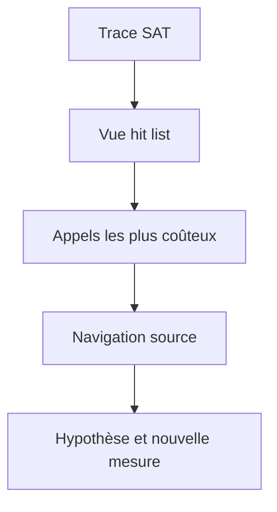

# MESURER LE TEMPS D EXECUTION AVEC SAT

## RÉSULTAT ATTENDU

Utiliser `SAT` pour localiser le temps consommé dans le code ABAP et les appels qu’il déclenche.

## PROCESS

### ÉTAPE 1 — PRÉPARER LE SCÉNARIO

Noter programme ou transaction, utilisateur, variante, jeu de données et action unique. Définir le résultat fonctionnel et une mesure de référence. Réduire les activités parallèles non nécessaires.

### ÉTAPE 2 — CRÉER UNE VARIANTE SAT CIBLÉE

Saisir `/nSAT`, choisir le type d’exécution et limiter les composants ou instructions enregistrés selon le besoin. Conserver assez de détail pour la pile suspecte sans produire une trace disproportionnée.

### ÉTAPE 3 — ENREGISTRER UNE SEULE REPRODUCTION

Démarrer la mesure, exécuter exactement l’action puis arrêter. Éviter navigation et temps d’attente utilisateur dans la fenêtre. Relever l’identifiant et l’horodatage de l’évaluation.

### ÉTAPE 4 — ANALYSER LA HIT LIST

Trier par temps net, temps brut et nombre d’appels. Identifier les routines dominantes et distinguer leur temps propre du temps des sous-appels. Vérifier si la base ou un appel externe explique le coût.

### ÉTAPE 5 — NAVIGUER DANS LA HIÉRARCHIE

Remonter de l’appel coûteux jusqu’au point métier qui le répète. Ouvrir la source et corréler les volumes. Formuler une correction portant sur la cause : réduction d’appels, algorithme ou données traitées.

### ÉTAPE 6 — COMPARER APRÈS CORRECTION

Rejouer la même variante SAT avec les mêmes données. Comparer temps net, brut, appels et résultat. Conserver les deux évaluations et exécuter les tests de non-régression.

## Lire les résultats

| Indicateur      | Interprétation                             |
| --------------- | ------------------------------------------ |
| Temps brut      | temps de la procédure avec ses sous-appels |
| Temps net       | temps propre à la procédure                |
| Nombre d’appels | fréquence d’exécution                      |
| Temps moyen     | coût moyen par appel                       |

Une méthode peu coûteuse appelée un million de fois peut dominer le traitement. Une méthode longue appelée une fois doit être analysée différemment.

## Filtrer le périmètre

Limiter la trace aux objets, packages ou composants pertinents réduit le bruit. Pour un scénario batch ou RFC, utiliser le mode d’enregistrement adapté plutôt que de reproduire artificiellement le traitement en dialogue.



## Interprétation

`SAT` montre où le temps est consommé. Il ne prouve pas à lui seul pourquoi une requête SQL est lente. Pour la base de données, poursuivre avec `ST05` ou `SQLM`.

## Références SAP officielles

- [SAP Help Portal — Analyzing Performance with ABAP Runtime Analysis](https://help.sap.com/docs/ABAP_PLATFORM_NEW/ba879a6e2ea04d9bb94c7ccd7cdac446/3c74c6163ce4459888bc06dedda37685.html)
- [SAP Help Portal — ABAP Performance and Tuning](https://help.sap.com/docs/SUPPORT_CONTENT/ABAP/3353523595.html)

## VÉRIFICATION

- Le scénario reproduit correspond au même utilisateur, mandant, transaction et jeu de données.
- L’horodatage et l’identifiant de l’analyse sont conservés.
- La cause retenue est soutenue par une ligne source, une trace ou une valeur observée.
- Après correction, le même scénario ne reproduit plus le défaut et le résultat métier reste identique.

## ERREURS FRÉQUENTES

- Optimiser sans mesure de référence.
- Accepter un finding critique sans correction ni justification formelle.

## FICHE DE CONTRÔLE À COPIER

```text
Système / SID       :
Mandant             :
Utilisateur         :
Transaction / outil :
Objet technique     :
Jeu de données      :
Résultat attendu    :
Résultat observé    :
Horodatage          :
Ordre de transport  :
```

## TERMES DU LEXIQUE

- [ATC](<../🧩 00 ├── LEXIQUE SAP ET ABAP/10 └── ACRONYMES SAP.md#acro-atc>)
- [ABAP](<../🧩 00 ├── LEXIQUE SAP ET ABAP/10 └── ACRONYMES SAP.md#acro-abap>)
- [Trace](<../🧩 00 ├── LEXIQUE SAP ET ABAP/08 ├── EXECUTION EXPLOITATION ET ADMINISTRATION.md#trace>)
